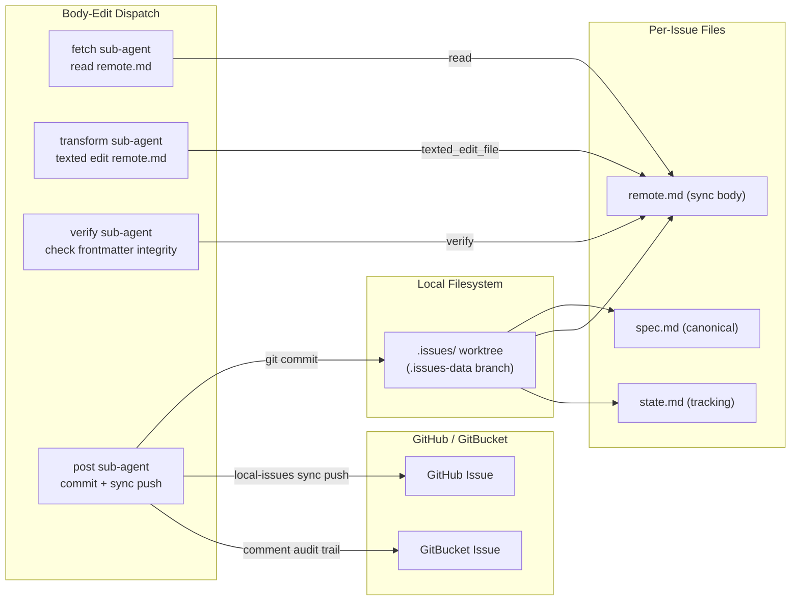

## Summary

Make `.issues/` the primary source of truth for local issue tracking by converting it into a git worktree on an independent `.issues-data` branch. Add a `remote.md` file alongside `spec.md` and `state.md` in each `.issues/N/` directory to decouple the canonical local spec from the remote-facing GitHub/GitBucket body. Add a texted-based `body-edit` task to the `issue-operations` skill that edits `remote.md` via discrete sub-agents with unidirectional sync to GitHub.

The parent repo (`opencode-config`) will auto-configure its `.issues/` worktree when the tooling is invoked — no manual setup, no `AGENTS.md` or `README` changes needed there.

## Concern Scope

Single concern: **`.issues/` worktree architecture + `remote.md` file layout + `body-edit` task for the `issue-operations` skill.** All implementation lives in `michael-conrad/.opencode`.

Out of scope:
- Parent repo configuration (tooling auto-handles it)
- Multi-remote sync daemons
- Full rewrite of issue-operations skill

## File Layout

Each `.issues/N/` directory has three files:

```
.issues/N/spec.md    # Canonical full spec — agent's working copy, never synced to remote
.issues/N/state.md   # Workflow phase tracking
.issues/N/remote.md  # Exact GitHub/GitBucket issue body — sync push reads this verbatim
```

`spec.md` holds the full canonical detail. `remote.md` holds the stakeholder-facing summary that gets pushed to GitHub/GitBucket. This decouples editing: the agent edits `spec.md` when spec detail changes, edits `remote.md` when the remote body needs updating. Sync push reads `remote.md` verbatim — no composition logic needed.

## Architecture



## Design Decisions

| Decision | Resolution |
|----------|-----------|
| Storage model | `.issues/` = git worktree on orphan `.issues-data` branch (files on disk for texted compatibility, branch-independent, piggybacks on existing remotes) |
| Mirror direction | Local-to-remote for bodies; remote-to-local for comments/metadata only |
| `remote.md` purpose | Exact issue body sent to GitHub/GitBucket — never composed, read verbatim |
| Sub-agent pattern | 4 discrete single-concern dispatches (fetch, transform, verify, post) — prevents context pollution and scope creep |
| Transform agent | Gets concern-scoped context (what to change, not why) — exercises judgment on how to locate and edit |
| GitBucket body updates | Not possible via API (PATCH 404) — post comment with executive summary for substantive changes; status changes = noise, skip |
| `.issues/` in `.gitignore` | Yes — parent repo ignores it since it's a linked worktree |
| Data migration | Migrate existing tracked `.issues/` content from `dev` branch onto `.issues-data` branch (preserve history) |
| `local-issues` CLI | Manages all `.issues/` git ops — agent never runs raw git commands for `.issues/` |

## Key Constraints

- **critical-rules-034**: orchestrator is pure router — must dispatch sub-agents, never edit inline
- **critical-rules-022 not applicable to remote.md**: the canonical detail lives in spec.md; remote.md is intentionally shorter as an exec summary — no body erasure safeguard needed
- **Submodule awareness**: `.opencode/` is itself a git submodule — both parent and submodule need `.issues/` worktree, but tooling handles parent automatically
- **Submodule `.git` is a file**: `gitdir: ../.git/modules/.opencode` — not a directory; `local-issues setup` must use `--git-dir` / `--work-tree` flags for submodule git commands
- **Worktree setup order**: submodule worktree BEFORE parent orphan checkout — avoids `fatal: relocate_gitdir for submodule with more than one worktree`

## Items

### Item 1: `local-issues setup` — worktree initialization

Add `cmd_setup` to `.opencode/tools/local-issues`:

- Check if `.issues/` is already a git worktree on `.issues-data` branch → skip if yes
- Create orphan `.issues-data` branch if it doesn't exist
- Initialize `.issues/` as a linked worktree pointed at `.issues-data`
- Handle submodule `.git` file format (use `--git-dir` / `--work-tree` flags)
- Add `.issues/` to `.gitignore` if not present
- Parent repo submodule: setup submodule worktree, then if `is_parent`, setup parent worktree
- Return exit code and readable status line

**Files edited:**
- `.opencode/tools/local-issues` — add `cmd_setup` (~150 lines)

**Success criteria:**
- SC-1: `local-issues setup` creates `.issues/` worktree on `.issues-data` branch in the current repo — verified by `git worktree list | grep issues`
- SC-2: `local-issues setup` creates `.issues/` worktree in submodule when run from parent — verified by `cd .opencode && git worktree list | grep issues`
- SC-3: Re-running `local-issues setup` is idempotent — second run exits with "already setup" status, no errors
- SC-4: `.issues/` worktree survives `git checkout` of a different branch — verified by `git checkout other-branch && ls .issues/N/spec.md` → file still readable
- SC-5: `.issues/` worktree survives `git checkout` back to original branch — verified by `git checkout - && ls .issues/N/spec.md` → file still readable

### Item 2: `local-issues sync push` — mirror remote.md to remote

Add `cmd_sync_push` to `.opencode/tools/local-issues`:

- Read `.issues/N/remote.md` verbatim
- For GitHub: call `github_issue_write(method="update", issue_number=N, body=)`
- For GitBucket: not possible via API — skip (body update is not supported)
- Verify the mirror via API read-back
- Update `.issues/N/state.md` with sync timestamp

**Files edited:**
- `.opencode/tools/local-issues` — add sync push logic (~60 lines, simpler than original since it reads remote.md verbatim instead of parsing spec.md)

**Success criteria:**
- SC-6: `local-issues sync push N` pushes `.issues/N/remote.md` content to GitHub Issue — verified by `github_issue_read(method=get, issue_number=N)` returns matching body
- SC-7: `local-issues sync push N` on a GitBucket issue skips body update and reports "API does not support body update" — verified by exit code + status message
- SC-8: `.issues/N/state.md` contains sync timestamp after successful push — verified by `grep last_sync .issues/N/state.md`

### Item 3: `local-issues sync pull` — fetch remote changes to remote.md

Add `cmd_sync_pull`:

- For GitHub: `github_issue_read(method=get, issue_number=N)`, write body to `.issues/N/remote.md`
- For GitBucket: `gitbucket-api` read, write body to `.issues/N/remote.md`
- Conflict detection: if local `.issues/` has uncommitted changes → warn, do NOT overwrite
- Does NOT touch `.issues/N/spec.md` — the canonical spec remains local-only

**Files edited:**
- `.opencode/tools/local-issues` — add sync pull logic (~60 lines)

**Success criteria:**
- SC-9: `local-issues sync pull N` writes GitHub Issue body to `.issues/N/remote.md` — verified by `read .issues/N/remote.md` matches GitHub content
- SC-10: `local-issues sync pull N` with dirty local `.issues/` warns and aborts — verified by exit code + "local changes present" message
- SC-11: `local-issues sync pull N` does NOT overwrite `.issues/N/spec.md` — verified by `git diff .issues/N/spec.md` shows no changes

### Item 4: `body-edit` task in issue-operations skill

Add task file `.opencode/skills/issue-operations/tasks/body-edit.md` with 4-agent dispatch:

1. **fetch agent**: Read current `.issues/N/remote.md` body via `read` tool, return `{ current_body, issue_number, platform, remote_md_path }`
2. **transform agent**: Apply texted script to `.issues/N/remote.md` using `texted_edit_file`, return `{ success, summary_of_changes }`
3. **verify agent**: Post-edit structural check only — verify frontmatter integrity, valid markdown, no corruption. Does NOT check body length (remote.md is intentionally shorter than spec.md). Return `{ pass, issues }`
4. **post agent**: Commit `.issues/` changes, run `local-issues sync push N`, return `{ sync_status, url }`

**Files created:**
- `.opencode/skills/issue-operations/tasks/body-edit.md` (~200 lines, < 3000 word limit)
  - Frontmatter: `name: body-edit`, `triggers_on: body edit, edit body, edit issue body, update issue body`

**Files edited:**
- `.opencode/skills/issue-operations/SKILL.md` — add `body-edit` to task table (~5 lines)

**Success criteria:**
- SC-12: `body-edit` task dispatched via `skill({name: "issue-operations"})` then `--task body-edit` — verified by skill dispatch mechanism
- SC-13: transform agent targets `remote.md` (not `spec.md`) — verified by tool call parameter check
- SC-14: transform agent uses `texted_edit_file` (not `edit`) for `.md` body edits — verified by tool call log
- SC-15: verify agent performs structural check only (no length ratio comparison) — verified by absence of `0.8 * len` logic in task file
- SC-16: body edit propagates to GitHub via `local-issues sync push` — verified by `github_issue_read` after edit

### Item 5: Update `platforms/github-mcp/SKILL.md` mirror protocol

Current protocol says "agent NEVER edits spec.md directly" — update to reflect the `remote.md` architecture:

- Change "NEVER edits spec.md" to "edits remote.md for remote body changes; spec.md is the canonical full spec"
- Document the three-file layout (spec.md, state.md, remote.md)
- Document mirror flow: local edit to remote.md → verify → sync push to GitHub

**Files edited:**
- `.opencode/skills/issue-operations/platforms/github-mcp/SKILL.md` — update mirror protocol section (~20 lines)

**Success criteria:**
- SC-17: `github-mcp/SKILL.md` no longer says agent NEVER edits spec.md — verified by grep for "NEVER edits spec" returns no match
- SC-18: `github-mcp/SKILL.md` references `remote.md` as the remote-synced body file — verified by grep for "remote.md"
- SC-19: `github-mcp/SKILL.md` references `body-edit` task as the mechanism for remote body edits — verified by grep for "body-edit"

### Item 6: Data migration of existing tracked `.issues/` content

Migrate tracked `.issues/` files from `dev` branch onto the new `.issues-data` branch:

- Parent repo: 16 tracked files across `.issues/`
- Submodule: 20 tracked files across `.opencode/.issues/`

`local-issues setup --migrate` handles this: reads tracked `.issues/` from `dev`, creates `.issues-data` branch, writes files there, removes from `dev` tracking

**Files edited:**
- `.opencode/tools/local-issues` — add `--migrate` flag to `setup` command (~80 lines)

**Success criteria:**
- SC-20: `local-issues setup --migrate` moves tracked `.issues/` files from `dev` to `.issues-data` branch — verified by `git ls-tree dev -- .issues` returns empty, `git ls-tree .issues-data -- .issues` lists all files
- SC-21: `.issues/` is in `.gitignore` after migration — verified by `grep '^.issues' .gitignore`
- SC-22: Migration is reversible — `local-issues setup --rollback-migration` restores `.issues/` files to `dev` and removes from `.gitignore` — verified by rollback test

## Files Changed

| File | Action | Item |
|------|--------|------|
| `.opencode/tools/local-issues` | Edit (add ~290 lines) | 1, 2, 3, 6 |
| `.opencode/skills/issue-operations/tasks/body-edit.md` | Create (~200 lines) | 4 |
| `.opencode/skills/issue-operations/SKILL.md` | Edit (~5 lines) | 4 |
| `.opencode/skills/issue-operations/platforms/github-mcp/SKILL.md` | Edit (~20 lines) | 5 |

## Risks

| Risk | Likelihood | Impact | Mitigation |
|------|-----------|--------|------------|
| Worktree setup order causes submodule errors | Medium | High | Setup order: submodule first, parent second |
| `git submodule update` wipes worktree | Low | High | `--no-checkout` flag when `.issues-data` worktree present on submodule |
| Parent auto-configuration fails silently | Medium | Medium | Add `--dry-run` flag for debugging |
| GitBucket API 404 unchanged (no body update) | Certain | Medium | Comment audit trail for substantive changes; skip status changes |
| spec.md and remote.md diverge without flagging | Low | Medium | state.md tracks sync status; body-edit only edits remote.md |

🤖 Co-authored with AI: OpenCode (ollama-cloud/glm-5.1)