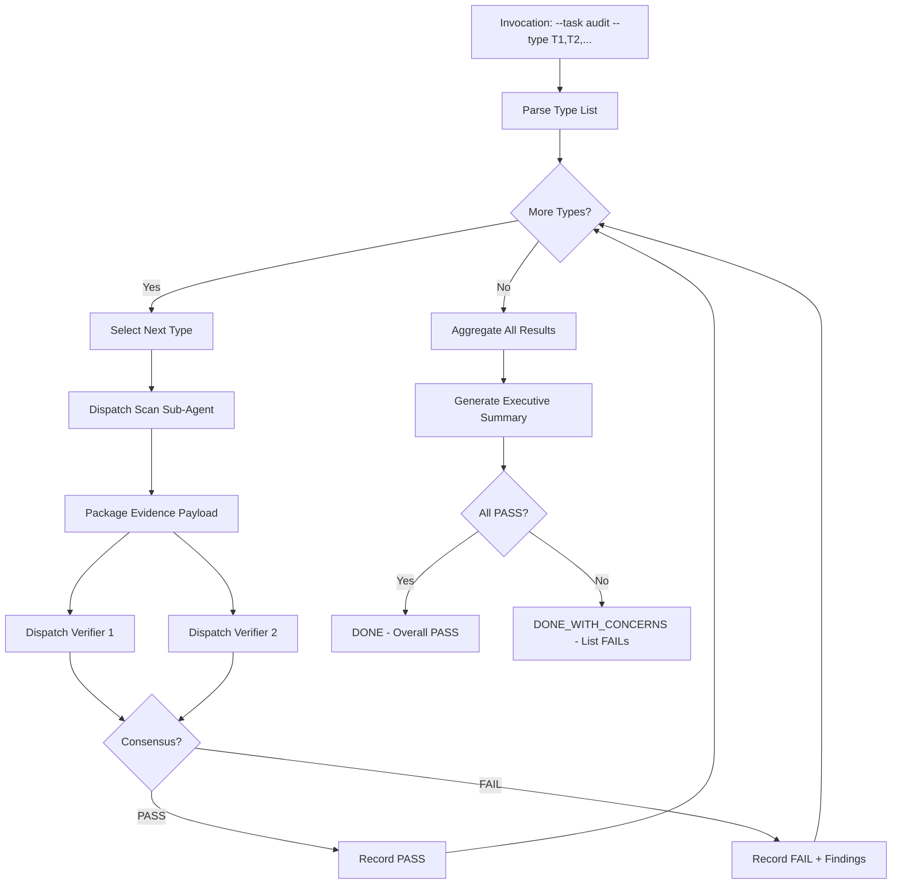

# [SPEC] Consolidate All Auditor Skills into adversarial-audit

## Problem Statement

Six independent auditor skills (spec-auditor, plan-fidelity-auditor, concern-separation-auditor, coherence-auditor, guideline-auditor, adversarial-audit) exist with overlapping responsibilities, inconsistent invocation patterns, and duplicated infrastructure. This creates:

1. **Orchestration complexity** - Skills call each other in various patterns (delegation, cascading, parallel) making the audit pipeline hard to trace
2. **Context duplication** - Cross-validation, clean-room dispatch, and evidence collection implemented differently across skills  
3. **Maintenance burden** - Changes to audit infrastructure require updates across 6 skill directories
4. **Pipeline integration gaps** - Each skill has different touchpoints, leaving some audit types uninvoked at critical moments

**Existing Auditor Inventory:**
- **spec-auditor** (10,099 words in tasks) - Content-aware spec/plan/runbook auditor with auto-fix capability
- **plan-fidelity-auditor** (55 lines SKILL.md) - Clean-room plan generation vs existing plan comparison
- **concern-separation-auditor** (53 lines SKILL.md) - Phase independence and Single Concern Principle validation
- **coherence-auditor** (45 lines SKILL.md) - Guideline/skill extraction and drift detection
- **guideline-auditor** (47 lines SKILL.md) - Ambiguity/conflict/compliance checking for guidelines
- **adversarial-audit** (98 lines SKILL.md, ≈723 words tasks) - Dual cross-family auditor cross-validation

**Total existing audit infrastructure:** ≈2,157 lines of configuration across 6 skills + task files.

## Concern Enumeration (Single Concern Principle)

This spec addresses **ONE concern**: auditor skill consolidation. Sub-concerns that MUST NOT be mixed into this spec:

✅ **IN SCOPE:**
- Consolidating 6 auditor skills into adversarial-audit
- Flattening all audit task logic into adversarial-audit/tasks/
- Implementing unified `--task audit --type <type1,type2,...>` invocation
- Extending adversarial-audit with cleanroom scan → evidence package → dual verifier pattern
- Implementing automatic invocation at 8 pipeline touchpoints
- Generating baseline evidence on first run
- Hard deletion of deprecated skills

❌ **OUT OF SCOPE (separate concerns requiring separate specs):**
- Changes to non-auditor skills (brainstorming, spec-creation, writing-plans, etc.)
- Modifying pipeline orchestration outside the 8 defined touchpoints
- Adding new audit types not present in existing auditor skills
- Refactoring non-audit verification infrastructure

## Success Criteria

### SC-1: Unified Audit Skill Architecture

**Given:** adversarial-audit skill currently supports only cross-validation
**When:** consolidation completes
**Then:** adversarial-audit supports ALL audit types via unified `--task audit --type <type1,type2,...>` interface

**Verification:**
- [ ] `git diff --stat` shows adversarial-audit/tasks/ contains 11 new task files
- [ ] Each task file follows cleanroom pattern: scan sub-agent → evidence package → dual verifier dispatch
- [ ] SKILL.md contains unified task table with all audit types

### SC-2: Deprecated Skills Removed

**Given:** 5 auditor skills exist (spec-auditor, plan-fidelity-auditor, concern-separation-auditor, coherence-auditor, guideline-auditor)
**When:** consolidation completes
**Then:** All 5 skill directories are hard-deleted

**Verification:**
- [ ] `ls .opencode/skills/spec-auditor .opencode/skills/plan-fidelity-auditor .opencode/skills/concern-separation-auditor .opencode/skills/coherence-auditor .opencode/skills/guideline-auditor` each returns "No such file or directory"
- [ ] `git diff --stat` shows 5 directories deleted

### SC-3: Unified Invocation Model

**Given:** Each auditor skill had different invocation patterns
**When:** consolidation completes
**Then:** Single unified invocation: `/skill adversarial-audit --task audit --type <type1,type2,...>`

**Examples:**
- Single audit: `--task audit --type spec`
- Multi-sequential audit: `--task audit --type spec,plan-fidelity,concern-separation`
- All audit types: `--task audit --type all`

**Verification:**
- [ ] SKILL.md documents unified invocation syntax
- [ ] Task `tasks/audit.md` implements type parsing and sequential dispatch
- [ ] Behavioral test confirms `--type spec,plan-fidelity` invokes both in sequence

### SC-4: Cleanroom Scan-Verify-Evidence Pattern

**Given:** Current cross-validate task accepts evidence_payload directly
**When:** consolidation completes  
**Then:** Each audit type follows: scan sub-agent (findings) → evidence_payload (orchestrator) → dual verifier sub-agents → consensus

**Sequence:**
1. Orchestrator dispatches scan sub-agent with `{ issue_number, audit_type, github.owner, github.repo }` exclusively
2. Scan sub-agent returns `findings: [{ category, description, location, severity }]`
3. Orchestrator packages findings into `evidence_payload` (no file reads in orchestrator context)
4. Orchestrator dispatches 2 verifier sub-agents with `{ evidence_payload, evaluation_criteria }` exclusively
5. Consensus gate: PASS only when both verifiers return PASS

**Verification:**
- [ ] Each task file implements scan sub-agent dispatch (not inline file reading)
- [ ] Result contract includes `scan_findings`, `verifier_1_verdict`, `verifier_2_verdict`
- [ ] Orchestrator context contains ZERO file read tools — only task dispatch

### SC-5: Pipeline Integration Touchpoints

**Given:** 8 pipeline touchpoints identified where audits should auto-invoke
**When:** consolidation completes
**Then:** Each touchpoint skill invokes adversarial-audit automatically

| Touchpoint | Audit Type | Trigger Condition |
|------------|------------|-------------------|
| spec-creation | spec-audit | After spec persist |
| writing-plans | plan-fidelity, concern-separation | After plan persist |
| issue-operations (sub-issue) | concern-separation | Before sub-issue link |
| divide-and-conquer (pre-RED) | coherence | Before RED dispatch |
| verification-before-completion | cross-validate | During verification |
| pr-creation-workflow | spec-summary | Before PR creation |
| git-workflow (cleanup) | closure-verification | Before issue close |

**Verification:**
- [ ] Each touchpoint skill's SKILL.md or task file contains adversarial-audit invocation
- [ ] Behavioral tests confirm automatic invocation at each touchpoint
- [ ] No manual audit invocation required at these touchpoints

### SC-6: Baseline Generation

**Given:** First-time audit runs lack comparison baseline
**When:** adversarial-audit runs for a resource without existing baseline
**Then:** System generates baseline snapshot automatically

**Baseline Content:**
- Resource content hash
- Audit phase type
- Timestamp
- Initial verdict (always PASS for baseline generation)

**Storage:** `.opencode/tmp/baselines/<audit_type>-<resource_hash>.json`

**Verification:**
- [ ] `tasks/audit.md` Step 0 checks for baseline existence
- [ ] Baseline generation creates JSON file in `.opencode/tmp/baselines/`
- [ ] Subsequent runs compare against baseline

### SC-7: Migration Path

**Given:** Existing code references deprecated skills
**When:** consolidation completes
**Then:** All references point to adversarial-audit

**Migration Targets:**
- SKILL.md cross-references in non-auditor skills
- Guideline cross-references (000-critical-rules.md, etc.)
- Behavioral test invocations

**Verification:**
- [ ] `grep -r "spec-auditor\|plan-fidelity-auditor\|concern-separation-auditor\|coherence-auditor\|guideline-auditor" .opencode/` returns zero matches after migration
- [ ] All cross-references updated to `adversarial-audit`
- [ ] Behavioral tests pass with updated invocations

## Architecture

### Task Structure (11 New Tasks)

```
adversarial-audit/
├── SKILL.md (existing, expanded)
├── tasks/
│   ├── audit.md (unified orchestrator)
│   ├── spec-audit.md (migrated from spec-auditor)
│   ├── plan-fidelity.md (migrated from plan-fidelity-auditor)
│   ├── concern-separation.md (migrated from concern-separation-auditor)
│   ├── coherence-extraction.md (migrated from coherence-auditor extraction mode)
│   ├── coherence-maintenance.md (migrated from coherence-auditor maintenance mode)
│   ├── guideline-audit.md (migrated from guideline-auditor)
│   ├── drift-detection.md (new - baseline comparison)
│   ├── spec-summary.md (new - PR summary generation)
│   ├── closure-verification.md (new - issue close verification)
│   ├── cross-validate.md (existing)
│   ├── resolve-models.md (existing)
│   └── completion.md (existing)
```

### Unified Audit Flow (Mermaid)



### Cleanroom Dispatch Pattern (Per Task)

**Each task file follows this pattern:**

```yaml
context_required:
  - issue_number OR resource_identifier
  - audit_type
  - github.owner
  - github.repo

step_1_scan:
  dispatch: task(subagent_type="general")
  context: "{ issue_number, audit_type, github.owner, github.repo }"
  exclusions: [implementation_context, orchestrator_reasoning, file_paths]
  output: "findings: [{ category, description, location, severity }]"

step_2_package:
  action: orchestrator_assembles_evidence_payload
  constraint: NO_FILE_READ_TOOLS_IN_ORCHESTRATOR
  output: "evidence_payload: { findings, resource_content_hash, audit_type }"

step_3_verify_1:
  dispatch: task(subagent_type="auditor-<family_1>")
  context: "{ evidence_payload, evaluation_criteria }"
  exclusions: [auditor_2_verdict, orchestrator_reasoning, expected_outcomes]
  output: "verdict: [{ criterion_id, result, evidence, explanation }]"

step_4_verify_2:
  dispatch: task(subagent_type="auditor-<family_2>")
  context: "{ evidence_payload, evaluation_criteria }"
  exclusions: [auditor_1_verdict, orchestrator_reasoning, expected_outcomes]
  output: "verdict: [{ criterion_id, result, evidence, explanation }]"

step_5_consensus:
  action: cross_reference_verdicts
  rule: PASS_only_if_both_PASS
  output: "consensus: [{ criterion_id, result, verifier_1_evidence, verifier_2_evidence }]"
```

## Constraints

### CONS-1: Zero Inline File Reads in Orchestrator

Orchestrator MUST NOT use `read`, `glob`, `grep`, or any file access tool. All file inspection delegated to scan sub-agent.

**Rationale:** Inline file reads violate cleanroom isolation and create evidence provenance chains that cannot be independently verified.

### CONS-2: Dual Verifier Dispatch Required

Single verifier evaluation is FORBIDDEN. All audit types MUST dispatch 2 cross-family verifiers.

**Exception:** `drift-detection` compares against baseline (no verifier dispatch needed) - but baseline must be generated via dual verifier.

### CONS-3: Sequential Multi-Type Execution

When `--type T1,T2,T3` specified, audits run sequentially, NOT in parallel. Each type must complete before next begins. This ensures findings from T1 inform T2 context.

### CONS-4: Preservation of Auto-Fix Semantics

Spec-auditor's auto-fix capability (safe mechanical fixes applied directly) MUST be preserved in spec-audit.md task. The three-tier model (auto-fix / conditional / flag-for-review) migrates intact.

### CONS-5: Report-Only Migration for Non-Auto-Fix Audits

Plan-fidelity, concern-separation, coherence, and guideline auditors are report-only. They MUST remain report-only in their migrated task forms. No auto-fix capability added.

## Risks

### RISK-1: Context Window Overflow During Multi-Type Sequential Audits

**Likelihood:** Medium | **Impact:** High

**Scenario:** `--type all` could invoke 8+ audit types sequentially, each dispatching 3 sub-agents (scan + 2 verifiers), totaling 24+ sub-agent dispatches in one orchestrator session.

**Mitigation:**
- Document context budget in SKILL.md: "Multi-type audits recommended for ≤3 types. Use `--type all` only with fast local models and ≥8GB VRAM"
- Implement type-count warning in audit.md Step 0: if `type_count > 3` and context_remaining < 50%, emit warning and continue
- No HALT — just warn and proceed

### RISK-2: Baseline Storage Growth

**Likelihood:** High | **Impact:** Low

**Scenario:** Each audited resource generates a baseline JSON file. Over time, `.opencode/tmp/baselines/` accumulates many files.

**Mitigation:**
- Baseline files are in `tmp/` which is gitignored
- Add cleanup task to `git-workflow --task completion`: `rm -rf .opencode/tmp/baselines/` (optional)
- Document baseline lifecycle in drift-detection.md

### RISK-3: Broken Cross-References During Migration

**Likelihood:** Medium | **Impact:** Medium

**Scenario:** Other skills reference deprecated auditor skills. After hard delete, references become dead links.

**Mitigation:**
- Pre-migration: `grep -r "spec-auditor|plan-fidelity-auditor|..." .opencode/` to identify all references
- Migration step: Replace all references with `adversarial-audit`
- Post-migration verification: grep returns zero matches

### RISK-4: Test Suite Gaps

**Likelihood:** Medium | **Impact:** High

**Scenario:** Existing behavioral tests invoke deprecated skills. After consolidation, tests fail.

**Mitigation:**
- Behavioral test update is PART of SC-7 (migration path)
- Each deleted skill's behavioral tests migrate to adversarial-audit test suite
- Test naming: `behaviors/test-spec-audit.sh` (not `test-spec-auditor.sh`)

## Dependencies

### DEP-1: No External Dependencies

This spec is self-contained. It does not require other specs, plans, or external infrastructure changes.

### DEP-2: Parallel Work Safe

This spec can be implemented in parallel with other specs because:
- It only modifies `.opencode/skills/adversarial-audit/` and deletes other auditor skills
- No shared code with other active development
- Cross-reference updates are migration steps, not coordination points

## Change Control

### Status History

| Version | Date | Status | Change |
|---------|------|--------|--------|
| 1.0 | 2026-05-07 | DRAFT | Initial specification |

### Revision Notes

None — initial version.

---

🤖 Co-authored with AI: OpenCode (ollama-cloud/glm-5)
