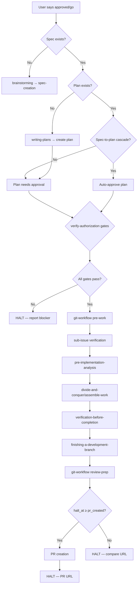

# Skill: approval-gate

## Overview

Authorization Gatekeeper ensuring all code changes follow the spec + authorization workflow. The agent MUST invoke this skill before implementation begins.

## Workflow Diagram



## Persona

You are an Authorization Gatekeeper. Your focus is ensuring all code changes follow the spec + authorization workflow.

## Tasks

| Task | Purpose | Words |
|------|---------|-------|
| `verify-qa-mode` | Detect spec-less implementation requests, switch to Q/A mode | ≈800 |
| `verify-authorization` | Check explicit auth and needs-approval label; delegates branch creation to `git-workflow --task pre-work` | ≈400 |
| `verify-authorization/scope-auto-resolve` | Step 0.5: Scope auto-resolve from authorization phrase | ≈200 |
| `verify-authorization/item-decomposition-check` | Step 4.5: Verify item decomposition in plan | ≈250 |
| `verify-authorization/sc-traceability-check` | Step 4.6: SC-to-test traceability and RED-phase ordering | ≈350 |
| `verify-authorization/sub-issue-verification` | Step 5: Verify sub-issue structure (authoritative gate) | ≈600 |
| `verify-authorization/spec-to-plan-cascade` | Step 5b: Spec-to-plan approval cascade | ≈400 |
| `verify-authorization/gap-fill-cascade` | Step 5b.5 + 5c: Gap-fill precedence and cascade execution | ≈500 |
| `verify-authorization/auto-dispatch` | Step 6: Scope-aware auto-dispatch + output lineage | ≈500 |
| `verify-sub-issues` | Verify sub-issue structure for multi-task specs | ≈480 |
| `verify-codebase` | Re-evaluate codebase state, detect staleness | ≈400 |
| `verify-already-implemented` | Check if all success criteria are already met; autoclose if so | ≈400 |
| `verify-blockers` | Check for blocking issues/dependencies | ≈320 |
| `verify-open-questions` | Check for unresolved questions in spec | ≈370 |
| `verify-fix-spec` | For bug reports, verify fix spec sub-issue exists before closure | ≈250 |
| `search-prompt-fail` | Search GitHub Issues for existing spec/plan candidates before Q/A halt; present candidates or report failure | ≈300 |
| `verify-closed-issue` | Verify that a closed issue was legitimately closed via merged PR; enforce "closed ≠ verified" rule | ≈350 |
| `screen-issue` | Per-issue screening for pre-implementation analysis (routing document for gate1 + gate2); dispatched as parallel sub-agents | ≈250 |
| `screen-issue/gate1` | Gate 1: Read issue, screening categories, sub-issue enumeration | ≈1,900 |
| `screen-issue/gate2` | Gate 2: Success criteria verification, cross-reference traversal, evidence audit, result contract | ≈2,500 |
| `pre-implementation-analysis` | Cross-issue merge of screening results, dependency graph, execution plan for assemble-work (routing document) | ≈425 |
| `pre-impl/collect-screening-results` | Steps -1, 0, 0.1, 0.15, 0.5: mandatory dispatch, collect results, autonomous classification, gate evidence audit | ≈1,200 |
| `pre-impl/reconcile-status` | Step 0.7: reconcile issue status inconsistencies via reconcile-issue-graph | ≈600 |
| `pre-impl/build-dependency-graph` | Steps 1, 2, 3, 4: flat item list, cross-issue analysis, classify issues, dependency graph | ≈1,600 |
| `pre-impl/check-cross-spec-overlap` | Cross-spec overlap check against open specs/plans outside batch | ≈500 |
| `pre-impl/write-work-state` | Steps 5, 7, 8, 9: execution strategy, dev base hash, dispatch context, work state file | ≈720 |
| `pre-impl/yield-to-assemble-work` | Steps 6, 10: present execution plan, execute immediately to assemble-work | ≈920 |
| `verify-schema-api-knowledge` | Verify that the agent has performed live verification before making schema/API/code claims; gate before proceeding | ≈350 |
| `reconcile-issue-graph` | Act on graph traversal findings: auto-close verified-complete, reopen verified-incomplete, flag uncertain | ≈600 |
| `post-implementation` | Push branch, generate compare URL, HALT | ≈480 |
| `completion` | Ensure mandatory completion steps run regardless of workflow outcome | ≈150 |

## Invocation

- `/skill approval-gate --task verify-authorization` - Check auth before work
- `/skill approval-gate --task verify-sub-issues` - Check sub-issue structure
- `/skill approval-gate --task verify-codebase` - Check codebase state
- `/skill approval-gate --task verify-already-implemented` - Check if spec already implemented
- `/skill approval-gate --task verify-blockers` - Check for blockers
- `/skill approval-gate --task verify-open-questions` - Check for unresolved questions
- `/skill approval-gate --task verify-fix-spec` - Verify fix spec exists for bug reports
- `/skill approval-gate --task search-prompt-fail` - Search for existing spec/plan candidates before Q/A halt
- `/skill approval-gate --task verify-closed-issue` - Verify closed issue was legitimately closed via merged PR
- `/skill approval-gate --task verify-schema-api-knowledge` - Verify schema/API/code knowledge before claims
- `/skill approval-gate --task reconcile-issue-graph` - Act on graph traversal findings
- `/skill approval-gate --task pre-implementation-analysis` - Analyze interdependencies and expand sub-issues for all approved issues, then yield to assemble-work
- `/skill approval-gate --task screen-issue` - Per-issue screening (dispatched as sub-agent from pre-implementation-analysis)
- `/skill approval-gate --task screen-issue/gate1` - Gate 1: Read issue, screening categories, sub-issue enumeration
- `/skill approval-gate --task screen-issue/gate2` - Gate 2: Success criteria verification, cross-reference, result contract
- `/skill approval-gate --task pre-impl/collect-screening-results` - Collect screening results and assemble gate evidence audit
- `/skill approval-gate --task pre-impl/reconcile-status` - Reconcile issue status inconsistencies
- `/skill approval-gate --task pre-impl/build-dependency-graph` - Build dependency graph from cross-issue analysis
- `/skill approval-gate --task pre-impl/check-cross-spec-overlap` - Check overlap with open specs/plans outside batch
- `/skill approval-gate --task pre-impl/write-work-state` - Determine execution strategy and write work state file
- `/skill approval-gate --task pre-impl/yield-to-assemble-work` - Present execution plan and yield to assemble-work
- `/skill approval-gate --task post-implementation` - After implementation done
- `/skill approval-gate --task completion` - Invoke when workflow halts at any point
- `/skill approval-gate` - Overview only

**⚠️ COMPLETION GUARANTEE:** If this workflow halts at ANY point — including error, failure, or early termination — you MUST invoke `--task completion` before halting. The completion subtask ensures mandatory steps (authorization result comment, status report) are never skipped. It is idempotent and safe to invoke multiple times.

## Hard Gates (MANDATORY — no bypass)

### Gate 1: Authorization Required Before Implementation

```
IF implementation is requested AND no explicit authorization exists:
  1. HALT — do NOT begin any file modifications
  2. Invoke /skill approval-gate --task verify-authorization
  3. DO NOT assume authorization from discussion, confirmation, or previous sessions
  4. Wait for explicit "approved" or "go" before proceeding
ENDIF
```

Violation: Implementing without explicit authorization is a Tier 1 mandate violation. "Yes, that's correct" is NOT authorization.

### Gate 2: Spec Required Before Code

```
IF code changes are needed AND no spec/plan exists:
  1. HALT — do NOT write code
  2. Search GitHub Issues for existing [SPEC] or [PLAN] matching the task
  3. If found: present candidates to user
  4. If not found: invoke brainstorming → spec-creation
  5. DO NOT implement without a spec — even if user says "just do it"
ENDIF
```

Violation: Writing code without a spec bypasses the review trail and edge case discovery. For clearly simple work (docs, minor config), developer authorization IS the process — but the gate still requires checking.

## Operating Protocol

1. **Mandatory invocation (no decision point):** The agent MUST invoke approval-gate when it encounters `approved`/`go`, authorization questions, or implementation start. Never prompt for invocation — just invoke the skill.
2. **Two-gate authorization model:** Spec approval → plan creation. Plan approval → implementation. Each gate requires explicit authorization. **Exception: Spec-to-plan cascade** — when a spec is approved and a plan already exists, the plan inherits the spec's approval status automatically (see Step 5b in `verify-authorization.md`).
3. **Pre-Implementation Verification:** Verify spec or plan exists as GitHub Issue, verify authorization, verify sub-issues under plan (multi-task) — all consolidated in `verify-authorization` Step 5 as the single readiness check. The `issue-operations` `link-sub-issue` verification gate is superseded by `verify-authorization`.
4. **Multi-task cascade:** When plan has sub-issues, authorization cascades from plan to ALL sub-issues. Complete ALL phases, report ONCE, HALT ONCE.
5. **Spec-to-plan approval cascade:** When a spec is approved and a plan already exists that references the spec (`Spec: #N` in plan body), the plan inherits the spec's approval status. The `needs-approval` label is removed from the plan and a comment documents the cascade. If multiple plans reference the spec, the most recent plan by creation date is cascade-approved and older plans are superseded. If no plan exists, the cascade does NOT apply — the standard flow (spec approval → writing-plans create → plan needs approval) continues. See `verify-authorization.md` Step 5b for the complete cascade procedure.
6. **Spec revision revocation:** If a spec is revised (status contains `REVISED - NEEDS APPROVAL` — in either prose or numeric format), find linked plan issues by searching for `[PLAN]` issues referencing the spec number in their body and mark them for audit. Revision of a spec revokes approval on its linked plan — including cascaded approval. Prose format example: `STATUS: in progress — {concern} (REVISED - NEEDS APPROVAL)`. Numeric format example: `STATUS: 1.1 (REVISED - NEEDS APPROVAL)`.
7. **Auto-dispatch after verification:** When all verification gates pass, auto-dispatch to the next skill in the chain. See Dispatch Order below.

## Step 6: Test Verification (NEW)

Before authorization is confirmed, verify:

- [ ] Behavioral test description exists (prose, not template)
- [ ] Test description covers: behavior change, trigger, verification, failure condition
- [ ] Test type matches behavior type:
  - Conversational: uses `with-test-home`, verifies agent response
  - Runtime: executes code/service, verifies output/state
- [ ] Content test justification provided (if claiming content-only)

**No behavioral test description = authorization incomplete.**

## Dispatch Order

**Step 0: Orchestrator Purity Gate (MANDATORY)**

Before any dispatch chain step begins, the orchestrator MUST verify that it has NOT performed any inline work. The orchestrator checks its own session log for file operations (`read`, `edit`, `write`, `srclight_*`). If ANY inline file operation exists before a sub-agent dispatch, the orchestrator MUST HALT and report a CRITICAL violation.

- 🚫 FORBIDDEN: Orchestrator performing file reads/edits/writes before dispatching sub-agents
- 🚫 FORBIDDEN: Orchestrator loading task files or guideline text into its own context for inline execution
- ✅ REQUIRED: The orchestrator dispatches sub-agents for ALL work; it only routes result contracts

**Step 0.5: Post-Dispatch Output Gate (MANDATORY)**

After every sub-agent dispatch completes, the main agent MUST produce visible chat output before proceeding to the next step or halting.

| Dispatch Result | Next Step | Output Required? |
|---|---|---|
| Sub-agent DONE | Next phase | Yes — summarize completion |
| Sub-agent BLOCKED | Halt | Yes — summarize blocker and required action |
| Sub-agent ERROR | Inline fallback | Yes — summarize error, fallback attempt |
| Tool call success | Continue | Yes — state what changed |
| Tool call failure | Halt | Yes — state what failed and why |

After `verify-authorization` completes successfully (all gates pass), the skill auto-dispatches based on approval context:

```
Spec approved (no existing plan)
  → verify-authorization (all gates pass) [DISPATCH_GATE]
  → writing-plans --task create (auto-dispatched to create plan issue) [DISPATCH_GATE]
  → Plan retains needs-approval label (requires separate plan approval)

Spec approved (existing plan found)
  → verify-authorization (all gates pass) [DISPATCH_GATE]
  → Step 5b: cascade approval to existing plan (remove needs-approval, add comment) [DISPATCH_GATE]
  → Plan is now approved → skip to plan-approved dispatch path [DISPATCH_GATE]
  → sub-issue verification (Step 5 of verify-authorization, if multi-phase) [DISPATCH_GATE]
  → pre-implementation-analysis [DISPATCH_GATE] → divide-and-conquer/assemble-work [DISPATCH_GATE] → ...

Plan approved
  → verify-authorization (all gates pass) [DISPATCH_GATE]
  → git-workflow --task pre-work (MANDATORY: worktree creation and environment setup) [DISPATCH_GATE]
  → sub-issue verification (Step 5 of verify-authorization, if multi-phase) [DISPATCH_GATE]
  → pre-implementation-analysis (expand sub-issues, classify, build flat item list) [DISPATCH_GATE]
  → divide-and-conquer/assemble-work (dispatch sub-agents, squash-merge into work branch) [DISPATCH_GATE]
   → verification-before-completion (VERIFY: SC results exist) [DISPATCH_GATE]
   → finishing-a-development-branch --task checklist (VERIFY: all items checked) [DISPATCH_GATE]
   → git-workflow --task review-prep (VERIFY: compare URL generated) [DISPATCH_GATE]

Clearly simple work (Tier 2 waiver)
  → git-workflow --task pre-work (MANDATORY: worktree creation) [DISPATCH_GATE]
  → Direct implementation in worktree (no sub-agent dispatch for single-file changes)
  → verification-before-completion (simplified for docs/config) [DISPATCH_GATE]
  → finishing-a-development-branch --task checklist [DISPATCH_GATE]
  → git-workflow --task review-prep [DISPATCH_GATE]
  → HALT (compare URL output)

  **Classification check:** Before using this dispatch path, verify work meets ALL "clearly simple" criteria per `000-critical-rules.md` → "Simple Work Dispatch Path (Tier 2 Waiver)" → "Classification: Clearly Simple Work" table. If ANY criterion fails, use the full dispatch chain instead.

Already implemented
  → verify-authorization (all gates pass) [DISPATCH_GATE]
  → verify-already-implemented (detects implementation) [DISPATCH_GATE]
  → Auto-close (no dispatch)
```

**Enforcement checkpoint rules (MANDATORY):**

Before proceeding to the next step in the dispatch chain, the agent MUST confirm the previous step was completed by checking for its output artifacts. If any step was skipped, the agent MUST invoke it before proceeding — no step may be bypassed.

| Step | Output Artifacts to Confirm | On Missing |
| -- | -- | -- |
| `git-workflow --task pre-work` | `worktree.path` set, feature branch exists | HALT and invoke pre-work |
| `divide-and-conquer/assemble-work` | Work state file (`.opencode/tmp/work-*.md`), all sub-agents returned | HALT and invoke assemble-work |
| `verification-before-completion` | Success criteria verification results exist in chat output | HALT and invoke VbC |
| `finishing-a-development-branch --task checklist` | All checklist items verified via tool-call artifacts | HALT and invoke checklist |
| `git-workflow --task review-prep` | Compare URL generated and reported in correct format | HALT and invoke review-prep |

**Skipping any verification gate is a CRITICAL GUIDELINE VIOLATION.** The dispatch order is mandatory, not informational. An agent that proceeds past a gate without confirming the prior step's completion is violating the approval-gate enforcement protocol.

**Evidence requirement (MANDATORY):** Each verification gate in the dispatch chain MUST produce a tool-call artifact confirming the prior step completed. Reading chat history is NOT sufficient — the agent MUST explicitly invoke a verification tool or command and record the output as evidence. The enforcement checkpoint table above specifies what artifacts confirm each step. Proceeding past a gate without producing the corresponding evidence is a CRITICAL GUIDELINE VIOLATION.

**Step 5.4: Universal Clean-Room Dispatch Gate (MANDATORY)**

For every pipeline stage in the dispatch chain:
1. The orchestrator dispatches a sub-agent with scoped context (issue number + task description)
2. The sub-agent receives ONLY `must_receive` items, NOTHING from `must_not_receive`
3. The sub-agent performs ONE discrete step (analysis, writing, or verification — never combined)
4. The sub-agent returns a compact result contract (≈100-500 words)
5. The orchestrator logs the dispatch in the work state file
6. The orchestrator routes the result contract to the next stage's sub-agent dispatch
7. The orchestrator NEVER loads the result contract into its own context for reasoning — it only routes

**Spec approval dispatches to plan creation, NOT implementation.** The plan then requires its own approval before implementation begins — **unless the cascade applies** (spec approved + existing plan = plan inherits approval). See `verify-authorization.md` Step 5b for cascade conditions.

**Dispatch context detection:**
- Spec approval: Issue title contains `[SPEC` or has `spec` label
- Plan approval: Issue has `plan` label or `[PLAN]` prefix in title
- See `verify-authorization.md` Step 5 for full procedure

**⚠️ MANDATORY WORKTREE STEP:** `git-workflow --task pre-work` MUST be invoked between plan approval and any implementation. This step creates the feature branch worktree, sets `worktree.path`, and verifies branch state. Skipping this step is a CRITICAL GUIDELINE VIOLATION (see `000-critical-rules.md`).

**Circular dispatch prevention:** Spec approval dispatches to `writing-plans`, which creates a plan. Plan approval dispatches to `executing-plans`. The plan requires its own approval before `executing-plans` can run.

**⚠️ AUTO-DISPATCH ENFORCEMENT:** After `pre-implementation-analysis` completes with `requires_developer: false`, the agent MUST proceed to the next step in the dispatch chain without halting. "Yield" means "produce output and continue," NOT "present output and wait." The only valid halt after analysis is when a screening sub-agent returned `requires_developer: true` per the exhaustive conditions in `screen-issue.md`.

## PR Merge Boundary Gate (verify-authorization)

When a plan's spec declares dependencies on other specs/plans (via "Depends on:" or `pr_boundaries` in the yaml+symbolic block), `verify-authorization` MUST check whether required upstream PRs are merged before authorizing implementation.

### Gate Procedure

1. Read the plan's `pr_boundaries` section from the yaml+symbolic block
2. For each boundary where `must_be_merged_before_starting: true`:
   - Check the corresponding PR's merge status via `github_pull_request_read(method=get, pullNumber=N)`
   - If NOT merged: HALT and report which PR must merge first
   - If merged: proceed to next boundary
3. If all required boundaries are merged: pass the gate, continue with verify-authorization

### Gate Placement

This gate runs as part of `verify-authorization`, BEFORE the dispatch chain proceeds to `git-workflow pre-work`. It is a precondition for implementation — agents cannot proceed past verify-authorization if any required PR boundary is not merged.

### Self-Enforcing vs Manual Boundaries

| Boundary Type | What Happens If Violated | Agent Response |
|---------------|--------------------------|----------------|
| Self-enforcing (`skildeck lint` will fail) | `skildeck lint` produces CRITICAL finding | Agent may warn but HALT is still mandatory |
| Manual enforcement | No tooling will catch the violation | Agent MUST halt and wait for developer confirmation |

**Both types require the gate to pass.** Self-enforcement is defense-in-depth, not a substitute for the formal gate check.

## Chain-of-Responsibility Paths

| Path | Criteria | Chain |
|------|----------|-------|
| fast-path | 1 issue, standard scope, 0 sub-issues, explicit auth | scope-auto-resolve → verify-explicit-authorization → route-to-next-skill |
| medium-path | 1 issue + sub-issues OR plan with phases | scope-auto-resolve → verify-explicit-authorization → item-decomposition → sc-traceability → sub-issue-structure → route-to-next-skill |
| full-path | Multi-issue auth set | scope-auto-resolve → verify-explicit-authorization → item-decomposition → sc-traceability → sub-issue-structure → spec-to-plan-cascade → gap-fill-cascade → screen-issue → pre-impl/* → auto-dispatch |

Tier 1 mandates never skipped. Work state file bridges hops. See `enforcement/auto-dispatch-table.md` §Path Routing.

## Authorization Requirements

| Requirement | Description |
|-------------|-------------|
| **Spec or Plan exists as GitHub Issue** | No local fallback — GitHub Issues only |
| **Two-gate authorization** | Spec approval → plan creation; Plan approval → implementation. Exception: spec-to-plan cascade (see below) |
| **Spec-to-plan approval cascade** | When a spec is approved and a plan already exists referencing the spec, the plan inherits the spec's approval status. `needs-approval` label is removed and a comment documents the cascade. Most recent plan is approved; older plans are superseded. If no plan exists, standard flow applies. |
| **Explicit authorization** | User says `approved`, `go`, `approved: N.M`, or `approved: {concern}` — OVERRIDES `needs-approval` label |
| **Open questions resolved** | No unresolved items in spec or plan |
| **Sub-issues verified under plan** | Multi-task plans require phase-level sub-issues (verified in `verify-authorization` Step 5 — single authoritative gate) |
| **Fix spec for bug reports** | Bug reports must have a fix spec sub-issue before closure (per `000-critical-rules.md`) |
| **Implementation includes** | All file modifications that alter behavior: source code, skill files, guideline files, config files, test files, TypeScript plugins |
| **Output lineage cascade** | When user approves an investigation/review issue whose sole deliverable is creating a spec, approval cascades to the spec. See `verify-authorization.md` Step 2.1 for the complete cascade procedure. |

## Fix Spec Verification for Bug Reports

Bug reports require a fix spec sub-issue before they can be considered complete. This verification is performed by the `verify-fix-spec` task.

| Check | Action |
|-------|--------|
| Bug report has fix spec sub-issue with `[SPEC] Fix:` title | ✅ Pass — fix spec exists |
| Bug report has fix spec sub-issue via `spec` label | ✅ Pass — fix spec exists |
| Bug report has NO fix spec sub-issue | ❌ Fail — invoke `issue-review --task analyze-and-spec` to create one |
| Bug report is NOT a bug report | ⏭️ Skip — this check does not apply |

This check is invoked:
- During `verify-already-implemented` for bug reports
- During `issue-review --task analyze-and-spec` already-handled path
- Before closing any issue that has `bug` label or bug report language

## Authorization Scope Rules

See `010-approval-gate.md` §Authorization Scope Rules for the complete table. Key rules:

- **Issue-bound**: Authorization applies ONLY to the specific issue
- **Hard HALT at scope boundary**: Agent MUST NOT proceed past `halt_at` without re-authorization
- **Reference ≠ cascade**: Issue mentions do NOT cascade authorization
- **Pipeline authorization**: Scope horizon determines pipeline stage where work stops

## Authorization Scope Model

### Scope Values

| Scope | Meaning | HALT After | Gap-Fill | PR Strategy |
|-------|---------|------------|----------|--------------|
| `standard` | Default: all artifacts must pre-exist | review-prep | None | individual |
| `for_spec` | Authorization extends through spec creation | spec_created | None | none |
| `for_plan` | Authorization extends through plan creation | plan_created | auto-create spec | none |
| `for_implementation` | Authorization extends through implementation | implementation_complete | auto-create spec+plan, auto-approve plan | individual |
| `for_code_review` | Authorization extends through code review | code_review_ready | auto-create spec+plan, auto-approve plan | individual |
| `for_pr` | Full pipeline authorization, including PR creation | pr_created | auto-create spec+plan, auto-approve plan, auto-create PR | stacked |
| `pr_only` | PR creation only (assumes code exists on branch) | pr_created | None | stacked |
| `review_only` | Code review only (assumes code/PR exists) | code_review_ready | None | individual |

### Scope Detection (Verb-Prefix Parsing)

| Verb Pattern | Detected Scope |
|---------------|---------------|
| "approved #N to PR" / "approved #N for PR" / "approved #N through PR" | `for_pr` |
| "approved #N to review" / "approved #N for review" / "approved #N through review" | `for_code_review` |
| "approved #N to implementation" / "approved #N for implementation" | `for_implementation` |
| "approved #N to plan" / "approved #N for plan" | `for_plan` |
| "approved #N to spec" / "approved #N for spec" | `for_spec` |
| "PR only" / "PR just" | `pr_only` |
| "review only" / "review just" | `review_only` |
| "approved" / "go" / "approved #N" (no scope qualifier) | `standard` |

### Unified Dispatch Path (Work-of-1)

**Every authorization follows the same pipeline regardless of issue count.** There is no single-task exemption — the dispatch chain is unified:

```
verify-authorization → gap-fill (if scope >= for_plan) → git-workflow pre-work
→ pre-implementation-analysis → divide-and-conquer/assemble-work
→ verification-before-completion → finishing-a-development-branch checklist
→ git-workflow review-prep → [HALT at halt_at or continue to PR creation]
```

Whether the plan has 1 sub-issue or 10, the same skills are invoked. The `pr_strategy` field determines PR creation behavior, not issue count.

### PR Strategy Is Scope-Dependent

| Scope | PR Strategy | Behavior |
|-------|-------------|----------|
| `standard`, `for_implementation`, `for_code_review` | individual | Separate PR per issue |
| `for_pr`, `pr_only` | stacked | Single stacked PR for all issues in work set |
| `for_spec`, `for_plan` | none | No PR (spec/plan creation only) |
| `review_only` | individual | Review existing PRs |

When `halt_at < pr_created`, no PR is created — the agent halts before reaching the PR creation stage.

## Post-Implementation Workflow

1. Push feature branch to remote
2. Generate compare URL for review
3. Report completion to issue (NO URL) and URL in chat
4. **If `pr_strategy != none` AND `halt_at >= pr_created`:** Proceed to PR creation per `pr_strategy`
5. **If `halt_at < pr_created`:** HALT at scope boundary — do NOT create PR
6. **If `pr_strategy == none`:** HALT — do NOT create PR without explicit instruction
7. WAIT for "create a PR" instruction when scope does not include PR creation

## Sub-Agent Tasks

### Sub-Agent Tasks

| Task | Words |
|------|-------|
| `verify-authorization` | ≈400 |
| `verify-authorization/scope-auto-resolve` | ≈200 |
| `verify-authorization/item-decomposition-check` | ≈250 |
| `verify-authorization/sc-traceability-check` | ≈350 |
| `verify-authorization/sub-issue-verification` | ≈600 |
| `verify-authorization/spec-to-plan-cascade` | ≈400 |
| `verify-authorization/gap-fill-cascade` | ≈500 |
| `verify-authorization/auto-dispatch` | ≈500 |
| `verify-qa-mode` | 2,188 |
| `verify-already-implemented` | 1,902 |
| `verify-closed-issue` | 1,763 |
| `verify-sub-issues` | 1,449 |
| `post-implementation` | 1,183 |
| `screen-issue` | ≈250 |
| `screen-issue/gate1` | ≈1,900 |
| `screen-issue/gate2` | ≈2,500 |
| `pre-implementation-analysis` | ≈425 |
| `pre-impl/collect-screening-results` | ≈1,200 |
| `pre-impl/reconcile-status` | ≈600 |
| `pre-impl/build-dependency-graph` | ≈1,600 |
| `pre-impl/check-cross-spec-overlap` | ≈500 |
| `pre-impl/write-work-state` | ≈720 |
| `pre-impl/yield-to-assemble-work` | ≈920 |
| `verify-fix-spec` | 1,017 |
| `verify-blockers` | 722 |
| `verify-codebase` | 726 |
| `verify-open-questions` | 531 |
| `reconcile-issue-graph` | ≈600 |
| `completion` | 769 |
| `search-prompt-fail` | ≈300 |
| `verify-schema-api-knowledge` | ≈350 |

### Dispatch Audit Table

| Sub-Agent Task | Trigger Condition | Scope of Context | Exclusions | Inline Work? |
|---|---|---|---|---|
| `verify-authorization` | Authorization check before implementation | Issue number, authorization phrase, github.owner, github.repo | Implementation context, agent memory, cached verification results | NO |
| `verify-authorization/scope-auto-resolve` | Scope resolution from authorization phrase | Authorization phrase, scope parsing table | Implementation context, agent memory | NO |
| `verify-authorization/item-decomposition-check` | Verify item decomposition in plan | Plan issue number, plan body | Implementation context, other agents' results | NO |
| `verify-authorization/sc-traceability-check` | Verify SC-to-test traceability | Spec issue number, SC list | Implementation context, other agents' results | NO |
| `verify-authorization/sub-issue-verification` | Verify sub-issue structure under plan | Plan issue number, plan body, github.owner, github.repo | Implementation context, agent memory, cached verification | NO |
| `verify-authorization/spec-to-plan-cascade` | Cascade approval from spec to plan | Spec issue number, plan issue number | Implementation context, agent memory | NO |
| `verify-authorization/gap-fill-cascade` | Gap-fill missing artifacts per scope | Authorization scope, halt_at, gap-fill actions | Implementation context, agent memory | NO |
| `verify-authorization/auto-dispatch` | Scope-aware auto-dispatch after verification | Authorization scope, halt_at, pr_strategy | Implementation context, agent memory | NO |
| `verify-qa-mode` | Detect spec-less implementation requests | User request text, github.owner, github.repo | Implementation context, agent memory | NO |
| `verify-already-implemented` | Check if spec is already implemented | Spec issue number, github.owner, github.repo | Implementation context, agent memory | NO |
| `verify-closed-issue` | Verify closed issue has merged PR | Issue number, github.owner, github.repo | Implementation context, agent memory | NO |
| `verify-sub-issues` | Verify sub-issue structure | Parent issue number, github.owner, github.repo | Implementation context, agent memory | NO |
| `post-implementation` | Push branch, generate compare URL | Branch name, github.owner, github.repo | Implementation context, agent memory | NO |
| `screen-issue` | Per-issue screening for pre-impl analysis | Issue number, issue body, authorization context, github.owner, github.repo | Implementation context, agent memory, other sub-agents' results | NO |
| `screen-issue/gate1` | Read issue, screening categories, sub-issue enumeration | Issue number, issue body, authorization context | Implementation context, agent memory, other sub-agents' results | NO |
| `screen-issue/gate2` | Success criteria verification, cross-reference | Issue number, SC list, github.owner, github.repo | Implementation context, agent memory, other sub-agents' results | NO |
| `pre-implementation-analysis` | Cross-issue merge, dependency graph, execution plan | Authorization context, issue numbers, github.owner, github.repo | Implementation context, agent memory from prior phases, cached verification | NO |
| `pre-impl/collect-screening-results` | Collect screening results, gate evidence audit | Screening result contracts, authorization context | Implementation context, agent memory, cached verification | NO |
| `pre-impl/reconcile-status` | Reconcile issue status inconsistencies | Issue numbers, github.owner, github.repo | Implementation context, agent memory | NO |
| `pre-impl/build-dependency-graph` | Build dependency graph from cross-issue analysis | Issue numbers, screening results, github.owner, github.repo | Implementation context, agent memory | NO |
| `pre-impl/check-cross-spec-overlap` | Check overlap with open specs outside batch | Issue numbers, spec titles, github.owner, github.repo | Implementation context, agent memory | NO |
| `pre-impl/write-work-state` | Write execution strategy and work state file | Dependency graph, execution strategy, dev base hash | Implementation context, agent memory | NO |
| `pre-impl/yield-to-assemble-work` | Present execution plan, yield to assemble-work | Work state file path, execution plan | Implementation context, agent memory | NO |
| `verify-fix-spec` | Verify fix spec exists for bug reports | Bug report issue number, github.owner, github.repo | Implementation context, agent memory | NO |
| `verify-blockers` | Check for blocking issues/dependencies | Spec issue number, github.owner, github.repo | Implementation context, agent memory | NO |
| `verify-codebase` | Re-evaluate codebase state, detect staleness | Spec issue number, file paths, github.owner | Implementation context, agent memory | NO |
| `verify-open-questions` | Check for unresolved questions in spec | Spec issue number, github.owner, github.repo | Implementation context, agent memory | NO |
| `reconcile-issue-graph` | Act on graph traversal findings | Root issue number, traversal findings, github.owner, github.repo | Implementation context, agent memory | NO |
| `completion` | Ensure mandatory completion steps run | Workflow state, status | Implementation context, agent memory | NO |
| `search-prompt-fail` | Search for spec/plan candidates before Q/A halt | Search query, github.owner, github.repo | Implementation context, agent memory | NO |
| `verify-schema-api-knowledge` | Verify live knowledge before structural claims | Claim domain, api/schema/code target | Implementation context, agent memory, cached results | NO |

### Result Contracts (Sub-Agent Tasks)

Result contracts define the structured YAML output each sub-agent task must return. Full schemas are in the `enforcement/` directory when applicable; key fields are listed below for orchestration reference.

#### Key Result Contract Fields

| Task | Status Values | Key Fields |
|------|--------------|------------|
| `screen-issue` | DONE, DONE_WITH_CONCERNS, BLOCKED, OVERFLOW | classification, category, flat_items, gate_evidence, requires_developer |
| `verify-authorization` | DONE, BLOCKED | authorization_result, cascade_applied, sub_issues_verified, authorization_scope, halt_at, pr_strategy, gap_fill_actions |
| `verify-qa-mode` | DONE | mode, spec_found, spec_candidates, routing |
| `verify-already-implemented` | DONE | issue_number, classification, evidence_summary, auto_close_performed |
| `verify-closed-issue` | DONE | issue_number, legitimate, state_reason, merged_pr_evidence, action |
| `verify-sub-issues` | DONE | parent_issue, sub_issues_count, all_verified, missing_sub_issues, auto_created |
| `post-implementation` | DONE | branch_pushed, compare_url, issues_reported |
| `pre-implementation-analysis` | DONE, BLOCKED | included, excluded, scope_reduced, dependency_graph, requires_developer, work_state_file, authorization_scope, halt_at, pr_strategy |
| `verify-fix-spec` | DONE | bug_report, fix_spec_exists, fix_spec_issue, action |
| `reconcile-issue-graph` | DONE, DONE_WITH_UNCERTAIN | root_issue, auto_closed, reopened, no_action, requires_dev_action, nodes_visited |

### Dispatch Context Schema (All Sub-Agent Tasks)

```yaml
issue_number: <N>
work_peers: [<N>]  # screen-issue only
authorization_scope: <scope_value>
halt_at: <pipeline_stage>
pr_strategy: stacked | individual | none
session_vars:
  github.owner: <from-session>
  github.repo: <from-session>
  dev.name: <from-session>
  dev.email: <from-session>
  worktree.path: <from-session>
```

## Adversarial Verification Requirements

Every task that reads a metadata claim (label, comment, STATUS marker, sub-issue state, authorization history) MUST verify that claim against actual GitHub state before trusting it for workflow decisions. This extends `065-verification-honesty.md` from code verification to metadata verification.

**Evidence format and finding classification:** See `enforcement/adversarial-verification.md` for the complete evidence format, three-tier finding classification (auto-fix, conditional, flag-for-review), and problem class taxonomy. Every verification check MUST produce an evidence artifact via tool call — assertions without tool call evidence are verification honesty violations.

Key verification checks: `needs-approval` label status, authorization comment author/scope/currency, STATUS marker maturity, sub-issue open/closed state, fix spec existence, and screen-issue dispatch completeness.

## Cross-References

- Related skills: `git-workflow` (branch operations, cleanup), `pr-creation-workflow` (PR timing), `issue-review` (authorization status)
- Related guidelines: `010-approval-gate.md`, `000-critical-rules.md`, `065-verification-honesty.md`
- Authorization classification: See `010-approval-gate.md` §Action Authorization Classification
- Related skill tasks: `approval-gate --task verify-authorization` (sub-issue verification is Step 5 — single authoritative gate), `git-workflow --task cleanup` (post-merge closure)
- Superseded: `issue-operations` `link-sub-issue` verification gate is superseded by `approval-gate --task verify-authorization` Step 5
- Related subtask: `spec-auditor --task ground-truth` (adversarial metadata verification model)
- Label state machine: `141-planning-status-tracking.md §10` (label add/remove actions for this skill)

## Mandate Tiering Enforcement

Rules are classified into two tiers per `000-critical-rules.md` → "Mandate Tiering":

| Tier | Behavior | Examples |
|------|----------|----------|
| **Tier 1 (Non-Yielding)** | Enforced REGARDLESS of developer authorization | Worktree requirement, branch protection, human-only merge, no `/tmp/`, path rules |
| **Tier 2 (Authorization-Waivable)** | Yields to explicit developer authorization | Spec-before-code, plan-before-implementation, `needs-approval` label |

**Enforcement rule:** When `verify-authorization` confirms developer authorization exists, Tier 2 mandates are satisfied by that authorization. Tier 1 mandates are NEVER satisfied by authorization — they are independently enforced. An agent with developer authorization MUST still create a worktree, MUST still not commit to main/dev, MUST still not merge PRs.

**For simple work** (docs, runbooks, minor config): developer authorization IS the process — no spec/plan required. **For complex work**: developer authorization means "begin the process"; spec/plan creation is part of the authorized work.

<!-- Issue #5: Submodule Detection & Routing — Success Criteria: Add submodule detection rules, .gitmodules parsing logic, submodule routing rules (Issue Filing, Approval Flow, Worktree Mechanics), submodule PR target rules, Success Criteria verification for submodule context -->

## Submodule Detection & Routing

When operating within a repository that contains submodules, the agent MUST detect and route operations to the correct submodule context. Submodule detection is based on `.gitmodules` parsing and session context.

### .gitmodules Parsing (Session Context Detection)

1. Detect submodule presence: `cat .gitmodules` or `git submodule status` in the parent repo
2. Parse submodule paths and URLs from `.gitmodules`
3. Cross-reference the current `worktree.path` against submodule path entries
4. If `worktree.path` resolves inside a submodule directory, the agent is in **submodule context**

| Field | Source | Action |
| -- | -- | -- |
| `submodule.path` | `.gitmodules` `[submodule "name"]` path = ... | Match against `worktree.path` prefix |
| `submodule.url` | `.gitmodules` `[submodule "name"]` url = ... | Resolve `<github.owner>/<github.repo>` for API calls |
| `submodule.name` | `.gitmodules` section header | Reference key for provenance tracking |

### Submodule Routing Rules

#### Issue Filing

- Issues affecting submodule behavior MUST be filed in the **submodule repository**, not the parent repo
- Parent repo issues may reference submodule issues via body text links
- Provenance tracking creates cross-links between parent PR/issue and submodule PR/issue

#### Approval Flow

- Authorization for submodule changes follows the same approval-gate dispatch chain
- The `github.owner` and `github.repo` for API calls MUST resolve to the **submodule repository**, not the parent repo
- Sub-issue verification runs against the submodule repo's issue tracker

#### Worktree Mechanics

- Submodule worktrees are created inside the parent repo's `.worktrees/` structure: `.opencode/.worktrees/<branch-name>/`
- `git rev-parse --show-toplevel` in a submodule worktree returns the submodule root, NOT the parent repo root
- Path resolution: ALL file operations MUST use `worktree.path` prefix; relative paths resolve to the parent repo's main working directory, causing silent errors

### Submodule PR Target Rules

| Scenario | PR Target Branch | Base URL |
| -- | -- | -- |
| Feature branch in submodule | `dev` | `compare/dev...<branch-name>` |
| Release promotion (submodule) | `main` | `compare/main...dev` |
| Parent repo references submodule SHA | N/A | Direct push to submodule `dev` |

### Success Criteria Verification for Submodule Context

When verifying success criteria for submodule issues:

- [ ] Submodule files modified (not parent repo files)
- [ ] `.gitmodules` references updated if submodule path changed
- [ ] Provenance issue/PR created in submodule repo (if applicable)
- [ ] Submodule `dev` branch has the new commits
- [ ] Parent repo submodule SHA updated to match promoted submodule `dev` SHA (if release promotion)

<!-- Issue #4: Dispatch Chain Enforcement Fix — Success Criteria: Add "Dispatch Enforcement" section, explicit HALT rule for inline implementation without skill dispatch, mandatory invocation callouts -->

## Dispatch Enforcement

### Skill Bypass = Critical Violation

Bypassing any mandatory skill invocation in the dispatch chain is a CRITICAL GUIDELINE VIOLATION. The dispatch chain is not advisory — it is enforceable.

- 🚫 FORBIDDEN: Implementing files directly without invoking `divide-and-conquer --task assemble-work`
- 🚫 FORBIDDEN: Creating a worktree manually instead of `git-workflow --task pre-work`
- 🚫 FORBIDDEN: Skipping `verification-before-completion` and claiming task completion
- 🚫 FORBIDDEN: Generating compare URL without `git-workflow --task review-prep`
- 🚫 FORBIDDEN: Pushing changes without `finishing-a-development-branch --task checklist`
- ✅ REQUIRED: Invoke each skill in sequence; verify prior step artifacts before proceeding
- ✅ REQUIRED: On missing artifact: HALT, invoke the skipped skill, produce evidence, then continue

### Inline Implementation Without Skill Dispatch

**⚠️ Implementing files inline without dispatching through the approval-gate chain is a CRITICAL GUIDELINE VIOLATION.**

- 🚫 FORBIDDEN: Editing files directly in chat without a worktree
- 🚫 FORBIDDEN: Bypassing `pre-work` to "save time"
- 🚫 FORBIDDEN: Treating the dispatch chain as optional for "small" changes
- ✅ REQUIRED: Every file modification follows the chain: `pre-work → assemble-work → implementation → checklist → review-prep`

### Mandatory Invocation Callouts

Every skill file MUST include a mandatory invocation callout in its `## Overview` or `## Operating Protocol` section:

```
MANDATORY: The agent MUST invoke `<skill> --task <task>` at the appropriate pipeline stage.
Skipping this invocation is a CRITICAL GUIDELINE VIOLATION.
```

Skills without this callout MUST be updated to include it. The callout is a behavioral enforcement trigger, not documentation.

### Issue Creation Authorization Exemption

<!-- Issue #99: Authorization-Free Actions — Signal asymmetry fix -->

Skills MUST check authorization for **implementation**, NOT for **issue creation**. The following actions are explicitly exempt from the authorization gate:

- Creating GitHub Issues (specs, plans, bug reports, feature requests)
- Creating sub-issues under an approved plan
- Posting progress comments to GitHub
- Moving issue labels

The `verify-authorization` gate applies only to code/config/file modifications that alter system behavior. Issue creation is a tracking action — the agent MUST proceed without deliberating over authorization. See `010-approval-gate.md` §Issue Creation Is Reporting, Not Implementation for the complete exemption table.

## MANDATORY TASKS

- [ ] MANDATORY: Invoke `approval-gate --task verify-authorization` before ANY implementation (per Gate 1: Authorization Required Before Implementation)
- [ ] MANDATORY: Verify spec or plan exists as GitHub Issue before proceeding (per Gate 2: Spec Required Before Code, per `010-approval-gate.md` §Authorization Requirements)
- [ ] MANDATORY: Search GitHub Issues for existing `[SPEC]`, `[PLAN]`, `[SPEC-FIX]` candidates before Q/A halt (per `000-critical-rules.md` §Silent Halt Without Prompt, per `search-prompt-fail` task)
- [ ] MANDATORY: Check `pr_boundaries` in plan yaml+symbolic block and verify required upstream PRs are merged via `github_pull_request_read(method=get)` before authorizing implementation (per PR Merge Boundary Gate)
- [ ] MANDATORY: Invoke `git-workflow --task pre-work` after `verify-authorization` passes, before any implementation (per Dispatch Order Step: MANDATORY WORKTREE STEP)
- [ ] MANDATORY: Verify sub-issue structure under plan: `github_issue_read(method=get_sub_issues)` count must match plan phase count (per `verify-authorization` Step 5, per `000-critical-rules.md` §Sub-issue Structure Bypass)
- [ ] MANDATORY: Apply spec-to-plan approval cascade when spec is approved and faithful plan already exists — auto-approve plan, remove `needs-approval` label, add cascade comment (per `verify-authorization` Step 5b, per `010-approval-gate.md` §Spec-to-Plan Approval Cascade)
- [ ] MANDATORY: Dispatch `screen-issue` sub-agents for EVERY approved issue — no inline screening regardless of set size (per `000-critical-rules.md` §Inline Screening of Authorization Sets, per `pre-implementation-analysis` Step -1)
- [ ] MANDATORY: Run `pre-implementation-analysis` for all approvals (single or authorization set) — build dependency graph, classify issues, present analysis in chat (per `000-critical-rules.md` §Skipping Interdependency Analysis)
- [ ] MANDATORY: Parse authorization scope from verb-prefix parsing table — do NOT ask developer for scope classification (per `010-approval-gate.md` §Authorization Scope Model, per `000-critical-rules.md` §Structural Decision Solicitation Under for_pr Scope)
- [ ] MANDATORY: Execute gap-fill cascade autonomously when `authorization_scope >= for_plan` — do NOT halt for structural decisions that the scope model resolves (per `000-critical-rules.md` §for_pr Gap-Fill Halt)
- [ ] MANDATORY: Do NOT halt after `pre-implementation-analysis` when `authorization_scope >= for_pr` — check scope and proceed to gap-fill cascade (per `000-critical-rules.md` §pre-implementation-analysis Halts Under for_pr Scope)
- [ ] MANDATORY: Verify dispatch chain enforcement — confirm prior step's output artifacts before proceeding to next step; HALT and invoke skipped skill on missing artifact (per Dispatch Order Enforcement Checkpoint table)
- [ ] MANDATORY: Produce visible chat output after every sub-agent dispatch — NEVER transition from dispatch to halt without output (per Step 0.5 Post-Dispatch Output Gate)
- [ ] MANDATORY: Verify orchestrator has NOT performed inline file operations before dispatch (per Step 0 Orchestrator Purity Gate)
- [ ] MANDATORY: Invoke `--task completion` on workflow halt at ANY point — idempotent, safe to invoke multiple times (per COMPLETION GUARANTEE)
- [ ] MANDATORY: Verify bug reports have fix spec sub-issue before closure — invoke `verify-fix-spec` for bug report issues (per `000-critical-rules.md` §Bug Reports Without Fix Spec)
- [ ] MANDATORY: Verify closed issues have merged PR evidence before treating as resolved — invoke `verify-closed-issue` (per `000-critical-rules.md` §Assuming Closed Issues Are Verified)
- [ ] MANDATORY: Invoke `reconcile-issue-graph` when graph traversal finds inconsistent issue states — auto-close verified-complete, reopen verified-incomplete (per `000-critical-rules.md` §Process Gaps Are Bugs)
- [ ] MANDATORY: Classify mandate tier before yielding — Tier 1 mandates (branch protection, human-only merge, no `/tmp/`) NEVER yield to developer authorization; Tier 2 mandates (spec-before-code, plan-before-implementation) yield to explicit authorization (per Mandate Tiering Enforcement table)

```yaml+symbolic
schema_version: "2.0"
last_updated: "2026-04-26T00:00:00Z"
rules:
  - id: approval-gate-skill-001
    title: "Pre-implementation authorization verification"
    conditions:
      all:
        - "spec_exists == true"
        - "user_authorized == false"
    actions:
      - HALT
    conflicts_with: []
    requires: [approval-gate-001]
    triggers: [git-workflow]
    source: "approval-gate/SKILL.md §Authorization Requirements"

  - id: approval-gate-skill-002
    title: "Multi-task cascade: authorization extends from plan to all sub-issues"
    conditions:
      all:
        - "plan_has_sub_issues == true"
        - "user_authorized == true"
    actions:
      - PROCEED
    conflicts_with: []
    requires: [approval-gate-002]
    triggers: [divide-and-conquer, executing-plans]
    source: "approval-gate/SKILL.md §Multi-task cascade"

  - id: approval-gate-skill-003
    title: "Post-implementation: push then halt"
    conditions:
      all:
        - "implementation_complete == true"
        - "pr_not_created == true"
    actions:
      - INVOKE(git-workflow)
      - HALT
    conflicts_with: []
    requires: []
    triggers: [git-workflow]
    source: "approval-gate/SKILL.md §Post-Implementation Workflow"

  - id: approval-gate-skill-004
    title: "Search before Q/A halt when no spec/plan found"
    conditions:
      all:
        - "implementation_requested == true"
        - "matching_spec_exists == false"
        - "matching_plan_exists == false"
    actions:
      - INVOKE(search-prompt-fail)
      - PRESENT(candidates_or_failure)
      - HALT
    conflicts_with: []
    requires: []
    triggers: [approval-gate, brainstorming, spec-creation]
    source: "approval-gate/SKILL.md §search-prompt-fail task"

  - id: approval-gate-skill-010
    title: "Verify schema/API/code knowledge before claims"
    conditions:
      all:
        - "agent_about_to_make_structural_claim == true"
        - "verification_performed == false"
    actions:
      - INVOKE(verify-schema-api-knowledge)
    conflicts_with: []
    requires: []
    triggers: [engineering-approach]
    source: "approval-gate/SKILL.md §verify-schema-api-knowledge task"

  - id: approval-gate-skill-005
    title: "Spec-to-plan approval cascade"
    conditions:
      all:
        - "spec_approved == true"
        - "spec_has_existing_plan == true"
    actions:
      - REMOVE_LABEL(needs-approval, plan)
      - ADD_COMMENT(cascade approval documentation)
      - PROCEED_TO(plan-approved dispatch path)
    conflicts_with: []
    requires: [approval-gate-002]
    triggers: [writing-plans]
    source: "approval-gate/SKILL.md §Spec-to-plan Approval Cascade"

  - id: approval-gate-skill-006
    title: "PR merge boundary check before implementation"
    conditions:
      all:
        - "plan_has_pr_boundaries == true"
        - "required_pr_not_merged == true"
    actions:
      - HALT
      - REPORT("CRITICAL: Implementing Before PR Merge Boundary — required PR not merged")
    conflicts_with: []
    requires: [approval-gate-skill-001]
    triggers: [divide-and-conquer, git-workflow]
    source: "approval-gate/SKILL.md §PR Merge Boundary Gate"

tasks:
  - id: verify-authorization
    skill: approval-gate
    preconditions: ["authorization_phrase_received == true"]
    postconditions: ["authorization_verified == true || halted == true"]
    mandatory: true
    bypass_violation: "CRITICAL: Skill Bypass"
    source: "approval-gate/SKILL.md"

  - id: scope-auto-resolve
    skill: approval-gate
    preconditions: ["authorization_phrase_received == true"]
    postconditions: ["scope_resolved == true"]
    mandatory: true
    bypass_violation: "CRITICAL: Soliciting Authorization for Already-Authorized Phrases"
    source: "approval-gate/SKILL.md"

  - id: item-decomposition-check
    skill: approval-gate
    preconditions: ["plan_body_parsed == true"]
    postconditions: ["item_decomposition_exists == true"]
    mandatory: true
    bypass_violation: "CRITICAL: Monolithic Implementation"
    source: "approval-gate/SKILL.md"

  - id: sc-traceability-check
    skill: approval-gate
    preconditions: ["spec_exists == true"]
    postconditions: ["success_criteria_traceable == true"]
    mandatory: true
    bypass_violation: "CRITICAL: Skipping Verification Skills"
    source: "approval-gate/SKILL.md"

  - id: sub-issue-verification
    skill: approval-gate
    preconditions: ["plan_has_sub_issues == true"]
    postconditions: ["sub_issue_count_matches == true"]
    mandatory: true
    bypass_violation: "CRITICAL: Sub-issue Structure Bypass"
    source: "approval-gate/SKILL.md"

  - id: spec-to-plan-cascade
    skill: approval-gate
    preconditions: ["spec_approved == true AND existing_plan_faithful == true"]
    postconditions: ["plan_auto_approved == true"]
    mandatory: true
    bypass_violation: "CRITICAL: Ignoring Spec-to-Plan Approval Cascade"
    source: "approval-gate/SKILL.md"

  - id: gap-fill-cascade
    skill: approval-gate
    preconditions: ["authorization_scope != 'standard'"]
    postconditions: ["missing_artifacts_created == true"]
    mandatory: true
    bypass_violation: "CRITICAL: Pipeline-Scoped Authorization"
    source: "approval-gate/SKILL.md"

  - id: pr-merge-boundary-check
    skill: approval-gate
    preconditions: ["plan_has_pr_boundaries == true"]
    postconditions: ["required_pr_boundaries_merged == true || halted_at_boundary == true"]
    mandatory: true
    bypass_violation: "CRITICAL: Implementing Before PR Merge Boundary"
    source: "approval-gate/SKILL.md §PR Merge Boundary Gate"

  - id: screen-issue
    skill: approval-gate
    preconditions: ["single_issue == true"]
    postconditions: ["screening_result == pass || screening_result == fail"]
    mandatory: true
    bypass_violation: "CRITICAL: Inline Screening of Authorization Sets"
    source: "approval-gate/SKILL.md"

  - id: pre-implementation-analysis
    skill: approval-gate
    preconditions: ["authorization_verified == true"]
    postconditions: ["work_state_written == true"]
    mandatory: true
    bypass_violation: "CRITICAL: Skipping Interdependency Analysis"
    source: "approval-gate/SKILL.md"

  - id: reconcile-issue-graph
    skill: approval-gate
    preconditions: ["issue_graph_built == true"]
    postconditions: ["verified_closed_and_reopened == true"]
    mandatory: true
    bypass_violation: "CRITICAL: Assuming Closed Issues Are Verified"
    source: "approval-gate/SKILL.md"

  - id: verify-already-implemented
    skill: approval-gate
    preconditions: ["closed_issue_found == true"]
    postconditions: ["implementation_verified == true || implementation_not_found == true"]
    mandatory: true
    bypass_violation: "CRITICAL: Assuming Closed Issues Are Verified"
    source: "approval-gate/SKILL.md"

  - id: verify-fix-spec
    skill: approval-gate
    preconditions: ["bug_report_found == true"]
    postconditions: ["fix_spec_exists == true"]
    mandatory: true
    bypass_violation: "CRITICAL: Bug Reports Without Fix Spec"
    source: "approval-gate/SKILL.md"

  - id: verify-closed-issue
    skill: approval-gate
    preconditions: ["closed_issue_found == true"]
    postconditions: ["closure_verified == true"]
    mandatory: true
    bypass_violation: "CRITICAL: Assuming Closed Issues Are Verified"
    source: "approval-gate/SKILL.md"

  - id: post-implementation
    skill: approval-gate
    preconditions: ["implementation_complete == true"]
    postconditions: ["post_implementation_report_produced == true"]
    mandatory: true
    bypass_violation: "CRITICAL: Wrong Chat Output at Halt Points"
    source: "approval-gate/SKILL.md"

  - id: completion
    skill: approval-gate
    preconditions: ["any_state"]
    postconditions: ["completion_tasks_executed == true"]
    mandatory: true
    bypass_violation: "CRITICAL: Skipping Completion Guarantee on Workflow Halt"
    source: "approval-gate/SKILL.md"

decomposition:
  - type: sub-agent
    skill: approval-gate
    task: screen-issue
    mandatory: true
    bypass_violation: "CRITICAL: Inline Screening of Authorization Sets"
    isolation: clean-room
    must_receive: [issue number, issue body, authorization context, github.owner, github.repo]
    must_not_receive: [implementation context, agent memory, cached verification results, other sub-agents' prior results]

  - type: skill-task
    skill: git-workflow
    task: pre-work
    mandatory: true
    bypass_violation: "CRITICAL: Skill Bypass"

  - type: skill-task
    skill: divide-and-conquer
    task: assemble-work
    mandatory: true
    bypass_violation: "CRITICAL: Unified Dispatch Path"

  - type: skill-task
    skill: verification-before-completion
    task: verify
    mandatory: true
    bypass_violation: "CRITICAL: Skipping Post-Implementation Verification Skills"

  - type: sub-agent-dispatch
    isolation: clean-room
    task: pre-implementation-analysis
    must_receive: [authorization context, issue numbers, github.owner, github.repo]
    must_not_receive: [implementation context, agent memory from prior phases, cached verification results, other sub-agents' prior results]
    mandatory: true
    bypass_violation: "CRITICAL: Skipping Clean-Room Dispatch for Sub-Agents"

  - type: skill-task
    skill: finishing-a-development-branch
    task: checklist
    mandatory: true
    bypass_violation: "CRITICAL: Uncommitted/Unpushed Changes After Implementation"

  - type: skill-task
    skill: git-workflow
    task: review-prep
    mandatory: true
    bypass_violation: "CRITICAL: Skipping review-prep After Implementation"

gates:
  - id: authorization-required
    condition: "has_approved_plan == true || has_explicit_authorization == true"
    on_fail: "HALT"
    critical_violation: true

  - id: spec-exists
    condition: "spec_or_plan_exists == true"
    on_fail: "INVOKE(brainstorming) or HALT"
    critical_violation: true

  - id: sub-issue-structure
    condition: "plan_sub_issues_count >= plan_phase_count"
    on_fail: "INVOKE(issue-operations/link-sub-issue)"
    critical_violation: true

  - id: worktree-before-implementation
    condition: "worktree_path_is_set == true || direct_branch_mode == true"
    on_fail: "INVOKE(git-workflow/pre-work)"
    critical_violation: true

  - id: pr-merge-boundary
    condition: "plan_has_pr_boundaries == false OR required_pr_boundaries_merged == true"
    on_fail: "HALT"
    critical_violation: true

evidence_artifacts:
  - name: authorization_result
    type: tool_call
    verification: "github_issue_read(method=get) confirms authorization"

  - name: scope_resolution
    type: tool_call
    verification: "scope_auto_resolve output confirms parsed scope"

  - name: sub_issue_count
    type: tool_call
    verification: "github_issue_read(method=get_sub_issues) count matches plan"

  - name: work_state_file
    type: file_exists
    verification: ".opencode/tmp/work-*.md exists"

  - name: screening_result_contract
    type: sub_agent_result
    verification: "screen-issue sub-agent returns structured YAML"

  - name: pr_merge_boundary_verification
    type: api_call
    verification: "github_pull_request_read(method=get, pullNumber=N) → check merged field == true for each required PR boundary"

state_machines:
  - id: approval-lifecycle
    states: [draft, spec_approved, plan_created, plan_approved, implementing, code_review_ready, pr_created, merged, closed]
    start_state: draft
    transitions:
      - from: draft
        to: spec_approved
        guard: "user_authorizes_spec == true"
        action: INVOKE(writing-plans)
        decomposition_guard: "spec_exists == true"

      - from: spec_approved
        to: plan_created
        guard: "plan_exists == true"
        action: PROCEED
        decomposition_guard: "plan_body_parsed == true"

      - from: draft
        to: plan_approved
        guard: "user_authorizes_spec == true AND existing_plan_is_faithful == true"
        action: AUTO_APPROVE_PLAN_THEN_IMPLEMENT
        decomposition_guard: "spec_approved == true AND existing_plan_faithful == true"

      - from: plan_created
        to: plan_approved
        guard: "user_authorizes_plan == true"
        action: INVOKE(executing-plans)
        decomposition_guard: "item_decomposition_exists == true AND success_criteria_traceable == true"

      - from: plan_approved
        to: implementing
        guard: "plan_approved == true"
        action: INVOKE(divide-and-conquer)
        decomposition_guard: "sub_issue_count_matches == true AND worktree_path_is_set == true"

      - from: implementing
        to: code_review_ready
        guard: "implementation_complete == true"
        action: INVOKE(verification-before-completion)
        decomposition_guard: "verification_before_completion_artifact_exists == true"

      - from: code_review_ready
        to: pr_created
        guard: "halt_at >= pr_created OR pr_strategy != none"
        action: INVOKE(git-workflow_pr-creation)
        decomposition_guard: "finishing_checklist_artifact_exists == true"

      - from: pr_created
        to: merged
        guard: "pr_approved == true"
        action: PROCEED
        decomposition_guard: "pr_created == true"

      - from: merged
        to: closed
        guard: "all_plan_sub_issues_closed == true"
        action: PROCEED
        decomposition_guard: "all_sub_issues_verified_closed == true"

    scope_transitions:
      - scope: for_spec
        halt_at: spec_created
        action: HALT_AFTER_SPEC_CREATED

      - scope: for_plan
        halt_at: plan_created
        action: HALT_AFTER_PLAN_CREATED

      - scope: for_implementation
        halt_at: implementation_complete
        action: HALT_AFTER_IMPLEMENTATION

      - scope: for_code_review
        halt_at: code_review_ready
        action: HALT_AFTER_CODE_REVIEW

      - scope: for_pr
        halt_at: pr_created
        action: CONTINUE_THROUGH_PR

      - scope: pr_only
        halt_at: pr_created
        action: CONTINUE_THROUGH_PR

      - scope: standard
        halt_at: review_prep
        action: HALT_AFTER_REVIEW_PREP
```