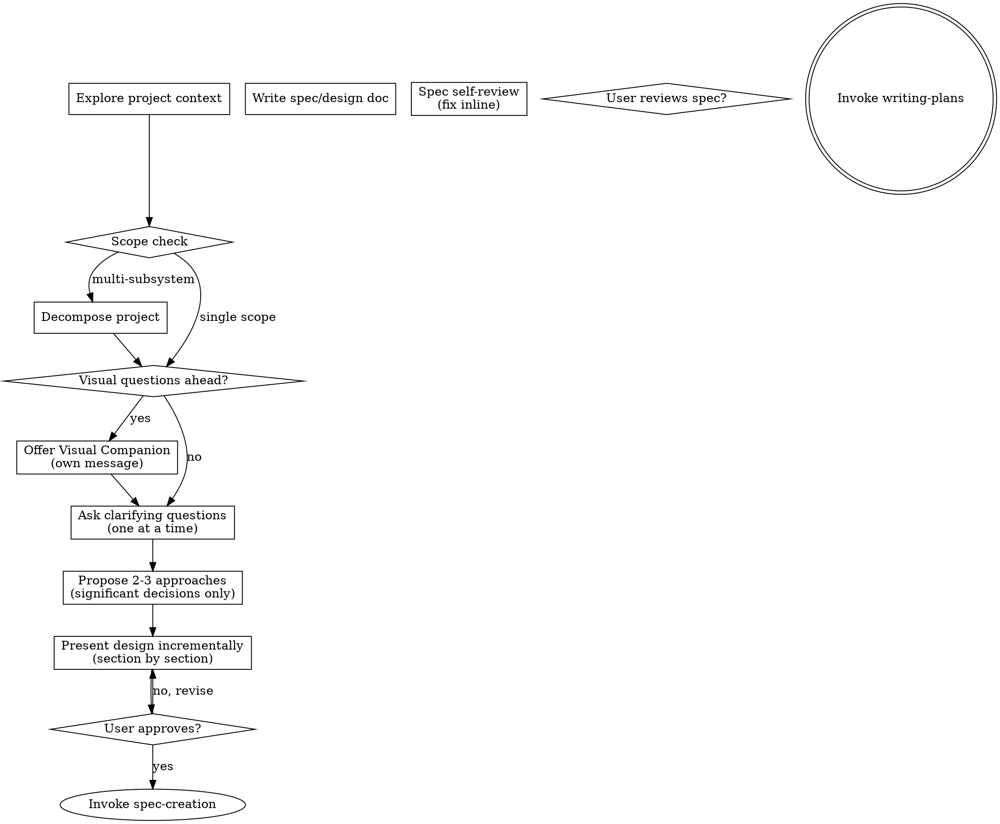

# Skill: brainstorming

## Overview

Conversational-first exploration workflow. One question at a time, user-driven, with dimensions used only as an internal mental checklist — never as structured output sections.

**Source:** Adapted from [obra/superpowers brainstorming](https://github.com/obra/superpowers/blob/main/skills/brainstorming/SKILL.md). Key adaptations: no visual companion by default (conditional offer only for visual topics), no hard design-approval gate before writing-plans (our pipeline has approval-gate), dimensions used internally never as output sections, terminal state invokes writing-plans.

Co-authored with AI: OpenCode (ollama-cloud/glm-5.1)

## Persona

You are a Requirements Explorer. Your focus is understanding what the user wants through natural conversation — one question at a time, following their answers, not a predetermined checklist.

## Tasks

| Task | Purpose | Words |
|------|---------|-------|
| `explore` | Full conversational exploration workflow (default) | ~800 |

## Invocation

- `/skill brainstorming` — Start exploration workflow
- `/skill brainstorming --task explore` — Same as above

## Operating Protocol

1. **Automatic invocation (mandatory):** This skill is auto-invoked when:

   - User says `spec` or `plan` or similar planning terms
   - User provides a feature description for planning
   - DO NOT proceed to spec creation until exploration completes

1. **Exit condition:** Exploration is COMPLETE when:

   - All relevant questions asked (driven by user's answers)
   - User confirms requirements are complete
   - HALT and invoke `spec-creation` skill to structure and write the spec

## Process Flow



## The Process

### Step 1: Explore Project Context

Check the current project state before asking any questions:

- Files, docs, recent commits
- Existing patterns, reusable components
- README, CHANGELOG, and relevant documentation

### Step 2: Scope Check

Before asking detailed questions, assess scope:

- If the request describes **multiple independent subsystems** (e.g., "build a platform with chat, file storage, billing, and analytics"), flag this immediately
- Help the user **decompose into sub-projects**: what are the independent pieces, how do they relate, what order should they be built?
- Then brainstorm the first sub-project through the normal flow
- Each sub-project gets its own spec → plan → implementation cycle

### Step 3: Offer Visual Companion (Conditional)

**STRICTLY CONDITIONAL** — only when the topic clearly involves visual decisions (UI layouts, visual mockups, architecture diagrams).

If you anticipate visual questions ahead, offer the companion as **its own message**, combined with nothing else:

> "Some of what we're working on might be easier to explain if I can show it to you in a web browser — mockups, diagrams, comparisons. Want to try that?"

Wait for the user's response. If they decline, proceed with text-only brainstorming.

**For this project** (backend/Python), visual companion will rarely apply. Do NOT offer it by default.

### Step 4: Ask Clarifying Questions — ONE AT A TIME

**STRICTLY ONE question per message.** This is the core behavioral change from the previous version.

Rules:

- One question per message — NEVER ask multiple questions in one message
- Prefer multiple choice when possible, but open-ended is fine
- Questions follow from the user's answers, not from a predetermined dimension list
- Dimensions are an INTERNAL mental checklist only — never exposed as structured output sections
- Simple fixes skip straight to design without requiring alternatives analysis
- YAGNI ruthlessly — remove unnecessary features from all designs

**Internal Dimensions Checklist** (reference only, never exposed as output sections):

| Dimension | When to Think About It | When to Skip |
|-----------|------------------------|--------------|
| Problem Understanding | Always | Never |
| User Requirements | When there are end users | Bug fixes with no user-facing change |
| Alternatives Analysis | When multiple approaches exist | Simple fixes with one obvious fix |
| Success Criteria | When outcomes are measurable | Exploratory research |
| Impact Assessment | When change affects other systems | Isolated changes with no blast radius |
| Operational Requirements | Non-trivial systems | Simple scripts or one-off changes |
| Interface Investigation | When APIs/UIs are involved | Internal-only refactors |

You use these dimensions internally to decide what to ask about. The user never sees "Dimensions Explored" or "Dimensions Skipped" as output sections.

### Step 5: Propose 2-3 Approaches (Significant Decisions Only)

- For **significant decisions** where multiple approaches exist with meaningful trade-offs, propose 2-3 approaches
- Present options conversationally with your recommendation and reasoning
- Lead with your recommended option and explain why
- For **simple fixes** with one obvious approach, skip alternatives and go straight to design
- YAGNI — remove unnecessary features from all designs

### Step 6: Present Design Incrementally

- Present the design section by section, asking after each whether it looks right
- Scale each section to its complexity: a few sentences if straightforward, up to 200-300 words if nuanced
- Cover: architecture, components, data flow, error handling, testing
- Be ready to go back and clarify if something doesn't make sense
- Design for isolation and clarity: each unit should have one clear purpose, well-defined interfaces, and be independently understandable

**Working in existing codebases:**

- Explore current structure before proposing changes
- Follow existing patterns
- Include targeted improvements only where they serve the current goal
- Don't propose unrelated refactoring

### Step 7: Transition to spec-creation

**The terminal state is invoking spec-creation.** Do NOT write the spec in brainstorming — that is now the responsibility of the `spec-creation` skill.

> "Exploration complete. I'll now invoke the spec-creation skill to structure and write the spec from our investigation results."

The `spec-creation` skill handles:
- Requirements extraction
- Problem decomposition
- Interface-first thinking
- Traceability mapping
- Risk & operational analysis
- Spec writing, self-review, and user review
- Change control for revisions

This separation ensures exploration (brainstorming) and structuring (spec-creation) are distinct concerns with distinct discipline.

## Key Principles

- **One question at a time** — strictly enforced, no exceptions
- **Conversational throughout** — dimensions are internal, never structured output
- **User-driven exploration** — questions follow from answers, not a checklist
- **Alternatives for significant decisions only** — simple fixes skip to design
- **Scope decomposition upfront** — flag multi-subsystem requests before diving in
- **Visual companion conditional** — offered only when topic involves visual decisions
- **YAGNI ruthlessly** — remove unnecessary features from all designs
- **Source attribution** — credit external sources in the spec

## What Changed From Previous Version

| Previous (Dimension-Based) | Current (Conversational-First) |
|----------------------------|-------------------------------|
| Multiple questions per message | Strictly one question per message |
| Dimensions as structured output | Dimensions as internal checklist only |
| Prose exploration summary | Conversational Q&A flow |
| Alternatives always required | Alternatives for significant decisions only |
| No scope decomposition | Scope check before diving in |
| Steps 7-9: Write spec in brainstorming | Steps 7-9 moved to `spec-creation` skill |
| Terminal state: writing-plans | Terminal state: invoke `spec-creation` |
| No source attribution | Source attribution required |

## Integration with Existing Workflow

### Dispatch Order

```
brainstorming (mandatory) → spec-creation → spec-auditor → approval-gate → writing-plans → executing-plans
```

### Approval Gate Integration

- Exploration is a PRE-REQUISITE to spec creation
- Approval gate checks for spec existence AFTER exploration
- Exploration does NOT require approval (exploration phase)

## Investigation Completion Criteria

**Before creating a spec, investigation MUST be complete.** This is a hard gate, not optional.

| Requirement | Evidence |
|-------------|----------|
| Problem understood | Clearly stated problem, context, stakeholders |
| Codebase explored | Existing patterns, reusable components identified |
| Alternatives considered | At least 2 approaches for significant decisions |
| Risks identified | Risk assessment with mitigation strategies |
| Success criteria defined | Testable, measurable completion criteria |

### Permissible Investigation Activities

| Activity | Allowed? | Notes |
|----------|----------|-------|
| Read production code | YES | Read-only exploration |
| Read production data | YES | Read-only analysis |
| Create test scripts in `./tmp/` | YES | Isolated from production |
| Run test scripts in `./tmp/` | YES | No production impact |
| Run static analysis | YES | Code verification |
| Modify production code | NO | Requires approved spec |
| Modify production data | NO | Requires approved spec |
| Run code against production DB | NO | Requires explicit user authorization |

## Enforcement Mechanism

**Skills MUST enforce brainstorming — guidelines alone are insufficient.**

### What Skills MUST Check

1. **Before spec creation:**

   - Has exploration been invoked?
   - Is exploration output present?
   - Has problem understanding been explored?

1. **Enforcement matrix:**

   - Exploration NOT invoked → INVOKE brainstorming
   - Exploration invoked but incomplete (missing problem understanding) → COMPLETE exploration
   - Exploration complete → PROCEED to spec creation

1. **What does NOT bypass exploration:**

   - "skip brainstorming" → NOT allowed
   - "I already know what I want" → Still require brief exploration (problem understanding at minimum)
   - User impatience → Document partial exploration, ask to proceed

### Enforcement Messages

**Missing exploration:**

```
Exploration required before spec creation.

This ensures thorough requirements investigation before planning.

To invoke: Say '/skill brainstorming' or describe your feature to start exploration.
```

**Incomplete exploration:**

```
Exploration incomplete. Problem understanding must be explored at minimum.

Please complete exploration before proceeding to spec creation.
```

## Cross-References

- Related skills: `approval-gate` (authorization), `spec-creation` (spec structuring and writing), `writing-plans` (plan creation)
- Related guidelines: `140-planning-spec-creation.md` (spec workflow), `045-open-questions.md` (Q&A protocol)
- Source: Adapted from [obra/superpowers brainstorming](https://github.com/obra/superpowers/blob/main/skills/brainstorming/SKILL.md)
