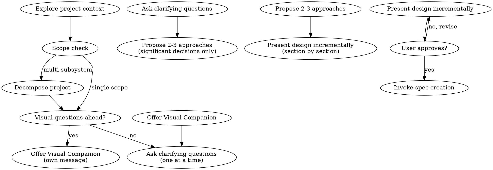

# Task: explore

Full conversational exploration workflow for requirements gathering before spec creation.

## Process Flow

## Step 1: Explore Project Context

Check current project state before asking any questions:

- Files, docs, recent commits
- Existing patterns, reusable components
- README, CHANGELOG, and relevant documentation

## Step 2: Scope Check

Before asking detailed questions, assess scope:

- If the request describes **multiple independent subsystems** (e.g., "build a platform with chat, file storage, billing, and analytics"), flag this immediately
- Help the user **decompose into sub-projects**: what are the independent pieces, how do they relate, what order should they be built?
- Then brainstorm the first sub-project through the normal flow
- Each sub-project gets its own spec → plan → implementation cycle

## Step 3: Offer Visual Companion (Conditional)

**STRICTLY CONDITIONAL** — only when the topic clearly involves visual decisions (UI layouts, visual mockups, architecture diagrams).

If you anticipate visual questions ahead, offer the companion as **its own message**, combined with nothing else:

> "Some of what we're working on might be easier to explain if I can show it to you in a web browser — mockups, diagrams, comparisons. Want to try that?"

Wait for the user's response. If they decline, proceed with text-only brainstorming.

**For this project** (backend/Python), visual companion will rarely apply. Do NOT offer it by default.

## Step 4: Ask Clarifying Questions — ONE AT A TIME

**STRICTLY ONE question per message.** This is the core behavioral change.

Rules:

- One question per message — NEVER ask multiple questions in one message
- Prefer multiple choice when possible, but open-ended is fine
- Questions follow from the user's answers, not from a predetermined dimension list
- Dimensions are an INTERNAL mental checklist only — never exposed as structured output sections
- Simple fixes skip straight to design without requiring alternatives analysis
- YAGNI ruthlessly — remove unnecessary features from all designs

**Internal Dimensions Checklist** (reference only, never exposed as output sections):

| Dimension | When to Think About It | When to Skip |
| -- | -- | -- |
| Problem Understanding | Always | Never |
| User Requirements | When there are end users | Bug fixes with no user-facing change |
| Alternatives Analysis | When multiple approaches exist | Simple fixes with one obvious fix |
| Success Criteria | When outcomes are measurable | Exploratory research |
| Impact Assessment | When change affects other systems | Isolated changes with no blast radius |
| Operational Requirements | Non-trivial systems | Simple scripts or one-off changes |
| Interface Investigation | When APIs/UIs are involved | Internal-only refactors |

You use these dimensions internally to decide what to ask about. The user never sees "Dimensions Explored" or "Dimensions Skipped" as output sections.

## Step 5: Propose 2-3 Approaches (Significant Decisions Only)

- For **significant decisions** where multiple approaches exist with meaningful trade-offs, propose 2-3 approaches
- Present options conversationally with your recommendation and reasoning
- Lead with your recommended option and explain why
- For **simple fixes** with one obvious approach, skip alternatives and go straight to design
- YAGNI — remove unnecessary features from all designs

## Step 6: Present Design Incrementally

- Present design section by section, asking after each whether it looks right
- Scale each section to its complexity: a few sentences if straightforward, up to 200-300 words if nuanced
- Cover: architecture, components, data flow, error handling, testing
- Be ready to go back and clarify if something doesn't make sense
- Design for isolation and clarity: each unit should have one clear purpose, well-defined interfaces, independently understandable

**Working in existing codebases:**

- Explore current structure before proposing changes
- Follow existing patterns
- Include targeted improvements only where they serve the current goal
- Don't propose unrelated refactoring

## Step 7: Transition to spec-creation

**The terminal state is invoking spec-creation.** Do NOT write the spec in brainstorming — that is the responsibility of the `spec-creation` skill.

> "Exploration complete. I'll now invoke the spec-creation skill to structure and write the spec from our investigation results."

The `spec-creation` skill handles:

- Requirements extraction, problem decomposition, interface-first thinking
- Traceability mapping, risk & operational analysis
- Spec writing, self-review, and user review
- Change control for revisions

This separation ensures exploration (brainstorming) and structuring (spec-creation) are distinct concerns with distinct discipline.
