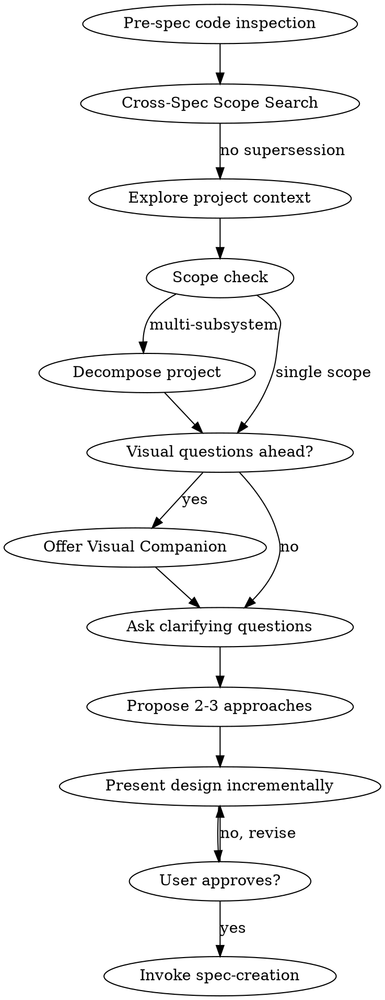

# Task: explore

## Purpose

Full conversational exploration workflow for requirements gathering before spec creation.

## Process Flow

## Operating Protocol

1. **Mandatory inspection first:** Run pre-spec code inspection before project context exploration
2. **Cross-spec scope search:** Check for overlapping specs/plans before proceeding
3. **One question at a time:** NEVER ask multiple questions in one message
4. **Autonomous scope decisions:** Agent determines single vs multi-task, NOT asks user
5. **Terminal step is spec-creation:** Exploration output feeds into spec-creation, never outputs spec directly

## Entry Criteria

- User wants to brainstorm/ideate/explore before spec creation
- Implementation request with existing code context

## Exit Criteria

- Design incrementally approved by user
- `spec-creation` skill invoked (terminal state)

## Procedure

### Step 0: Pre-Spec Code Inspection

**Route to:** `explore/pre-spec-inspection`

Mandatory checklist covering all six inspection items with tool-call evidence. Generates verification classification table.

### Step 0.5: Cross-Spec Scope Search

**Included in:** `explore/pre-spec-inspection`

Searches GitHub Issues for open specs/plans that may overlap with the proposed work. Reports FULL-SUPERSESSION, PARTIAL-OVERLAP, or CONFLICT-RISK if found.

### Steps 1-7: Project Context, Scope, Q&A, Design

**Route to:** `explore/exploration-workflow`

Explores project context, assesses scope (decomposing if multi-subsystem), conducts interactive Q&A with minimum turn threshold, proposes approaches for significant decisions, and presents design incrementally.

## Sub-Task Files

| Sub-Task | Purpose | Words |
| -- | -- | -- |
| `explore/pre-spec-inspection` | Mandatory code inspection with evidence artifacts | ≈850 |
| `explore/exploration-workflow` | Context exploration, scope assessment, interactive Q&A, design | ≈950 |

## Key Behavioral Constraints

| Constraint | Enforcement |
| -- | -- |
| One question per message | STRICT — never multiple questions |
| Minimum interactive turns | 2 turns minimum with substantial responses |
| Autonomous structural classification | Agent decides single vs multi-task |
| Confirmation per finding | Each major finding confirmed individually |
| Hard gate: spec-creation is terminal | Never output spec in chat |

## Context Required

- Related skill: `spec-creation` (terminal step)
- Related guidelines: `015-pre-spec-inspection.md`, `065-verification-honesty.md`, `091-incremental-build.md`