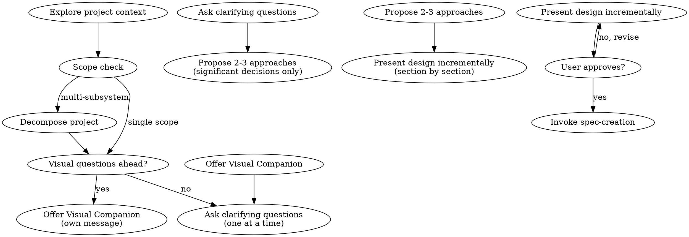

# Task: explore

Full conversational exploration workflow for requirements gathering before spec creation.

## Evidence Artifact Requirement for Exploration Checklist (MANDATORY)

**🚫 CRITICAL: Each item in the code inspection checklist (Step 0) and project context exploration (Step 1) MUST produce a tool-call artifact demonstrating the verification was performed. Assertions without tool-call evidence are VERIFICATION-GAP findings per `065-verification-honesty.md`.**

### Checklist Evidence Requirements

| Checklist Item | Verification Action | Tool Call | Problem Class |
| -- | -- | -- | -- |
| 1. Trace call paths | Verify actual import/call relationships for the target code | `srclight_get_callers(symbol_name="target")` and `srclight_get_callees(symbol_name="target")` | VERIFICATION-GAP |
| 2. Verify imports | Confirm actual import path matches assumed path | `srclight_get_symbol(name="module.symbol")` → check file location | VERIFICATION-GAP |
| 3. Detect dead code | Verify referenced symbols are actually used | `srclight_get_dependents(symbol_name="symbol")` → check if non-empty | MISSING-ELEMENT |
| 4. Verify format/protocol assumptions | Confirm data format, signature, or protocol matches assumption | `srclight_get_signature(name="function_name")` → compare with assumed | CONFLICTING |
| 5. Confirm architectural layer | Verify the target code is in the correct layer | `srclight_search_symbols(query="target", kind="function")` → check file path | STRUCTURE-VIOLATION |
| 6. Check for existing alternatives | Search for existing solutions to the stated problem | `srclight_search_symbols(query="feature description")` → check results | MISSING-ELEMENT |

### Exploration Context Evidence (Step 1)

| Context Item | Verification Action | Tool Call | Problem Class |
| -- | -- | -- | -- |
| Recent commits | Verify claimed recent activity actually exists | `srclight_recent_changes(n=10)` → confirm commits | VERIFICATION-GAP |
| Existing patterns | Verify referenced patterns exist in codebase | `srclight_search_symbols(query="pattern")` → confirm results | MISSING-ELEMENT |
| Documentation files | Verify claimed documentation exists | `glob(pattern="docs/**/*.md")` → confirm file paths | MISSING-ELEMENT |
| Configuration state | Verify project config matches assumptions | `read(filePath="pyproject.toml")` → confirm dependencies | CONFLICTING |

### Evidence Format

```
Check: [what was verified]
Tool: [tool call and parameters]
Result: [actual state found]
Classification: [STRUCTURE-VIOLATION|MISSING-ELEMENT|CONFLICTING|VERIFICATION-GAP|MISSING-TRACEABILITY]
Action: [auto-fix|conditional|flag-for-review]
```

### Classification on Failure

| Failure | Problem Class | Classification | Action |
| -- | -- | -- | -- |
| Call path assumption wrong | CONFLICTING | conditional | Re-map actual call path, update analysis |
| Import path assumed but not found | VERIFICATION-GAP | conditional | Search alternates, verify actual path |
| Dead code claimed as alive | MISSING-ELEMENT | auto-fix | Remove from affected-files list |
| Data format assumption wrong | CONFLICTING | flag-for-review | HALT — design may be based on wrong format |
| Architectural layer violation | STRUCTURE-VIOLATION | flag-for-review | HALT — redesign may be needed |
| Alternative solution already exists | MISSING-ELEMENT | conditional | Evaluate existing solution, adjust scope |

**These verifications are MANDATORY. Asserting "I checked" without tool-call artifacts is a VERIFICATION-GAP finding. Skipping them is a CRITICAL GUIDELINE VIOLATION.**

## Step 0.5: Cross-Spec Scope Search (MANDATORY)

**Before exploring project context, search for open specs/plans that may overlap with the proposed work.** This prevents creating duplicate or overlapping specs — the process gap that cross-spec overlap detection addresses at audit time should also be caught earlier, during exploration.

**Search procedure:**

1. **Query open issues:** Use `github_list_issues(owner, repo, state="open")` to retrieve all open issues.

2. **Filter for specs/plans:** Select issues with `[SPEC]`, `[PLAN]`, or `[SPEC-FIX]` title prefix.

3. **Extract scope signals from the user's request and compare:** For each open spec/plan:

   - Compare **file references**: Does the user's request mention the same files?
   - Compare **symbol references**: Does the user's request reference the same functions/classes?
   - Compare **concern boundaries**: Does the user's request address the same problem domain?

4. **Classify overlap using the four-tier model:**

   | Classification | Criteria | Action |
   | -- | -- | -- |
   | **FULL-SUPERSESSION** | An existing spec entirely covers the user's request | Report: "Existing spec #N covers this scope. Consider using that spec instead of creating a new one." |
   | **PARTIAL-OVERLAP** | Existing spec shares files/symbols but has different core concerns | Report: "Spec #N partially overlaps — shared files: \[list\]. Your new spec should be scoped to avoid the shared concern." |
   | **CONFLICT-RISK** | Existing spec modifies same files with conflicting intent | Report: "Spec #N conflicts with your request on \[files\]. Coordinate before creating." |
   | **INDEPENDENT** | No meaningful overlap | Proceed normally |

5. **Present findings to the user:** If any overlap is found (PARTIAL-OVERLAP, CONFLICT-RISK, or FULL-SUPERSESSION), inform the user before proceeding to Step 1. For FULL-SUPERSESSION, strongly recommend using the existing spec instead of creating a new one.

6. **If no overlap found:** Proceed silently to Step 1 — no need to report absence of overlap.

**This step prevents the process gap where overlapping specs are created that should have been detected earlier in the pipeline.**

## Process Flow

<!-- Original dot digraph below is superseded by the yaml+symbolic state machine block at the end of this file. -->



## Step 0: Pre-Spec Code Inspection (MANDATORY)

**Before exploring project context, complete the code inspection checklist in `015-pre-spec-inspection.md`.**

The checklist is MANDATORY when the spec or bug report proposes changes to existing code. It covers:

1. Trace actual call paths (who imports/calls the target?)
2. Verify imports (actual import path vs assumed)
3. Detect dead code (exported but unused symbols)
4. Verify format/protocol assumptions (data formats, signatures, protocols)
5. Confirm architectural layer (correct layer, no boundary violations)
6. Check for existing alternatives (already-solved concerns)

**Incomplete inspection = "Spec Without Investigation" critical violation** (see `000-critical-rules.md`).

Exempt: New greenfield features with no existing code interaction; trivial typos with no code interaction.

Address all six items. If an item is not applicable, state "N/A" with a one-sentence justification. Unmentioned items are violations.

## Step 1: Explore Project Context

Check current project state before asking any questions:

- Files, docs, recent commits
- Existing patterns, reusable components
- README, CHANGELOG, and relevant documentation
- **Reference code inspection results from Step 0** — do not re-investigate what was already verified

## Step 2: Scope Check

Before asking detailed questions, assess scope:

- If the request describes **multiple independent subsystems** (e.g., "build a platform with chat, file storage, billing, and analytics"), flag this immediately
- Help the user **decompose into sub-projects**: what are the independent pieces, how do they relate, what order should they be built?
- Then brainstorm the first sub-project through the normal flow
- Each sub-project gets its own spec → plan → implementation cycle

### Autonomous Structural Classification (MANDATORY)

Structural classification — single-task vs multi-task, phase decomposition — is an **agent intelligence concern**. Resolve it autonomously. Do NOT ask the user to make this decision.

**Ask the user when**: Multiple valid structures exist with meaningful trade-offs that only the user can resolve:

- 3+ subsystems with unclear boundaries or interdependencies
- Ambiguity about whether a subsystem is in-scope or out-of-scope
- Multiple valid decomposition orders where business priority is genuinely unclear

**Do NOT ask the user when**: One structure is clearly appropriate:

- Focused rule addition, single-file change, or bug fix with obvious scope → single-task, no question
- Request naturally decomposes into sequential phases with clear boundaries → multi-task with phased structure, no question
- The agent can determine scope from context, codebase, or the request itself → autonomous decision, no question

**Prohibited questions** (examples of what NOT to ask):

- "Should this be a single-task spec or broken into phases?"
- "Is this a small change or a big one?"
- "Do you want this as one spec or multiple?"

When in doubt, classify autonomously and state the classification as part of your design proposal. The user can override during design review — but the default is agent-resolved.

## Step 3: Offer Visual Companion (Conditional)

**STRICTLY CONDITIONAL** — only when the topic clearly involves visual decisions (UI layouts, visual mockups, architecture diagrams).

If you anticipate visual questions ahead, offer the companion as **its own message**, combined with nothing else:

> "Some of what we're working on might be easier to explain if I can show it to you in a web browser — mockups, diagrams, comparisons. Want to try that?"

Wait for the user's response. If they decline, proceed with text-only brainstorming.

**For this project** (backend/Python), visual companion will rarely apply. Do NOT offer it by default.

## Step 4: Ask Clarifying Questions — ONE AT A TIME

**STRICTLY ONE question per message.** This is the core behavioral change.

Rules:

- One question per message — NEVER ask multiple questions in one message
- Prefer multiple choice when possible, but open-ended is fine
- Questions follow from the user's answers, not from a predetermined dimension list
- Dimensions are an INTERNAL mental checklist only — never exposed as structured output sections
- Simple fixes skip straight to design without requiring alternatives analysis
- YAGNI ruthlessly — remove unnecessary features from all designs

### Per-Item Developer Confirmation Gate (MANDATORY)

After each significant finding discovered during Q&A, the agent MUST:

1. **Present the finding** — clearly state what was discovered (new requirement, architectural decision, risk, alternative, constraint)
2. **Ask for confirmation** — "Does this align with your intent?" or "Should this be included in the spec?"
3. **Wait for developer response** — the developer must confirm, modify, or reject before proceeding
4. **Track confirmation state** — confirmed items become part of the exploration output; unconfirmed items remain as open questions

**The agent MUST NOT accumulate unconfirmed findings and present them as a batch.** Each significant discovery is confirmed individually before the next question.

**Prohibited patterns:**

- Listing multiple findings then asking "Does this all look right?" — each finding needs its own confirmation
- Presenting a complete investigation result without having confirmed individual findings during the conversation
- Proceeding with a pre-determined list of requirements without checking each one against the developer's actual answers

**Turn tracking:** Each Q&A exchange (one agent question + one developer response with real content) counts as one interactive turn. The minimum threshold for proceeding to Step 5 is **2 interactive turns**. "Yes"/"No"/"OK" responses without substance do NOT count as interactive turns.

**Deep analysis expectation:** The agent should explore pros, cons, what-ifs, howevers, and counterpoints for each significant finding. Brainstorming is not merely listing requirements — it is a thorough back-and-forth considering both wanted and unwanted outcomes. The agent should:

- Challenge assumptions ("What happens if this fails?" / "What about when X occurs?")
- Explore edge cases and second-order effects
- Present counterarguments to its own proposals
- Consider unintended consequences
- Discuss trade-offs explicitly rather than presenting a single option as obvious

**Internal Dimensions Checklist** (reference only, never exposed as output sections):

| Dimension | When to Think About It | When to Skip |
| -- | -- | -- |
| Problem Understanding | Always | Never |
| User Requirements | When there are end users | Bug fixes with no user-facing change |
| Alternatives Analysis | When multiple approaches exist | Simple fixes with one obvious fix |
| Success Criteria | When outcomes are measurable | Exploratory research |
| Impact Assessment | When change affects other systems | Isolated changes with no blast radius |
| Operational Requirements | Non-trivial systems | Simple scripts or one-off changes |
| Interface Investigation | When APIs/UIs are involved | Internal-only refactors |

You use these dimensions internally to decide what to ask about. The user never sees "Dimensions Explored" or "Dimensions Skipped" as output sections.

## Step 5: Propose 2-3 Approaches (Significant Decisions Only)

- For **significant decisions** where multiple approaches exist with meaningful trade-offs, propose 2-3 approaches
- Present options conversationally with your recommendation and reasoning
- Lead with your recommended option and explain why
- For **simple fixes** with one obvious approach, skip alternatives and go straight to design
- YAGNI — remove unnecessary features from all designs

## Step 6: Present Design Incrementally

- Present design section by section, asking after each whether it looks right
- Scale each section to its complexity: a few sentences if straightforward, up to 200-300 words if nuanced
- Cover: architecture, components, data flow, error handling, testing
- Be ready to go back and clarify if something doesn't make sense
- Design for isolation and clarity: each unit should have one clear purpose, well-defined interfaces, independently understandable

**Working in existing codebases:**

- Explore current structure before proposing changes
- Follow existing patterns
- Include targeted improvements only where they serve the current goal
- Don't propose unrelated refactoring

⚠️ HARD GATE: Design approval is NOT spec completion.
The design you presented is raw input TO spec-creation.
You MUST invoke spec-creation to structure it into a formal spec.
Do NOT output the design as the final spec in chat.

## Step 7: Transition to spec-creation

**The terminal state is invoking spec-creation.** Do NOT write the spec in brainstorming — that is the responsibility of the `spec-creation` skill.

> "Exploration complete. I'll now invoke the spec-creation skill to structure and write the spec from our investigation results."

The `spec-creation` skill handles:

- Requirements extraction, problem decomposition, interface-first thinking
- Traceability mapping, risk & operational analysis
- Spec writing, self-review, and user review
- Change control for revisions

This separation ensures exploration (brainstorming) and structuring (spec-creation) are distinct concerns with distinct discipline.

````yaml+symbolic
schema_version: "1.0"
last_updated: "2026-04-16T12:00:00Z"
rules: []
state_machines:
  - id: brainstorming-flow
    states:
      - "Pre-spec code inspection"
      - "Cross-Spec Scope Search"
      - "Explore project context"
      - "Scope check"
      - "Decompose project"
      - "Visual questions ahead?"
      - "Offer Visual Companion"
      - "Ask clarifying questions"
      - "Propose 2-3 approaches"
      - "Present design incrementally"
      - "User approves?"
      - "Invoke spec-creation"
      - "HALT: batch-dump detected"
      - "HALT: insufficient interactive turns"
      - "HALT: full supersession detected"
    start_state: "Pre-spec code inspection"
    transitions:
      - from: "Pre-spec code inspection"
        to: "Cross-Spec Scope Search"
        guard: "checklist_completed == true OR exempt == true"
        action: PROCEED
      - from: "Pre-spec code inspection"
        to: "HALT"
        guard: "checklist_completed == false AND exempt == false"
        action: WARN
      - from: "Cross-Spec Scope Search"
        to: "Explore project context"
        guard: "overlap_class != 'FULL-SUPERSESSION'"
        action: REPORT_OVERLAP_IF_FOUND
      - from: "Cross-Spec Scope Search"
        to: "HALT: full supersession detected"
        guard: "overlap_class == 'FULL-SUPERSESSION'"
        action: RECOMMEND_EXISTING_SPEC
      - from: "Explore project context"
        to: "Scope check"
        guard: "context_gathered == true"
        action: PROCEED
      - from: "Scope check"
        to: "Decompose project"
        guard: "scope_type == 'multi-subsystem'"
        action: PROCEED
      - from: "Scope check"
        to: "Visual questions ahead?"
        guard: "scope_type == 'single'"
        action: PROCEED
      - from: "Decompose project"
        to: "Visual questions ahead?"
        guard: "decomposition_complete == true"
        action: PROCEED
      - from: "Visual questions ahead?"
        to: "Offer Visual Companion"
        guard: "visual_questions == true"
        action: PROCEED
      - from: "Visual questions ahead?"
        to: "Ask clarifying questions"
        guard: "visual_questions == false"
        action: PROCEED
      - from: "Offer Visual Companion"
        to: "Ask clarifying questions"
        guard: "companion_offered == true"
        action: PROCEED
      - from: "Ask clarifying questions"
        to: "Ask clarifying questions"
        guard: "protocol_compliance == true AND min_interactive_turns < 2"
        action: CONTINUE_QA
      - from: "Ask clarifying questions"
        to: "HALT: batch-dump detected"
        guard: "consecutive_agent_messages_without_developer_response == true OR multiple_findings_without_confirmation == true"
        action: HALT_REQUIRE_INTERACTION
      - from: "Ask clarifying questions"
        to: "HALT: insufficient interactive turns"
        guard: "protocol_compliance == false"
        action: HALT_REQUIRE_PROTOCOL_COMPLIANCE
      - from: "Ask clarifying questions"
        to: "Propose 2-3 approaches"
        guard: "clarification_complete == true AND protocol_compliance == true AND min_interactive_turns >= 2"
        action: PROCEED
      - from: "Propose 2-3 approaches"
        to: "Present design incrementally"
        guard: "approach_selected == true"
        action: PROCEED
      - from: "Present design incrementally"
        to: "User approves?"
        guard: "design_presented == true"
        action: PROCEED
      - from: "User approves?"
        to: "Present design incrementally"
        guard: "user_approved == false"
        action: WARN
      - from: "User approves?"
        to: "Invoke spec-creation"
        guard: "user_approved == true"
        action: INVOKE(spec-creation)
    ```

## Top-Down Analysis Output (Per `091-incremental-build.md`)

When exploration reaches the point where requirements are clear enough for a spec, the exploration output MUST include a top-down decomposition section that feeds into `writing-plans --task create`. This section is produced during the `explore` task and attached to the spec's brainstorming output.

### Scope Classification

Determine the scope before producing decomposition output:

| Scope | Top-Down Starts From | Input Artifact |
|-------|---------------------|---------------|
| GREENFIELD | Project spec (no existing code) | New project specification |
| NEW_FEATURE | Existing code + feature request | Feature spec with acceptance criteria |
| FIX | Existing code + bug report | Bug report with root cause analysis |
| ENHANCEMENT | Existing code + change request | Enhancement spec with change scope |

### Required Top-Down Output

The exploration output MUST include:

1. **Item enumeration** — List every implementation unit as a discrete item with name, scope, and deliverable
2. **Dependency graph** — Show which items depend on which, producing a dependency order
3. **Acceptance criteria per item** — Each item has testable criteria that can be verified independently
4. **Concern boundary annotations** — Flag items that cross architectural concerns with explicit transition notes

This structure feeds directly into `writing-plans --task create` for bottom-up design per item. The top-down decomposition is verified at the approval gate (`approval-gate --task verify-authorization` Step 4.5).

### Verification-Mechanics Prompting (Conversational)

When a requirement that will produce a success criterion is identified during Q&A, the agent's next question should naturally follow from the developer's answer by prompting about verifiability. This is NOT a separate checklist step — it is a conversational enrichment of the per-item confirmation gate.

**Pattern:** After the developer confirms a requirement, the agent adds a verification-mechanics follow-up:

- Developer: "The script should exit with an error code when validation fails."
- Agent: "Got it. What would you check to confirm this works as intended? For instance, would you run a specific command and check for a particular exit code?"

This prompting is conversational — it follows from the developer's answer about a requirement, not from a predetermined checklist. The goal is to ensure verification mechanics are considered early, preventing the later gap where the write task has to invent verification methods from scratch.

**The verification-mechanics question follows from the developer's answer** — it does not precede it, and it is not asked about every requirement, only about requirements that will produce success criteria.
````
