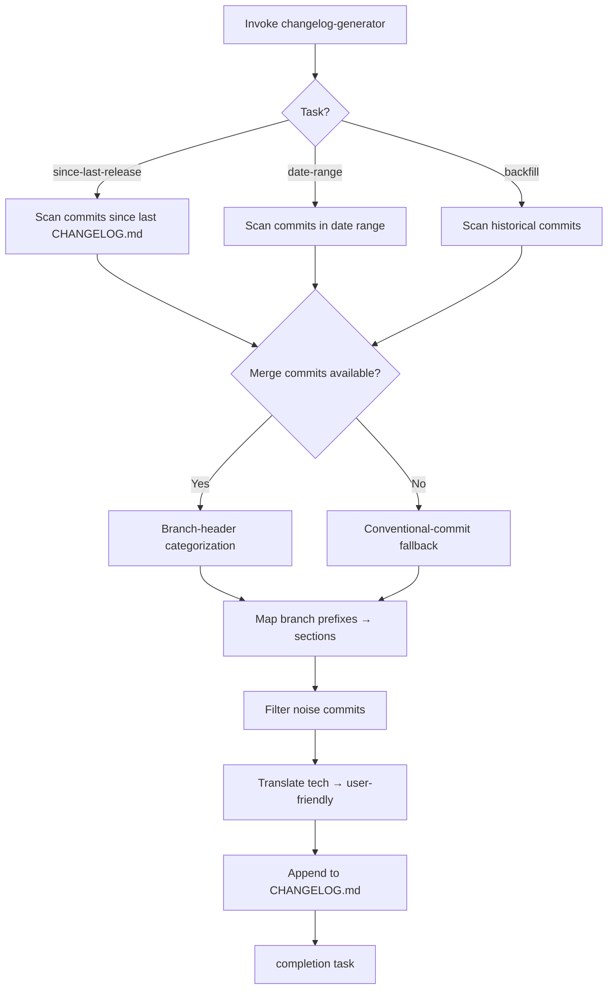

# Skill: changelog-generator

## Workflow Diagram



This skill transforms technical git commits into polished, user-friendly changelogs that your customers and users will actually understand and appreciate.

## Prerequisites

- **Git**: Required for reading commit history
- **Repository access**: Must be run from a git repository root
- **Optional**: Custom changelog style guide (CHANGELOG_STYLE.md)

## Tasks

| Task | Purpose | Words |
| -- | -- | -- |
| `since-last-release` | Generate changelog for commits since last CHANGELOG.md update | ≈170 |
| `date-range` | Generate changelog for commits within specific date range | ≈90 |
| `backfill` | One-time historical backfill of missing changelog entries | ≈120 |
| `completion` | Ensure mandatory terminal-state dispatch occurred; remediate if not; report status | ≈200 |

## Invocation

- `/skill changelog-generator --task since-last-release` - Normal PR workflow (after PR creation)
- `/skill changelog-generator --task date-range --from DATE --to DATE` - Weekly/monthly updates
- `/skill changelog-generator --task backfill` - One-time historical catchup
- `/skill changelog-generator --task completion` - Invoke when workflow halts at any point
- `/skill changelog-generator` - Overview only

## Sub-Agent Tasks

### Dispatch Audit Table

| Sub-Agent Task | Trigger Condition | Scope of Context | Exclusions | Inline Work? |
|---|---|---|---|---|
| `since-last-release` | When generating changelog since last release | Repository path, branch name, github.owner, github.repo | Implementation context, agent memory | NO |
| `date-range` | When generating changelog for date range | Repository path, date range, github.owner, github.repo | Implementation context, agent memory | NO |
| `backfill` | When performing historical backfill | Repository path, github.owner, github.repo | Implementation context, agent memory | NO |
| `completion` | When workflow halts at any point | Workflow state, status | Implementation context, agent memory | NO |

## When to Use This Skill

- Preparing release notes for a new version
- Creating weekly or monthly product update summaries
- Documenting changes for customers
- Writing changelog entries for app store submissions
- Generating update notifications
- Creating internal release documentation
- Maintaining a public changelog/product updates page

## Branch-Header-Based Workflow

The `since-last-release` task uses **merge commit branch headers** as the primary categorization mechanism, with conventional commit prefixes as a fallback.

### Branch Prefix → Category Mapping

| Branch Prefix | Changelog Section |
| -- | -- |
| `spec/` | Own `### <branch-name>` header (primary) |
| `feature/` | `### Added` |
| `fix/` | `### Fixed` |
| `hotfix/` | `### Fixed` |
| `chore/` | `### Changed` |
| `doc/` | `### Changed` |
| `skill/` | `### Changed` |

### How It Works

1. Merge commits contain the branch name (e.g., `from Owner/spec/306-changelog-optimization`)
2. The branch prefix maps to a changelog section
3. `spec/` branches get their own `### spec/<branch-name>` subsection header
4. Other prefixes map to standard sections (`### Added`, `### Fixed`, `### Changed`)
5. When no merge commit exists (squash merge, direct commit), fall back to conventional commit prefix parsing

### Fallback Behavior

When a commit has no merge commit parent (squash merges, direct pushes):

1. Parse the commit message for conventional commit prefixes (`feat:`, `fix:`, etc.)
2. Map to the appropriate standard section
3. Use the commit subject as the entry description

### Examples

**Branch-header-based generation** (merge commits available):

```markdown
## [Unreleased]

### spec/306-changelog-optimization

- **Branch Header Extraction** (#306) - Changelog now uses merge commit branch names to categorize entries instead of parsing individual commits.
- **Incremental Updates** (#306) - since-last-release only appends new entries, never rewrites the entire [Unreleased] section.

### spec/698-fix-phase1-schema-gaps

- **FK Cascade** (#698) - Fixed FK violation crash on record deletion.
```

**Fallback generation** (no merge commits, conventional commits only):

```markdown
## [Unreleased]

### Added

- **Feature Name** - Description of new feature.

### Fixed

- **Bug Fix** - Description of what was fixed.
```

## What This Skill Does

1. **Scans Git History**: Analyzes commits from a specific time period or between versions
2. **Categorizes Changes**: Groups commits into logical categories (features, improvements, bug fixes, breaking changes, security)
3. **Translates Technical → User-Friendly**: Converts developer commits into customer language
4. **Formats Professionally**: Creates clean, structured changelog entries
5. **Filters Noise**: Excludes internal commits (refactoring, tests, etc.)
6. **Follows Best Practices**: Applies changelog guidelines and your brand voice

## How to Use

### Basic Usage

From your project repository:

```
Create a changelog from commits since last release
```

```
Generate changelog for all commits from the past week
```

```
Create release notes for version 2.5.0
```

### With Specific Date Range

```
Create a changelog for all commits between March 1 and March 15
```

### With Custom Guidelines

```
Create a changelog for commits since v2.4.0, using my changelog 
guidelines from CHANGELOG_STYLE.md
```

## Example

**User**: "Create a changelog for commits from the past 7 days"

**Output**:

```markdown
# Updates - Week of March 10, 2024

### spec/team-workspaces

- **Team Workspaces** (#110) - Create separate workspaces for different projects. Invite team members and keep everything organized.

### spec/keyboard-shortcuts

- **Keyboard Shortcuts** (#111) - Press ? to see all available shortcuts. Navigate faster without touching your mouse.

### Changed

- **Faster Sync** (from `chore/sync-perf`) - Files now sync 2x faster across devices.
- **Better Search** (from `chore/search-improvement`) - Search now includes file contents, not just titles.

### Fixed

- **Large Image Upload** (from `fix/image-upload`) - Fixed issue where large images wouldn't upload.
- **Timezone Confusion** (from `hotfix/timezone-scheduled-posts`) - Resolved timezone confusion in scheduled posts.
```

**Inspired by:** Manik Aggarwal's use case from Lenny's Newsletter

## Worktree Mode

When invoked from a worktree context (`worktree.path` is set):

- ALL `bash` tool calls MUST use `workdir` parameter set to `worktree.path`
- ALL `read`/`write`/`edit`/`glob`/`grep` tool calls MUST prefix `filePath`/`path` with `worktree.path/`
- `git` commands run from the worktree directory, NOT the main repo
- `CHANGELOG.md` path MUST be prefixed with `worktree.path/`

**Verification guard:** Before any git operation, run:
```bash
git rev-parse --show-toplevel
```
If the output does NOT match `worktree.path`, HALT and report: "Worktree mismatch — skill is executing in the wrong directory."

If `worktree.path` is NOT set, operate normally from the project root.

## Cross-Reference Verification (MANDATORY)

**🚫 CRITICAL: Each cross-reference must be verified against actual skill content. Assertions without verification are VERIFICATION-GAP findings.**

| Reference | Verification | Finding Class |
| -- | -- | -- |
| `git-workflow` in Cross-References section | File exists at `.opencode/skills/git-workflow/SKILL.md` | MISSING-TRACEABILITY if missing |
| Task table entry `since-last-release` | File exists at `.opencode/skills/changelog-generator/tasks/since-last-release.md` | MISSING-TRACEABILITY if missing |
| Task table entry `date-range` | File exists at `.opencode/skills/changelog-generator/tasks/date-range.md` | MISSING-TRACEABILITY if missing |
| Task table entry `backfill` | File exists at `.opencode/skills/changelog-generator/tasks/backfill.md` | MISSING-TRACEABILITY if missing |
| `git-workflow` commit/branch workflow behavior | Matches actual SKILL.md: branch management and commit workflow | CONFLICTING if mismatched |

**Verification Procedure:**

Before invoking any cross-referenced skill:
1. `ls .opencode/skills/<skill-name>/SKILL.md` → EVIDENCE: file exists or MISSING-TRACEABILITY
2. `grep -c "<task-name>" .opencode/skills/<skill-name>/SKILL.md` → EVIDENCE: task referenced or MISSING-TRACEABILITY
3. Compare described behavior with actual content → EVIDENCE: match or CONFLICTING

**Classification on failure:**

| Failure | Problem Class | Classification | Action |
| -- | -- | -- | -- |
| Referenced skill file missing | MISSING-TRACEABILITY | flag-for-review | Cannot verify cross-reference |
| Referenced task file missing | MISSING-TRACEABILITY | flag-for-review | Task may have been renamed |
| Described behavior mismatches | CONFLICTING | flag-for-review | Cross-reference may be stale |
| Invocation mismatch | CONFLICTING | flag-for-review | Skill may have been updated |

## Cross-References

- Related skills: `git-workflow` (branch management, commit workflow)
- Related guidelines: `000-critical-rules.md` (no vibe coding, scope autonomy)

## Tips

- Run from your git repository root
- Specify date ranges for focused changelogs
- Use your CHANGELOG_STYLE.md for consistent formatting
- Review and adjust the generated changelog before publishing
- Save output directly to CHANGELOG.md

## Related Use Cases

- Creating GitHub release notes
- Writing app store update descriptions
- Generating email updates for users
- Creating social media announcement posts

**⚠️ COMPLETION GUARANTEE:** If this workflow halts at ANY point — including error, failure, or early termination — you MUST invoke `--task completion` before halting. The completion subtask ensures mandatory steps are never skipped. It is idempotent and safe to invoke multiple times.

```yaml+symbolic
schema_version: "2.0"
last_updated: "2026-04-25T00:00:00Z"
rules:
  - id: changelog-gen-001
    title: "Changelog entries MUST reference actual commit/PR sources"
    conditions:
      all:
        - "changelog_entry_created == true"
        - "entry_has_source_reference == false"
    actions:
      - HALT
      - REPORT("changelog entry lacks commit/PR source reference")
    conflicts_with: []
    requires: []
    triggers: []
    source: "changelog-generator/SKILL.md §Branch-Header-Based Workflow"

  - id: changelog-gen-002
    title: "Branch-header-based categorization is primary; conventional commits are fallback"
    conditions:
      all:
        - "merge_commit_available == true"
    actions:
      - USE_BRANCH_HEADER_CATEGORIZATION
    conflicts_with: []
    requires: []
    triggers: []
    source: "changelog-generator/SKILL.md §Fallback Behavior"

tasks:
  - id: since-last-release
    skill: changelog-generator
    preconditions:
      - "git_repo_available == true"
      - "CHANGELOG.md_exists == true"
    postconditions:
      - "changelog_entries_appended == true"
      - "all_entries_have_source_references == true"
    mandatory: true
    bypass_violation: "changelog entries lack source references"
    source: "changelog-generator/SKILL.md §Tasks"

  - id: date-range
    skill: changelog-generator
    preconditions:
      - "git_repo_available == true"
      - "from_date_specified == true"
      - "to_date_specified == true"
    postconditions:
      - "changelog_generated_for_range == true"
      - "all_entries_have_source_references == true"
    mandatory: false
    bypass_violation: "changelog entries lack source references"
    source: "changelog-generator/SKILL.md §Tasks"

  - id: backfill
    skill: changelog-generator
    preconditions:
      - "git_repo_available == true"
      - "missing_changelog_entries_detected == true"
    postconditions:
      - "historical_entries_backfilled == true"
      - "all_entries_have_source_references == true"
    mandatory: false
    bypass_violation: "backfill entries lack source references"
    source: "changelog-generator/SKILL.md §Tasks"

decomposition: []
gates:
  - id: changelog-source-gate
    type: postcondition
    check: "every changelog entry references a commit SHA, PR number, or branch name"
    on_fail: HALT
    source: "changelog-generator/SKILL.md §Cross-Reference Verification"
evidence_artifacts:
  - "CHANGELOG.md with source-referenced entries"
  - "git log output used for entry generation"
```
