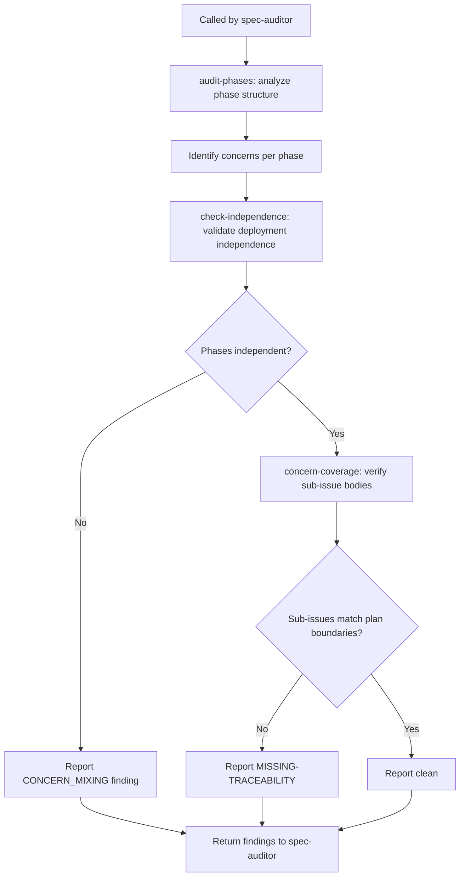

# Skill: concern-separation-auditor

## Overview

Concern Separation Auditor analyzes spec phase structures to identify deployment independence, risk profile, and blast radius issues. Reports findings to the agent for decision-making — does NOT auto-fix.

## Workflow Diagram



**Core v2 shift:** Report-only. Findings are presented to the agent, who decides whether to apply them given the context. No longer invoked directly — called by spec-auditor orchestrator when relevant.

**Single Concern Principle (SCP):** The authoritative universal rule for concern separation is defined in `000-critical-rules.md` §Single Concern Principle. SCP applies to ALL artifacts the agent produces (issues, commits, PRs, plans, specs, comments, sub-agents). This skill enforces SCP as it applies to spec/plan phase structure — it is a domain-specific instance of the universal rule, not a substitute for it.

## Tasks

| Task | Purpose | Words |
|------|---------|-------|
| `audit-phases` | Analyze phase structure for concern quality | ≈400 |
| `check-independence` | Validate deployment independence between phases | ≈300 |
| `concern-coverage` | Verify sub-issue bodies reflect Plan concern boundaries | ≈350 |

## Invocation

**This skill is NOT invoked directly.** It is called by the spec-auditor orchestrator via `/skill spec-auditor --issue N --task concerns`.

If invoked directly (deprecated, but still works):
- `/skill concern-separation-auditor --issue N` — Audit (report-only mode)

## Sub-Agent Tasks

### Dispatch Audit Table

| Sub-Agent Task | Trigger Condition | Scope of Context | Exclusions | Inline Work? |
|---|---|---|---|---|
| `audit-phases` | When analyzing phase structure for concern quality | Issue number, plan body, github.owner, github.repo | Implementation context, agent memory | NO |
| `check-independence` | When validating deployment independence between phases | Issue number, phase boundaries, github.owner, github.repo | Implementation context, agent memory | NO |
| `concern-coverage` | When verifying sub-issue bodies reflect Plan concern boundaries | Issue number, sub-issue list, github.owner, github.repo | Implementation context, agent memory | NO |

## Report-Only Model

**All findings are reported, NOT auto-applied.**

Previous versions auto-fixed BOILERPLATE-TITLE and phase splits. v2 reports findings and lets the agent decide:

- A BOILERPLATE-TITLE rename might be wrong for the specific spec
- A concern split might break an intentionally grouped phase
- The agent has full context; this subtask doesn't

**Report format:**
```
Finding: [BOILERPLATE-TITLE|CONCERN_MIXING|DEPENDENCY_REVERSAL|HIGH_RISK_GROUPING] - [summary]
Location: [phase/step]
Context: [why this matters for this spec]
Recommendation: [suggested change, if obvious]
Severity: [HIGH|MEDIUM|LOW]
```

## Concern-Based Analysis (NOT Rigid Template)

This skill analyzes ACTUAL concerns, not static templates.

**What this is NOT:**
- NOT a rigid DB→Repo→BL→UI template
- NOT a mandatory ordering
- NOT applying patterns blindly

**What this IS:**
- Analyzes deployment independence for each step
- Analyzes risk profile (HIGH/MEDIUM/LOW)
- Analyzes blast radius
- Groups steps by ACTUAL concern boundaries

**Different project structures:**

| Project Type | Typical Concerns | Notes |
|--------------|------------------|-------|
| Stateless service | Config → API → Tests | No DB, no UI |
| CLI tool | Args → Core → Output | Deployment is reinstall |
| Frontend-only | Components → State → Tests | No backend |
| Infrastructure | Setup | Crosses all layers, ONE concern |
| Monolith | Schema → API → UI | May not have repository layer |

## Key Differences from v1

| v1 (Auto-Fix) | v2 (Report-Only) |
|----------------|-------------------|
| Auto-fixes BOILERPLATE-TITLE | Reports BOILERPLATE-TITLE finding |
| Auto-splits phases | Reports concern mixing recommendation |
| Invoked directly via `/skill concern-separation-auditor` | Invoked via spec-auditor `--task concerns` |
| Standalone skill | Subtask within orchestrator |
| `--interactive` mode for human review | Always report-only |

## Cross-Reference Verification (MANDATORY)

**🚫 CRITICAL: Each cross-reference must be verified against actual skill content. Assertions without verification are VERIFICATION-GAP findings.**

| Reference | Verification | Finding Class |
| -- | -- | -- |
| `spec-auditor` in Cross-References (orchestrated by) | File exists at `.opencode/skills/spec-auditor/SKILL.md` | MISSING-TRACEABILITY if missing |
| `writing-plans` in Cross-References section | File exists at `.opencode/skills/writing-plans/SKILL.md` | MISSING-TRACEABILITY if missing |
| `programming-principles` in Cross-References section | File exists at `.opencode/skills/programming-principles/SKILL.md` | MISSING-TRACEABILITY if missing |
| Task table entry `audit-phases` | File exists at `.opencode/skills/concern-separation-auditor/tasks/audit-phases.md` | MISSING-TRACEABILITY if missing |
| Task table entry `check-independence` | File exists at `.opencode/skills/concern-separation-auditor/tasks/check-independence.md` | MISSING-TRACEABILITY if missing |
| Task table entry `concern-coverage` | File exists at `.opencode/skills/concern-separation-auditor/tasks/concern-coverage.md` | MISSING-TRACEABILITY if missing |
| `spec-auditor` orchestration behavior | Matches actual SKILL.md: `concerns` subtask delegates to this skill | CONFLICTING if mismatched |
| `writing-plans` clean-room behavior | Matches actual SKILL.md: `clean-room` task for fidelity generation | CONFLICTING if mismatched |
| `programming-principles` principle definitions | Matches actual SKILL.md: SoC and Blast Radius principles defined there | CONFLICTING if mismatched |
| `spec-auditor` ground-truth subtask | File exists at `.opencode/skills/spec-auditor/tasks/ground-truth.md` | MISSING-TRACEABILITY if missing |
| `065-verification-honesty.md` metadata extension | Guideline contains "Metadata Verification Extension" section | CONFLICTING if missing |

**Verification Procedure:**

Before invoking any cross-referenced skill:
1. `ls .opencode/skills/<skill-name>/SKILL.md` → EVIDENCE: file exists or MISSING-TRACEABILITY
2. `grep -c "<task-name>" .opencode/skills/<skill-name>/SKILL.md` → EVIDENCE: task referenced or MISSING-TRACEABILITY
3. Compare described behavior with actual content → EVIDENCE: match or CONFLICTING

**Classification on failure:**

| Failure | Problem Class | Classification | Action |
| -- | -- | -- | -- |
| Referenced skill file missing | MISSING-TRACEABILITY | flag-for-review | Cannot verify cross-reference |
| Referenced task file missing | MISSING-TRACEABILITY | flag-for-review | Task may have been renamed |
| Described behavior mismatches | CONFLICTING | flag-for-review | Cross-reference may be stale |
| Invocation mismatch | CONFLICTING | flag-for-review | Skill may have been updated |
| Ground-truth subtask missing | MISSING-TRACEABILITY | flag-for-review | spec-auditor may not have Phase 1 changes |

**Adversarial cross-reference:** The `spec-auditor --task ground-truth` subtask (Phase 1 of spec #827) performs adversarial verification of metadata claims including code reference existence. When this skill's boundary claims reference code that may not exist or may have moved, ground-truth verification ensures the references are valid. See `065-verification-honesty.md` → "Metadata Verification Extension" for the extended principle.

## Live Verification: Code Boundary Claims (MANDATORY)

**🚫 CRITICAL: When this skill makes boundary claims about code (concern mixing, layer violations, dependency directions), it MUST verify against actual code. Boundary claims without code verification are VERIFICATION-GAP findings per `065-verification-honesty.md`.**

| Boundary Claim | Verification Action | Tool Call | Problem Class |
|---------------|-------------------|-----------|---------------|
| "Phase mixes concerns X and Y" | Verify actual code in claimed files touches both concerns | `srclight_get_symbol(name="symbol")` → check file contents | VERIFICATION-GAP |
| "Deployment independence violated" | Verify actual cross-phase imports/dependencies exist | `srclight_get_callers(symbol_name="symbol")` or `srclight_get_callees(symbol_name="symbol")` | CONFLICTING |
| "Blast radius exceeds phase boundary" | Verify actual code dependencies span claimed phases | `srclight_get_dependents(symbol_name="symbol")` | VERIFICATION-GAP |
| "Architectural layer violation" | Verify code exists in the claimed layer | `srclight_search_symbols(query="target", kind="function")` → check file paths | STRUCTURE-VIOLATION |

**Evidence format:**

```
Check: [what was verified]
Tool: [tool call and parameters]
Result: [actual state found]
Classification: [STRUCTURE-VIOLATION|MISSING-ELEMENT|CONFLICTING|VERIFICATION-GAP|MISSING-TRACEABILITY]
Action: [auto-fix|conditional|flag-for-review]
```

**Classification on failure:**

| Failure | Problem Class | Classification | Action |
| -- | -- | -- | -- |
| Claimed mixing not found in code | VERIFICATION-GAP | flag-for-review | Boundary claim may be incorrect |
| Cross-phase dependency not found | CONFLICTING | flag-for-review | Independence claim may be correct |
| Symbol not found at claimed layer | MISSING-ELEMENT | conditional | Search alternates, verify actual location |
| File path assumption wrong | STRUCTURE-VIOLATION | auto-fix | Update finding with actual path |

## Cross-References

- **Authoritative rule:** `000-critical-rules.md` §Single Concern Principle — the universal SCP rule that this skill enforces for phase structure
- Orchestrated by: `spec-auditor` (via `concerns` subtask, including `ground-truth` adversarial verification)
- Related skills: `spec-auditor` (orchestrator), `writing-plans` (clean-room for fidelity), `programming-principles` (principle definitions for SoC and Blast Radius — this subtask checks structural separation, that skill defines the underlying principles)
- Related guidelines: `000-critical-rules.md` (SCP universal rule and auditor enforcement), `065-verification-honesty.md` (metadata verification extension), `142-planning-archive-workflow.md`

Co-authored with AI: <AgentName> (<ModelId>)

## Symbolic Engine Integration

**Optional pre-step:** Before auditing, invoke the symbolic analysis engine for formal evidence:

```bash
./.opencode/tools/symbolic flow
```

- `sym-flow`: Builds a networkx DiGraph from rule triggers/requires and detects activation graph anomalies. Cross-concern triggers (edges linking rules in different concern areas) indicate potential concern mixing.

Results are used as **evidence** (not verdict) — they supplement prose-only analysis with formal activation graph showing cross-concern dependencies.

**Graceful degradation:** If the engine is unavailable or produces no results, fall back to prose-only analysis. Do NOT block the audit if the engine fails.

```yaml+symbolic
schema_version: "2.0"
last_updated: "2026-04-26T00:00:00Z"
rules:
  - id: concern-separation-001
    title: "Concern analysis must verify against actual code"
    conditions:
      all:
        - "boundary_claim_made == true"
        - "code_verification_performed == false"
    actions:
      - HALT
      - VERIFY_AGAINST_CODE
    conflicts_with: []
    requires: []
    triggers: []
    source: "concern-separation-auditor/SKILL.md §Live Verification"

  - id: concern-separation-002
    title: "SCP is the authoritative universal concern-separation rule"
    conditions:
      all:
        - "scp_violation_detected == true"
    actions:
      - FLAG
      - REPORT(single_concern_principle_violation)
    conflicts_with: []
    requires: [critical-rules-042]
    triggers: [spec-auditor, concern-separation-auditor]
    source: "concern-separation-auditor/SKILL.md §Single Concern Principle"

tasks:
  - id: audit-phases
    skill: concern-separation-auditor
    preconditions: ["plan_available == true"]
    postconditions: ["phase_audit_complete == true"]
    mandatory: true
    bypass_violation: "CRITICAL: Skipping Phase Audit"
    source: "concern-separation-auditor/SKILL.md"

  - id: check-independence
    skill: concern-separation-auditor
    preconditions: ["phases_identified == true"]
    postconditions: ["independence_checked == true"]
    mandatory: true
    bypass_violation: "CRITICAL: Skipping Independence Check"
    source: "concern-separation-auditor/SKILL.md"

  - id: concern-coverage
    skill: concern-separation-auditor
    preconditions: ["independence_checked == true"]
    postconditions: ["coverage_checked == true"]
    mandatory: true
    bypass_violation: "CRITICAL: Skipping Concern Coverage Check"
    source: "concern-separation-auditor/SKILL.md"

decomposition:
  - type: skill-task
    skill: spec-auditor
    task: ground-truth
    mandatory: true
    bypass_violation: "CRITICAL: Skipping Ground-Truth Verification"
    purpose: "Adversarial verification of boundary claims against actual code"

  - type: skill-task
    skill: programming-principles
    task: audit
    mandatory: false
    bypass_violation: "WARNING: Skipping Engineering Principle Audit"
    purpose: "Check SoC and Blast Radius principle definitions"

gates:
  - id: code-verification-mandatory
    condition: "boundary_claim_verified_against_code == true"
    on_fail: "HALT AND VERIFY"
    critical_violation: true

  - id: independence-verified
    condition: "independence_check_performed == true"
    on_fail: "PERFORM_INDEPENDENCE_CHECK"
    critical_violation: false

evidence_artifacts:
  - name: phase_structure_analysis
    type: structured_table
    verification: "Each phase has concern, deployment independence, risk profile, blast radius"

  - name: boundary_verification
    type: tool_call_artifact
    verification: "Each boundary claim verified via srclight against actual code"

  - name: coverage_findings
    type: structured_table
    verification: "Each sub-issue checked for scope match against plan phase"

state_machines:
  - id: concern-audit
    states: [idle, analyzing, checking_independence, checking_coverage, complete]
    start_state: idle
    transitions:
      - from: idle
        to: analyzing
        guard: "plan_available == true"
        action: INVOKE(audit-phases)
      - from: analyzing
        to: checking_independence
        guard: "phases_identified == true"
        action: INVOKE(check-independence)
      - from: checking_independence
        to: checking_coverage
        guard: "independence_checked == true"
        action: INVOKE(concern-coverage)
      - from: checking_coverage
        to: complete
        guard: "coverage_checked == true"
        action: PROCEED
```