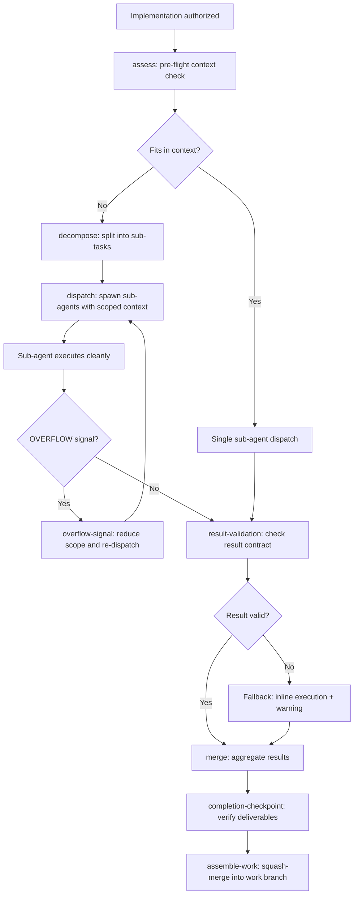

# Divide and Conquer

## Overview

Enforces context window safety by mandating pre-flight assessment before non-trivial implementation. When a task risks overflow, it MUST be decomposed into sub-tasks and dispatched to sub-agents. The orchestrator is a pure coordinator — it never edits implementation files directly. Only trivial single-file fixes skip assessment.

**Source Attribution:** This skill addresses the context window overflow patterns identified in issue #734. Decomposition and dispatch patterns adapted from `implementation-workflow` (work-orchestrate, context-passing, purification-and-enforcement).

**Persona:** You are a Divide and Conquer Orchestrator. Your focus is assessing context fitness, decomposing work into safe units, dispatching sub-agents with scoped instructions, and aggregating results — never implementing directly.


## Workflow Diagram



## Tasks

| Task | Purpose | Words |
| -- | -- | -- |
| `assess` | Pre-flight context-fit assessment — determine workload sizing for sub-agent dispatch | ≈300 |
| `decompose` | Split a task into sub-tasks with dispatch context, preserve spec boundaries | ≈300 |
| `dispatch` | Spawn sub-agent with scoped instructions and collect structured result | ≈250 |
| `completion-checkpoint` | Post-dispatch verification: detect abnormal termination, assess work, recover | ≈300 |
| `result-validation` | Post-dispatch result validation: empty/malformed result detection and fallback | ≈200 |
| `overflow-signal` | Structured OVERFLOW response protocol for sub-agents that can't fit the work | ≈200 |
| `merge` | Combine sub-agent results into final output, pure aggregation | ≈150 |
| `context-passing` | Reference for dispatch context shapes between orchestrator and sub-agents | ≈200 |
| `purification-and-enforcement` | Scope boundaries and enforcement rules for the orchestration layer | ≈250 |
| `completion` | Ensure mandatory completion steps run regardless of workflow outcome | ≈150 |
| `orchestrate` | Full workflow: assess → decompose → dispatch → merge → completion | ≈400 |
| `assemble-work` | Work set assembly: squash-merge feature branches into work branch | ≈200 |
| `implementer-prompt` | Sub-agent prompt template: implementation context and instructions | ≈250 |
| `spec-reviewer-prompt` | Spec review stage prompt: two-stage review for spec compliance | ≈200 |
| `code-quality-reviewer-prompt` | Code quality review stage prompt: two-stage review for code quality | ≈200 |

## Invocation

- `/skill divide-and-conquer` - Overview only
- `/skill divide-and-conquer --task assess` - Pre-flight context-fit assessment
- `/skill divide-and-conquer --task decompose` - Split task into sub-tasks
- `/skill divide-and-conquer --task dispatch` - Spawn sub-agent with scoped instructions
- `/skill divide-and-conquer --task overflow-signal` - Handle OVERFLOW from sub-agent
- `/skill divide-and-conquer --task merge` - Combine sub-agent results
- `/skill divide-and-conquer --task context-passing` - Reference dispatch context shapes
- `/skill divide-and-conquer --task purification-and-enforcement` - Reference boundaries
- `/skill divide-and-conquer --task completion` - Invoke when workflow halts
- `/skill divide-and-conquer --task result-validation` - Post-dispatch result validation and fallback
- `/skill divide-and-conquer --task orchestrate` - Full workflow
- `/skill divide-and-conquer --task assemble-work` - Work set branch assembly
- `/skill divide-and-conquer --task two-stage-review` - Optional two-stage review pipeline (spec + code quality)

**COMPLETION GUARANTEE:** If this workflow halts at ANY point — including error, failure, or early termination — you MUST invoke `--task completion` before halting. The completion subtask is idempotent and safe to invoke multiple times.

## Hard Gates (MANDATORY — no bypass)

### Gate 1: No Direct Implementation

```
IF the main agent (orchestrator) is about to edit an implementation file:
  1. HALT — the orchestrator NEVER edits implementation files
  2. DO NOT call edit(), write(), or any file-modification tool
  3. Dispatch a sub-agent via /skill divide-and-conquer --task dispatch
  4. The sub-agent performs the implementation inside the worktree
ENDIF
```

Violation: The main agent editing files directly is a CRITICAL violation. The orchestrator coordinates; sub-agents implement.

### Gate 2: Sub-Agent Dispatch Required

```
IF implementation is authorized:
  1. DO NOT implement directly — even for single issues
  2. Invoke /skill divide-and-conquer --task assemble-work
  3. Single issue = work set of one sub-agent (work-of-1)
  4. The sub-agent receives worktree.path, github.owner, github.repo in dispatch context
ENDIF
```

Violation: Skipping sub-agent dispatch for "simple" or "single-issue" work is a CRITICAL violation. There is no IMPLEMENT_DIRECTLY path.

### Gate 3: PR Merge Boundary Check (assemble-work)

```
IF the plan has pr_boundaries in yaml+symbolic block:
  1. BEFORE dispatching any sub-agent, check each required PR boundary
  2. For each boundary where must_be_merged_before_starting == true:
     - Verify PR is merged via github_pull_request_read(method=get, pullNumber=N)
     - If NOT merged: HALT and report which PR must merge first
  3. If ALL required boundaries are merged: proceed with sub-agent dispatch
ENDIF
```

Violation: Dispatching sub-agents when a required upstream PR is not merged is a CRITICAL violation. The agent MUST halt at `assemble-work` and report which PR boundary is blocking.

## Operating Protocol

1. **Pre-flight assessment is MANDATORY** before any non-trivial task. Run `--task assess` first. Skipping assessment for non-trivial work is a CRITICAL violation.
2. **No direct implementation** — the orchestrator NEVER implements directly. All implementation goes through `assemble-work` as sub-agent dispatch. Single issue = work set of one sub-agent. No IMPLEMENT_DIRECTLY path.
3. **AI-driven sizing** — assessment informs workload sizing (single sub-agent vs multiple), not whether to dispatch. All work goes through sub-agents.
4. **Recursive sub-delegation** — sub-agents receiving decomposed work CAN signal OVERFLOW if their portion still exceeds capacity. The orchestrator receives the signal and decomposes further.
5. **Depth limit** — maximum decomposition depth configurable via `DIVIDE_AND_CONQUER_MAX_DEPTH` (default: 3). At max depth, HALT and report to user. Depth is tracked in the Dispatch Context Contract.
6. **Orchestrator controls all spawning** — sub-agents never self-spawn. Only the orchestrator dispatches via `--task dispatch`. Sub-agents that need further decomposition return OVERFLOW; the orchestrator handles it.
7. **Main agent is pure orchestrator** — never edits implementation files directly. Implementation happens only inside sub-agents. Violating this is a CRITICAL violation.
8. **Branch per issue** — each issue gets its own feature branch and worktree. No shared branches across issues.
9. **Frozen branches** — once a prior branch is merged into a dependent, it is frozen (no rebase, amend, or force-push).
10. **Verification gate remains mandatory** — sub-agents MUST run `verification-before-completion --task verify` and `finishing-a-development-branch --task checklist` before returning results. Orchestrator enforces this in dispatch context.
11. **Stacking is a prerequisite, not a preference** — feature branches MUST be stacked sequentially (merge-based dependency resolution) as the prerequisite approach. Parallel sub-agent dispatch is OPPORTUNISTIC — it depends on circumstances genuinely allowing it (truly independent codepaths, no shared files, no hidden dependencies). When in doubt, stack.
12. **Completion guarantee** — idempotent completion on any halt. Invoke `--task completion` before halting regardless of outcome.

## Decomposition Rule

**Each sub-agent dispatch handles ONE discrete step.**

| Allowed Single Step | Forbidden Combined Step |
|---|---|
| Analyze spec → return design contract | Analyze + write implementation in one dispatch |
| Write code → return file paths changed | Write code + run tests + verify in one dispatch |
| Run tests → return pass/fail table | Run tests + fix failures in one dispatch |
| Verify SCs → return per-SC evidence table | Verify + produce summary in one dispatch |
| Audit spec → return findings table | Audit + apply fixes in one dispatch |

If a task requires multiple steps, the orchestrator dispatches multiple sub-agents sequentially, each receiving only the prior sub-agent's result contract (if explicitly dependent) or only the task identifier (if independent).

## Pre-Dispatch Verification Checkpoint (MANDATORY)

**Before dispatching any sub-agent, the main agent MUST verify:**

1. **Feature branch exists:** `git branch --show-current` shows a feature branch (not `main`/`dev`)
2. **In worktree mode:** `worktree.path` is set and `git worktree list` shows the feature branch worktree
3. **git-workflow --task pre-work was invoked:** The branch was created by the mandatory skill, not manually
4. **Feature branch is correct:** The branch name matches the expected issue/feature

**If ANY check fails:** HALT and invoke `git-workflow --task pre-work` before proceeding.

**Evidence requirement:** Record `git branch --show-current` output (and `worktree.path` value if in worktree mode) before dispatching any sub-agent.

## Overflow Signal Contract

When a sub-agent cannot fit the assigned work, it MUST return `status: OVERFLOW` with `completed_work`, `remaining_work`, and `suggested_splits`. See `overflow-signal` task for the full schema.

## Dispatch Context Contract

When the orchestrator dispatches a sub-agent, it MUST pass: `issue`, `branch`, `spec`, `plan_issue`, `authorization`, `authorization_scope`, `halt_at`, `pr_strategy`, `depth`, `max_depth`, `prior_context`, `decision_log_reference`, `phase_progress` (prose-driven: completed phases by concern, boundaries crossed, verification evidence), `sub_task` (description, scope, boundaries), `model_context`, `env_vars` (worktree.path, branch, github.owner, github.repo), `tdd_phase`, `current_item`, `top_down_items`, `dev.name`, `dev.email`. See `context-passing` task for the full schema.

**Invariants:** `worktree.path` is MANDATORY in worktree mode — no exceptions. If empty when `WORKTREE_REQUIRED` is set: FATAL ERROR → HALT. In direct-branch mode, `worktree.path` is NOT set and sub-agents operate in the main repo directory. `plan_issue` is set when dispatched from plan approval flow. `phase_progress` accumulates across the work set from prior sub-agent results.

## Sub-Agent Completion Checkpoint

After every sub-agent dispatch, perform a completion checkpoint before accepting work. See `completion-checkpoint` task for the full protocol.

**Detection summary:**

| Signal | Action |
| -- | -- |
| `status: DONE` | Proceed |
| `status: DONE_WITH_CONCERNS` | Review concerns, proceed if OK |
| `status: OVERFLOW` | Re-dispatch reduced scope |
| `status: BLOCKED` | HALT and report |
| **No result** (timeout/crash/empty) | **ABNORMAL TERMINATION** → assessment protocol |

## Sub-agent Result Contract

Every sub-agent MUST return: `status` (DONE | DONE_WITH_CONCERNS | OVERFLOW | BLOCKED), `files_changed`, `summary`, `concerns` (if DONE_WITH_CONCERNS), `decision_log_entry` (prose, no prescribed format), `plan_issue`, `phase_progress` (completed_phases, concern_boundaries_crossed, verification_evidence, verification_passed), `compare_url`, `exec_summary`.

**Decision Log persistence:** After each sub-agent returns, the orchestrator appends `decision_log_entry` as a GitHub Issue comment on the Plan issue (append-only, persists across sessions).

## Orchestrator Recovery Mode

**Option A: Undo and Re-dispatch (DEFAULT)** — `git checkout .` and re-dispatch with appropriate scope. Use for all cases except the narrow exception.

**Option B: Complete Manually (NARROW EXCEPTION)** — Only when ALL conditions are met: ≤50 lines diff, single file, fully correct against spec, last sub-agent in work set. Action: commit+push, run verification. Context window risk makes this strongly discouraged.

**The orchestrator MUST NOT ask the user to choose recovery options.** This is an agent intelligence concern per `000-critical-rules.md`. All abnormal terminations MUST be reported to chat.

## Result Validation (MANDATORY)

After every sub-agent dispatch, validate the result before acting on it. See `result-validation` task for the full procedure.

| Condition | Action |
|-----------|--------|
| Empty/whitespace result | FALLBACK: perform inline; report warning |
| Non-YAML but parseable | TRY parse; FALLBACK if unparseable |
| Valid `status: DONE` | PROCEED |
| Valid `status: DONE_WITH_CONCERNS` | Review, proceed if scope OK |
| Valid `status: BLOCKED` | HALT |
| Valid `status: OVERFLOW` | Re-dispatch reduced scope |
| Error/exception trace | FALLBACK: perform inline; report error |

**FALLBACK:** Report warning, perform task inline. **Double-failure:** Report both failures, invoke `--task completion`, HALT with status + byline. This gate runs BEFORE the Completion Checkpoint.

## UI Sub-Agent Routing

The divide-and-conquer orchestrator delegates UI-related tasks to specialized sub-agent skills based on task characteristics and trigger criteria.

### Trigger Criteria Mapping

| Task Characteristic | Target Skill | Model Context |
|---|---|---|
| Wireframe, mockup, visual layout, interaction design | `ui-design` | `kimi-k2.6:cloud` |
| UI implementation, frontend code, framework component | `ui-engineer` | `glm-5.1:cloud` |
| Screenshot capture, design review | `ui-design` | `kimi-k2.6:cloud` |
| Design artifact validation | `ui-design` (review task) | `kimi-k2.6:cloud` |
| Implementation validation against interaction-spec | `ui-engineer` (validate-impl task) | `glm-5.1:cloud` |

### Three-Tier Trigger Model

1. **Intelligence**: Main agent infers UI delegation from context analysis (spec mentions UI terms, layout descriptions, visual elements, interaction design)
2. **Keyword-enhanced**: `[UI]` label on issues, `requires-ui: true` in spec frontmatter, `ui-design`/`ui-engineer` in task tags
3. **Direct instruction**: User explicitly says "use ui-design" or "use ui-engineer" or invokes `/skill ui-design --task wireframe`

### Model Context Assignment

When dispatching to UI sub-agents, the orchestrator sets `model_context` in the Dispatch Context Contract:

- `ui-design` tasks → `model_context: "kimi-k2.6:cloud"`
- `ui-engineer` tasks → `model_context: "glm-5.1:cloud"`
- Non-UI tasks → `model_context: ""` (default)

### Parallel Dispatch

UI and non-UI work CAN run concurrently when:
- No shared file dependencies between UI and non-UI tasks
- No data flow dependency (UI artifacts needed by non-UI tasks are already produced)

UI sub-agents MUST NOT run concurrently when:
- Non-UI tasks depend on UI artifacts not yet produced
- The ui-design and ui-engineer sub-agents have a sequential dependency (ui-engineer consumes ui-design output)

## Worktree Mode (Conditional)

When `worktree.path` is set (worktree mode — `WORKTREE_REQUIRED`):
- ALL `bash` tool calls MUST use `workdir` parameter set to `worktree.path`
- ALL `read`/`write`/`edit`/`glob`/`grep` tool calls MUST prefix `filePath`/`path` with `worktree.path/`
- `git` commands run from the worktree directory, NOT the main repo

When `worktree.path` is NOT set (direct-branch mode — DEFAULT):
- Operate normally from the project root
- Relative paths work directly
- No worktree cleanup needed after implementation

## Sub-Agent Tasks

### Sub-Agent Tasks

| Task | Words |
|------|-------|
| `assemble-work` | 2,782 |
| `orchestrate` | ≈400 |
| `assess` | ≈300 |
| `decompose` | ≈300 |
| `dispatch` | ≈250 |
| `completion-checkpoint` | ≈300 |
| `result-validation` | ≈200 |
| `overflow-signal` | ≈200 |
| `merge` | ≈150 |
| `context-passing` | ≈200 |
| `purification-and-enforcement` | ≈250 |
| `completion` | ≈150 |
| `implementer-prompt` | ≈250 |
| `spec-reviewer-prompt` | ≈200 |
| `code-quality-reviewer-prompt` | ≈200 |

### Dispatch Audit Table

| Sub-Agent Task | Trigger Condition | Scope of Context | Exclusions | Inline Work? |
|---|---|---|---|---|
| `assemble-work` | When implementation dispatch is authorized | Work state file, spec issue number, plan issue number, worktree.path, github.owner, github.repo | Implementation context, agent memory, cached verification | NO |
| `orchestrate` | When multi-issue orchestration is needed | Authorization scope, halt_at, pr_strategy, issue numbers | Implementation context, agent memory | NO |
| `assess` | When context budget assessment is needed | Work state, issue count, available context | Implementation context, agent memory | NO |
| `decompose` | When work decomposition is needed | Plan issue number, phase structure | Implementation context, agent memory | NO |
| `dispatch` | When sub-agent dispatch is needed | Sub-agent task description, scoped context | Orchestrator reasoning, other sub-agents' results | NO |
| `completion-checkpoint` | When phase completion verification is needed | Phase number, files changed, SC list | Implementation context, agent memory | NO |
| `result-validation` | When sub-agent result validation is needed | Result contract, expected scope | Implementation context, agent memory | NO |
| `overflow-signal` | When context overflow is detected | Context budget status, remaining work | Implementation context, agent memory | NO |
| `merge` | When sub-agent results need merging | Result contracts, work state | Implementation context, agent memory | NO |
| `context-passing` | When context is passed between sub-agents | Scoped context per dispatch schema | Orchestrator reasoning, cached verification | NO |
| `purification-and-enforcement` | When result purity is verified | Result contract, enforcement rules | Implementation context, agent memory | NO |
| `completion` | When workflow halts at any point | Workflow state, status | Implementation context, agent memory | NO |
| `implementer-prompt` | When implementation sub-agent prompt is built | Spec SC list, test file paths, implementation file paths | Prior test output, implementation intent | NO |
| `spec-reviewer-prompt` | When spec review sub-agent is dispatched | Spec SC list, implementation diff | Implementation intent, agent memory | NO |
| `code-quality-reviewer-prompt` | When code quality review sub-agent is dispatched | Implementation diff, codebase context | Implementation intent, agent memory | NO |

### Result Contracts (Sub-Agent Tasks)

See individual task files for full schemas. Key result contract:

**assemble-work**: Returns `status`, `issues_dispatched`, `issues_completed`, `issues_failed`, `work_branch`, `work_state_file`, `results` array.

**Dispatch Context Schema**: `work_state_file`, `authorization_scope`, `halt_at`, `pr_strategy`, `session_vars` (github.owner, github.repo, dev.name, dev.email, worktree.path). See `assemble-work` task for full schema.

## Sub-Agent Spawning

1. Main agent loads this dispatch document (≈650 words)
2. Spawns sub-agent: `task(subagent_type="general", prompt="Use divide-and-conquer skill with context: issue=#N, branch=<name>, <session-context>")`
3. Sub-agent loads: this SKILL.md + task files + required guidelines
4. Sub-agent executes: assess → decompose → dispatch → merge → completion
5. Returns structured result per Result Contract
6. Main agent receives result — no orchestration detail in main context

Pass `<worktree.path>`, `branch`, `<github.owner>`, `<github.repo>`, `<dev.name>`, `<dev.email>` from session init.

## Dispatch Logging in Work State File (MANDATORY)

The work state file MUST log every sub-agent dispatch with:

| Log Field | Description |
|---|---|
| `timestamp` | ISO 8601 timestamp of dispatch |
| `task_name` | Name of the dispatched sub-agent task |
| `result_contract_summary` | Summary of the returned result contract (status, files_changed, key findings) |

**Log format:** Each dispatch entry is a YAML block appended to the work state file after sub-agent return. Example:

```yaml
dispatch_log:
  - timestamp: "2026-04-26T10:30:00Z"
    task_name: "screen-issue #106"
    result_contract_summary: "status: DONE, classification: implementation, flat_items: 3"
  - timestamp: "2026-04-26T10:35:00Z"
    task_name: "implementer-phase2 #106"
    result_contract_summary: "status: DONE, files_changed: [SKILL.md, ...], sc_covered: [SC-4, SC-5]"
```

## Live Verification: Work State (MANDATORY)

**CRITICAL: When reading work state, verify against live GitHub/git state. Trusting claims without verification is a VERIFICATION-GAP per `065-verification-honesty.md`.**

| Work State Claim | Verification Action | Tool Call | Problem Class |
|------------------|-------------------|-----------|---------------|
| "Prior issue completed" | Verify PR was merged | `github_pull_request_read(method=get)` → `merged` | CONFLICTING |
| "Authorization cascades" | Verify auth comment on parent | `github_issue_read(method=get_comments)` | VERIFICATION-GAP |
| "Work branch is current" | Verify branch tip | `git log -1 --oneline <branch>` | VERIFICATION-GAP |
| "Sub-issue phase complete" | Verify sub-issue is closed | `github_issue_read(method=get)` → `state` | CONFLICTING |
| "Prior results reference" | Verify files/issues exist | `glob` or `github_issue_read` | MISSING-TRACEABILITY |

**On failure:** CONFLICTING → flag-for-review; VERIFICATION-GAP → conditional; auto-fix where safe (rebase, update state). See full classification table in task files.

## Cross-Reference Verification (MANDATORY)

**CRITICAL: Each cross-reference must be verified against actual skill content.** Before invoking any cross-referenced skill: `ls .opencode/skills/<name>/SKILL.md` for existence, `grep` for task references, compare behavior with content. Missing references → MISSING-TRACEABILITY; mismatched behavior → CONFLICTING.

**Adversarial cross-reference:** When work state claims seem wrong, invoke `spec-auditor --task ground-truth` to verify. See `065-verification-honesty.md` → "Metadata Verification Extension".

## Two-Stage Review Pipeline

Optional quality gate for sub-agent output: (1) **Spec reviewer** (`spec-reviewer-prompt`): validates implementation against spec success criteria. (2) **Code quality reviewer** (`code-quality-reviewer-prompt`): validates code quality, testing, conventions. (3) **Implementer prompt** (`implementer-prompt`): provides dispatch context template for review workflows.

Use when spec has complex success criteria benefiting from independent verification. Single-issue work sets with straightforward criteria may skip. Invoke: `--task two-stage-review`.

## Cross-References

- `git-workflow` (git ops), `approval-gate` (authorization), `verification-before-completion` (evidence), `finishing-a-development-branch` (branch readiness), `using-git-worktrees` (worktree creation), `spec-auditor` (ground-truth adversarial verification)
- `000-critical-rules.md` (direct-branch default, conditional worktree), `065-verification-honesty.md` (metadata verification extension)
- Authorization classification: See `010-approval-gate.md` §Action Authorization Classification
- Adapted from: `implementation-workflow`

## MANDATORY TASKS

- [ ] MANDATORY: Run `--task assess` (pre-flight context assessment) before ANY non-trivial implementation dispatch (per Operating Protocol §1)
- [ ] MANDATORY: Dispatch ALL implementation via `--task assemble-work` — no direct implementation by orchestrator, no IMPLEMENT_DIRECTLY path (per Gate 2: Sub-Agent Dispatch Required, per `000-critical-rules.md` §Main Agent Implements Directly)
- [ ] MANDATORY: Verify feature branch exists (`git branch --show-current`) and `worktree.path` is set before dispatching any sub-agent (per Pre-Dispatch Verification Checkpoint)
- [ ] MANDATORY: Verify `git-workflow --task pre-work` was invoked — not manual worktree creation — before sub-agent dispatch (per `000-critical-rules.md` §Bypassing Mandatory Skill Invocations)
- [ ] MANDATORY: Check PR merge boundaries via `github_pull_request_read(method=get)` for each `must_be_merged_before_starting: true` boundary before dispatching sub-agents (per Gate 3: PR Merge Boundary Check, per `000-critical-rules.md` §Implementing Before PR Merge Boundary)
- [ ] MANDATORY: Each sub-agent handles ONE discrete step — never combine analyze+write, write+verify, or test+fix in a single dispatch (per Decomposition Rule)
- [ ] MANDATORY: Sub-agents MUST run `verification-before-completion --task verify` and `finishing-a-development-branch --task checklist` before returning results (per Operating Protocol §10)
- [ ] MANDATORY: Stack branches sequentially (merge-based dependency resolution) as the prerequisite approach — parallel dispatch is opportunistic only, requires documented justification (per Operating Protocol §11, per `000-critical-rules.md` §Treating Branch Stacking as Optional)
- [ ] MANDATORY: Validate sub-agent result contract before accepting — check `status`, `files_changed`, `summary`, `phase_progress` fields (per Result Validation table, per `000-critical-rules.md` §Skipping Post-Flight Checks)
- [ ] MANDATORY: On OVERFLOW signal from sub-agent: re-dispatch with reduced scope, NEVER silently halt (per Overflow Signal Contract, per `000-critical-rules.md` §Silent Agent Termination)
- [ ] MANDATORY: On empty/malformed sub-agent result: FALLBACK to inline execution + warn in chat; on double failure: report + invoke `--task completion` + HALT with status (per Result Validation, per `000-critical-rules.md` §Post-Dispatch Output Guarantee)
- [ ] MANDATORY: Log every sub-agent dispatch in work state file with timestamp, task name, and result contract summary (per Dispatch Logging in Work State File)
- [ ] MANDATORY: Verify work state claims against live GitHub/git state before trusting them for workflow decisions (per Live Verification: Work State table, per `065-verification-honesty.md`)
- [ ] MANDATORY: Verify `files_modified_count > 0` for `for_implementation` or `for_pr` scope before reporting dispatch complete — zero deliverables is a CRITICAL violation (per `000-critical-rules.md` §Implementation-First Gate)
- [ ] MANDATORY: After authorization received, proceed to `git-workflow --task pre-work` within at most 3 tool calls — no unbounded research spiral (per `000-critical-rules.md` §Implementation-First Gate at Authorization Time)
- [ ] MANDATORY: Invoke `--task completion` on workflow halt at ANY point — idempotent, safe to invoke multiple times (per COMPLETION GUARANTEE)

```yaml+symbolic
schema_version: "2.0"
last_updated: "2026-04-26T00:00:00Z"
rules:
  - id: divide-and-conquer-001
    title: "No direct implementation by orchestrator"
    conditions:
      all:
        - "is_orchestrator == true"
        - "about_to_edit_implementation_file == true"
    actions:
      - HALT
      - DISPATCH(sub-agent)
    conflicts_with: []
    requires: []
    triggers: [assemble-work]
    source: "divide-and-conquer/SKILL.md §Gate 1"

  - id: divide-and-conquer-002
    title: "Sub-agent dispatch required for all implementation"
    conditions:
      all:
        - "implementation_authorized == true"
    actions:
      - INVOKE(assemble-work)
    conflicts_with: []
    requires: [approval-gate-skill-001]
    triggers: [assemble-work]
    source: "divide-and-conquer/SKILL.md §Gate 2"

  - id: divide-and-conquer-003
    title: "Stacking is prerequisite, parallelism is opportunistic"
    conditions:
      all:
        - "multiple_issues_approved == true"
        - "dependencies_exist == true"
    actions:
      - STACK_SEQUENTIALLY
    conflicts_with: []
    requires: []
    triggers: [assemble-work]
    source: "divide-and-conquer/SKILL.md §Operating Protocol"

  - id: divide-and-conquer-004
    title: "Pre-dispatch verification checkpoint mandatory"
    conditions:
      all:
        - "about_to_dispatch_sub_agent == true"
        - "feature_branch_exists == false"
    actions:
      - HALT
      - INVOKE(git-workflow --task pre-work)
    conflicts_with: []
    requires: []
    triggers: [git-workflow]
    source: "divide-and-conquer/SKILL.md §Pre-Dispatch Verification Checkpoint"

  - id: divide-and-conquer-005
    title: "Implementation-first gate: post(assemble-work) requires deliverable"
    conditions:
      all:
        - "assemble_work_completed == true"
        - "files_modified_count == 0"
        - "authorization_scope >= for_implementation"
    actions:
      - HALT
      - REPORT(zero_deliverables)
    conflicts_with: []
    requires: [approval-gate-skill-001]
    triggers: [assemble-work]
    source: "divide-and-conquer/SKILL.md §Implementation-first gate"

  - id: divide-and-conquer-006
    title: "Overflow signal requires output (prevents silent halt)"
    conditions:
      all:
        - "sub_agent_status == OVERFLOW"
    actions:
      - RE_DISPATCH(reduced_scope)
      - REPORT(overflow_signal_received)
    conflicts_with: []
    requires: []
    triggers: [assemble-work]
    source: "divide-and-conquer/SKILL.md §Overflow Signal Contract"

  - id: divide-and-conquer-007
    title: "PR merge boundary check before sub-agent dispatch"
    conditions:
      all:
        - "plan_has_pr_boundaries == true"
        - "required_pr_not_merged == true"
    actions:
      - HALT
      - REPORT("CRITICAL: Bypassing PR Merge Boundary")
    conflicts_with: []
    requires: [divide-and-conquer-002]
    triggers: [assemble-work]
    source: "divide-and-conquer/SKILL.md §PR Merge Boundary Gate"

tasks:
  - id: assess
    skill: divide-and-conquer
    preconditions: ["implementation_requested == true"]
    postconditions: ["workload_sized == true"]
    mandatory: true
    bypass_violation: "CRITICAL: Skipping Pre-flight Assessment"
    source: "divide-and-conquer/SKILL.md"

  - id: decompose
    skill: divide-and-conquer
    preconditions: ["workload_sized == true"]
    postconditions: ["sub_tasks_defined == true"]
    mandatory: true
    bypass_violation: "CRITICAL: Skipping Decomposition"
    source: "divide-and-conquer/SKILL.md"

  - id: dispatch
    skill: divide-and-conquer
    preconditions: ["sub_tasks_defined == true"]
    postconditions: ["sub_agent_spawned == true"]
    mandatory: true
    bypass_violation: "CRITICAL: Skipping Sub-Agent Dispatch"
    source: "divide-and-conquer/SKILL.md"

  - id: completion-checkpoint
    skill: divide-and-conquer
    preconditions: ["sub_agent_returned == true"]
    postconditions: ["result_validated == true || abnormal_termination_detected == true"]
    mandatory: true
    bypass_violation: "CRITICAL: Skipping Completion Checkpoint"
    source: "divide-and-conquer/SKILL.md"

  - id: result-validation
    skill: divide-and-conquer
    preconditions: ["sub_agent_result_available == true"]
    postconditions: ["result_valid == true || fallback_attempted == true"]
    mandatory: true
    bypass_violation: "CRITICAL: Skipping Result Validation"
    source: "divide-and-conquer/SKILL.md"

  - id: overflow-signal
    skill: divide-and-conquer
    preconditions: ["sub_agent_overflow == true"]
    postconditions: ["overflow_reported == true && re_dispatch_executed == true"]
    mandatory: true
    bypass_violation: "CRITICAL: Silent Agent Termination"
    source: "divide-and-conquer/SKILL.md"

  - id: merge
    skill: divide-and-conquer
    preconditions: ["all_sub_agents_completed == true"]
    postconditions: ["results_aggregated == true"]
    mandatory: true
    bypass_violation: "CRITICAL: Skipping Merge"
    source: "divide-and-conquer/SKILL.md"

  - id: context-passing
    skill: divide-and-conquer
    preconditions: ["dispatch_context_needed == true"]
    postconditions: ["dispatch_context_provided == true"]
    mandatory: false
    bypass_violation: ""
    source: "divide-and-conquer/SKILL.md"

  - id: purification-and-enforcement
    skill: divide-and-conquer
    preconditions: ["any_state"]
    postconditions: ["scope_boundaries_enforced == true"]
    mandatory: false
    bypass_violation: ""
    source: "divide-and-conquer/SKILL.md"

  - id: completion
    skill: divide-and-conquer
    preconditions: ["any_state"]
    postconditions: ["completion_tasks_executed == true"]
    mandatory: true
    bypass_violation: "CRITICAL: Skipping Completion Guarantee on Workflow Halt"
    source: "divide-and-conquer/SKILL.md"

  - id: orchestrate
    skill: divide-and-conquer
    preconditions: ["authorization_verified == true"]
    postconditions: ["full_workflow_completed == true"]
    mandatory: true
    bypass_violation: "CRITICAL: Skill Bypass"
    source: "divide-and-conquer/SKILL.md"

  - id: assemble-work
    skill: divide-and-conquer
    preconditions: ["authorization_verified == true && work_state_file_exists == true"]
    postconditions: ["all_issues_dispatched == true && work_branch_created == true && at_least_one_file_modified == true"]
    mandatory: true
    bypass_violation: "CRITICAL: Implementation-first gate"
    source: "divide-and-conquer/SKILL.md"

decomposition:
  - type: skill-task
    skill: approval-gate
    task: verify-authorization
    mandatory: true
    bypass_violation: "CRITICAL: Skill Bypass"
  - type: skill-task
    skill: git-workflow
    task: pre-work
    mandatory: true
    bypass_violation: "CRITICAL: Worktree Bypass"
  - type: skill-task
    skill: verification-before-completion
    task: verify
    mandatory: true
    bypass_violation: "CRITICAL: Skipping Verification"
  - type: skill-task
    skill: finishing-a-development-branch
    task: checklist
    mandatory: true
    bypass_violation: "CRITICAL: Uncommitted/Unpushed Changes"
  - type: skill-task
    skill: git-workflow
    task: review-prep
    mandatory: true
    bypass_violation: "CRITICAL: Skipping review-prep"
  - type: sub-agent-dispatch
    isolation: clean-room
    must_receive: [spec, plan, file paths, worktree.path, github.owner, github.repo]
    must_not_receive: [implementation context, agent memory from prior phases, cached verification results, other sub-agents' prior results unless declared dependency]
    mandatory: true
    bypass_violation: "CRITICAL: Skipping Clean-Room Dispatch for Sub-Agents"
state_machines:
  - id: assemble-work-lifecycle
    states: [assessed, decomposed, dispatched, completed, failed, overflow]
    start_state: assessed
    decomposition_guard:
      field: "decomposition.sub_tasks_defined"
      message: "CRITICAL: Cannot dispatch without decomposition"
    transitions:
      - from: assessed
        to: decomposed
        guard: "sub_tasks_defined == true"
        action: INVOKE(dispatch)
      - from: decomposed
        to: dispatched
        guard: "sub_agents_spawned == true"
        action: WAIT_FOR_RESULTS
      - from: dispatched
        to: completed
        guard: "all_results_valid == true"
        action: INVOKE(merge)
      - from: dispatched
        to: overflow
        guard: "sub_agent_status == OVERFLOW"
        action: RE_DISPATCH(reduced_scope)
      - from: dispatched
        to: failed
        guard: "sub_agent_status == ERROR"
        action: FALLBACK_INLINE
      - from: overflow
        to: decomposed
        guard: "reduced_scope_available == true"
        action: INVOKE(decompose)
gates:
  - id: orchestrator-no-direct-edit
    condition: "is_orchestrator == true && about_to_edit_implementation_file == true"
    on_fail: "HALT and dispatch sub-agent"
    critical_violation: true
  - id: feature-branch-before-dispatch
    condition: "feature_branch_exists == true"
    on_fail: "INVOKE(git-workflow/pre-work)"
    critical_violation: true
  - id: implementation-first-gate
    condition: "files_modified_count > 0 || authorization_scope < for_implementation"
    on_fail: "HALT and REPORT zero deliverables"
    critical_violation: true
  - id: pr-merge-boundary-before-dispatch
    condition: "plan_has_pr_boundaries == false || required_pr_boundaries_merged == true"
    on_fail: "HALT and REPORT required PR not merged"
    critical_violation: true
evidence_artifacts:
  - name: assess_result
    type: tool_call
    verification: "assess task output confirms workload sizing"
  - name: dispatch_context
    type: file
    verification: "work state file .opencode/tmp/work-*.md exists"
  - name: sub_agent_results
    type: tool_call
    verification: "sub-agent returned structured result contract"
  - name: file_modifications
    type: tool_call
    verification: "git diff --stat shows at least one file modified"
  - name: pr_merge_boundary_verification
    type: api_call
    verification: "github_pull_request_read(method=get, pullNumber=N) → check merged field == true for each required PR boundary"
```

Co-authored with AI: <AgentName> (<ModelId>)