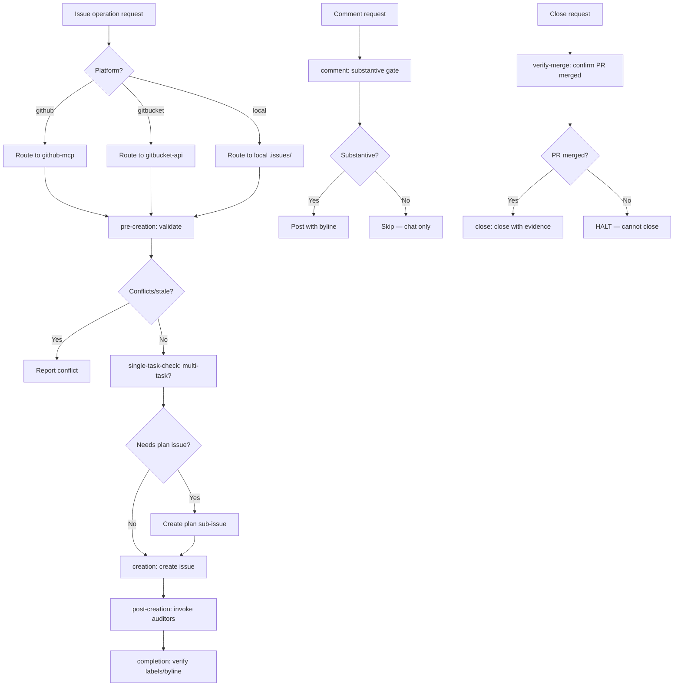

# Skill: issue-operations

## Overview

Platform-agnostic Issue Operations dispatcher. Detects `github.platform` from session init and routes all issue tracking operations to the appropriate platform sub-skill. Absorbs and replaces `github-issue-creation`, `github-comments`, and `github-sub-issues`.


## Workflow Diagram



## Persona

You are an Issue Operations Dispatcher. Your focus is ensuring all issue operations follow the spec-first workflow with proper validation, labeling, auditor integration, and platform-aware routing.

## Architecture

```
issue-operations/                     # Dispatcher — workflow logic, platform routing
  SKILL.md
  tasks/
    pre-creation.md                   # Validation (absorbed from github-issue-creation)
    single-task-check.md              # Multi-task detection
    creation.md                       # Create with labels/byline
    post-creation.md                  # Auditors, plan trigger
    comment.md                        # Channel routing (absorbed from github-comments)
    close.md                          # Post-merge closure
    link-sub-issue.md                 # Sub-issue hierarchy (absorbed from github-sub-issues)
    verify-merge.md                   # PR merge verification
    capabilities.md                   # Capability probe/discovery
    completion.md                     # Mandatory completion
  platforms/
    github-mcp/
      SKILL.md                        # Capability manifest (dynamic: queries GitHub MCP)
      tools/                          # Thin wrappers around github_* MCP tools
    gitbucket-api/
      SKILL.md                        # Capability manifest (static: probed v4.46.0)
      tools/                          # Existing Python client + tests
      tasks/                          # Existing issue/label/repo/error-recovery tasks
      reference/                      # OpenAPI spec
    local/
      SKILL.md                        # Capability manifest (local .issues/ directory)
```

## Tasks

| Task | Purpose | Words |
|------|---------|-------|
| `pre-creation` | Validate before creating issue (conflicts, superseded, staleness) | ≈240 |
| `single-task-check` | Determine if spec needs a plan issue (multi-task) or is single-task | ≈160 |
| `creation` | Create issue with proper title, labels, byline via platform routing | ≈200 |
| `post-creation` | Invoke auditors, trigger plan creation for multi-task specs | ≈180 |
| `comment` | Channel routing — substantive comment gate, format, posting | ≈400 |
| `close` | Post-merge closure with parent/child verification | ≈250 |
| `link-sub-issue` | Sub-issue linking via platform API or comment-based fallback | ≈200 |
| `verify-merge` | Verify PR merge before closing issues | ≈200 |
| `capabilities` | Probe platform capabilities (dynamic MCP query or static manifest) | ≈150 |
| `completion` | Ensure mandatory completion steps run regardless of workflow outcome | ≈200 |

## Invocation

- `/skill issue-operations --task pre-creation` - BEFORE creating issue (validation)
- `/skill issue-operations --task single-task-check` - Check if spec is single-task
- `/skill issue-operations --task creation` - Create issue with enforcement
- `/skill issue-operations --task post-creation` - After creation (auditors, sub-issues)
- `/skill issue-operations --task comment` - Post substantive comment with byline
- `/skill issue-operations --task close` - Close issue after PR merge
- `/skill issue-operations --task link-sub-issue` - Link/create sub-issue to parent
- `/skill issue-operations --task verify-merge` - Verify PR merge status
- `/skill issue-operations --task capabilities` - Probe platform capabilities
- `/skill issue-operations --task completion` - Invoke when workflow halts at any point
- `/skill issue-operations` - Overview only

**COMPLETION GUARANTEE:** If this workflow halts at ANY point — including error, failure, or early termination — you MUST invoke `--task completion` before halting. The completion subtask ensures mandatory steps (labels, auditors, sub-issues, status report) are never skipped. It is idempotent and safe to invoke multiple times.

## Hard Gates (MANDATORY — no bypass)

### Gate 1: Skill Dispatch Before Direct API Calls

```
IF creating a GitHub Issue or posting a comment:
  1. DO NOT call github_issue_write or github_add_issue_comment directly
  2. Invoke /skill issue-operations --task creation (for new issues)
  3. Invoke /skill issue-operations --task comment (for comments)
  4. These tasks handle: byline verification, label enforcement, pre-creation validation
ENDIF
```

Violation: Direct `github_issue_write` calls skip byline verification, label enforcement, and pre-creation validation (superseded specs, duplicate detection).

### Gate 2: Byline Verification Before Posting

```
IF calling github_issue_write, github_add_issue_comment, or github_create_pull_request with AI-authored content:
  1. VERIFY body contains "Co-authored with AI" or the emoji byline
  2. If missing → APPEND byline before API call
  3. DO NOT post AI-authored content without byline
ENDIF
```

Violation: AI-authored content without byline attribution is a CRITICAL violation per `000-critical-rules.md`.

## Platform Routing

### Detection

The dispatcher detects `github.platform` from session init output:

| `github.platform` | Platform Sub-Skill |
|----------------|-------------------|
| `github` | `platforms/github-mcp/` |
| `gitbucket` | `platforms/gitbucket-api/` |
| `local` | `platforms/local/` |
| (unset) | `platforms/local/` (default when no remote) |

### Target Parameter

```yaml
target:
  owner:     # overridden for submodules
  repo:        # overridden for submodules
  platform:   # rarely overridden (defaults to session github.platform)
```

### Capability Resolution (Hybrid)

1. If platform MCP tools present with `capabilities()` → use dynamic capabilities
2. If no MCP or no capabilities endpoint → fall back to static manifest in platform SKILL.md
3. If neither available → conservative defaults (basic CRUD only)

Each platform sub-skill decides internally whether to query MCP or read static manifest. The dispatcher never sees this decision.

### Fallback Patterns

| Operation | GitBucket Status | Fallback |
|----------|----------------|----------|
| Create issue | WORKS | — |
| List/get issues | WORKS | — |
| Update issue (PATCH) | BROKEN | Add comment with change content |
| Close issue | BROKEN | Add comment "Closing: reason" |
| Revise spec | BROKEN | Add comment with full revised body |
| Add/update/delete comment | WORKS | — |
| Sub-issues | BROKEN | Comment-based linking on parent issue |
| Search issues/PRs | BROKEN | Iterative listing + client-side filter |
| Create/list/get PRs | WORKS | — |
| Merge PR | WORKS | — |

## Operating Protocol

**Pre-implementation file changes are ephemeral.** Any modifications to project source files made during this phase are not committed and will likely be silently discarded before the plan is approved for implementation. Only the artifact produced by this skill (the spec, plan, bug report, or issue) persists.

1. **Mandatory invocation (no decision point):** The agent MUST invoke this skill when:
   - Agent is about to create an issue
   - Agent is about to post a comment to an issue/PR
   - Agent is about to close an issue
   - Agent is about to link sub-issues
   - DO NOT use direct `github_issue_write` / `github_add_issue_comment` / `github_sub_issue_write` calls
   - ALWAYS route through this skill for validation and platform routing

2. **Workflow sequence (issue creation):**
   - Phase 1: `pre-creation` → Validate spec, check for conflicts/superseded
   - Phase 2: `single-task-check` → Determine if spec needs a plan issue
   - Phase 3: `creation` → Create issue with labels and byline (routed to platform)
   - Phase 4: `post-creation` → Invoke auditors, trigger plan creation via writing-plans if multi-task

3. **Comment workflow:**
   - `comment` task → Substantiveness gate → Format with byline → Post via platform

4. **Sub-issue workflow:**
   - `link-sub-issue` task → Platform with sub-issue API → formal link; Platform without → comment-based fallback

## Substantive Comment Gate

**A comment is substantive if and only if it conveys information a stakeholder needs to understand what changed or why.**

| Comment Type | Substantive? | Action |
|-------------|-------------|--------|
| "Approval Tracking: Approvals tracked via comments" | No | ELIMINATE |
| "Created by" standalone comment | No | MOVE to issue body footer |
| "Ready for approval workflow" instructions | No | ELIMINATE |
| "Created sub-issue for phase: X" | No | ELIMINATE |
| Hierarchy tree report | No | ELIMINATE |
| "Starting execution" | No | ELIMINATE |
| Step evidence per step | No | ELIMINATE |
| Verification result | No | ELIMINATE |
| Raw auditor report | No | ELIMINATE |
| Substantive spec change explanation | Yes | KEEP |
| Closing summary (explains what changed) | Yes (conditional) | KEEP if substantive |
| Production data violation documentation | Yes | KEEP |
| Squash violation report | Yes | KEEP |
| Response to user question on issue | Yes | KEEP |

## Issue Tracking Required — Platform Routing

**When issue tracking tools are NOT available, the agent MUST refuse planning work entirely.**

### NO FALLBACK TO LOCAL FILES

- **PROHIBITED**: Using `plans/SPEC-*.md` files as fallback when issue tracking is unavailable
- **PROHIBITED**: Creating local plan files when issue tracking is unavailable
- **PROHIBITED**: Proceeding with implementation without issue tracking

### REQUIRED ACTION

If issue tracking tools are unavailable:
1. STOP immediately
2. Report: "Issue tracking tools unavailable. Cannot create or track specs without issue tracking."
3. Wait for issue tracking to be restored before proceeding

## Sub-Issue Fallback Detail

When platform lacks `sub_issue_write` API:
1. Post structured comment on parent issue listing sub-issue numbers
2. Dispatcher records which method was used (formal link vs comment) for later closure operations
3. Sub-issue closure queries parent comments to find children

## Search Fallback Detail

When platform lacks search API:
1. List PRs/issues with `direction=desc&sort=created&per_page=30`
2. Scan each item body for reference pattern (`Fixes #N`, `#N`)
3. Stop on first match — most recent PRs are most likely to be relevant
4. Paginate only if no match found on first page

## PATCH Fallback Detail

When platform PATCH endpoint is broken (returns 404):
- All mutations on existing issues are comments
- Title change → comment "Title updated: New Title"
- Body change → comment with full revised body
- State change → comment "Closing: reason" / "Reopening: reason"

## Interdependencies

| Skill | Purpose | Integration Point |
|-------|---------|-------------------|
| `spec-auditor` | Orchestrate spec quality audit | Run BEFORE approval |
| `approval-gate` | Enforce authorization | Run AFTER issue created |
| `writing-plans` | Plan issue creation | Invoke for multi-task specs after creation |

## When to Invoke

| Trigger | Task |
|---------|------|
| Creating new `[SPEC]` issue | `pre-creation` → `single-task-check` → `creation` → `post-creation` |
| Creating new `[Task]` issue | `creation` (skip validation) |
| Posting comment | `comment` |
| Closing issue post-merge | `close` |
| Linking sub-issues | `link-sub-issue` |
| Verifying PR merge | `verify-merge` |
| Agent about to call `github_issue_write` directly | STOP → invoke this skill instead |

## PR Merge Boundary in Sub-Issue Bodies (MANDATORY When Plan Has Boundaries)

When creating sub-issues from a plan that has `pr_boundaries` in its `yaml+symbolic` block, each sub-issue body MUST include a `## PR Merge Boundary` section when the sub-issue's phase has a merge boundary.

### Section Format

```markdown
## PR Merge Boundary (CRITICAL — HALT Until Merged)

This issue is part of **PR2** (approval-gate + git-workflow). It MUST NOT begin
implementation until PR1 (#38 + #39) is merged to dev.

**Self-Enforcement**: `skildeck lint --skill <skill>` will fail with CRITICAL
"contract unresolvable" if PR1 is not merged. The boundary is impossible to
bypass silently.

**Manual Enforcement**: If `skildeck lint` is not run, the agent MUST halt at
this boundary and wait for the developer to confirm the prior PR is merged.
```

### When to Include

| Condition | Include PR Merge Boundary in Sub-Issue? |
|-----------|----------------------------------------|
| Sub-issue's phase has a `pr_boundaries` entry with `must_be_merged_before_starting: true` | YES — mandatory |
| Sub-issue's phase has no merge boundary | NO — omit entirely |

### Enforcement

The `link-sub-issue` task MUST read the parent plan's `pr_boundaries` section and inject the appropriate boundary information into each sub-issue body. Missing boundary information in a sub-issue whose phase has a merge boundary is a STRUCTURE-VIOLATION.

## Critical Rules

### NEVER DO

- Create issues via direct `github_issue_write` calls (bypasses validation)
- Skip `needs-approval` label for new specs
- Create sub-issues for single-task specs
- Skip auditor invocation for multi-task specs
- Create issues with conflicting/overlapping objectives
- Create sub-issues directly under spec (sub-issues go under plan)
- Post non-substantive comments to issues
- Create an issue without checking for existing matches first
- Create an issue via `creation` task without Step 0.5 dedup evidence

### ALWAYS DO

- Invoke `pre-creation` task before creating issue
- Run Step 0.5 title dedup gate before any issue creation
- Verify Step 0.5 dedup evidence before proceeding to `creation` task
- Apply `needs-approval` label to new specs
- Add creation byline in issue body footer
- Invoke auditors before approval
- Check for superseding/conflicting issues
- For multi-task specs, invoke `writing-plans` for plan creation
- Route all operations through platform sub-skills
- Use `./tmp/` for temporary files (never `/tmp/`)

## Task Dependencies

```
pre-creation → single-task-check → creation → post-creation
                                            ↓
                                     (if multi-task)
                                            ↓
                                      writing-plans skill
                                            ↓
                                      plan issue (with sub-issues under plan)
```

## Enforcement

**This skill is MANDATORY for all issue operations.**

Direct `github_issue_write` / `github_add_issue_comment` / `github_sub_issue_write` calls bypassing this skill are a CRITICAL GUIDELINE VIOLATION.

When creating a new issue:
1. STOP before calling platform API directly
2. Invoke `/skill issue-operations --task pre-creation`
3. Follow validation results (HALT if conflicts)
4. Invoke `/skill issue-operations --task creation`
5. Invoke `/skill issue-operations --task post-creation`

## Submodule Routing for Issue Operations

When targeting files under a submodule or sub-folder repo path, issues MUST be filed against the submodule's repository, NOT the parent repository. The session-init output includes `## Sub-folder Repo Mappings` that list path-to-repo mappings derived from `.gitmodules`.

### Submodule Routing Table

The routing table below determines which repository to target for issue operations based on file paths. When a target file falls under a submodule path, the issue must be created in the submodule's repository using the mapped `owner/repo`.

| Target Path | Routes to | Platform |
|---|---|---|
| `.opencode/guidelines/*` | `<github.owner>/<github.repo>` | Per session init |
| `.opencode/skills/*` | `<github.owner>/<github.repo>` | Per session init |
| `.opencode/AGENTS.md` | `<github.owner>/<github.repo>` | Per session init |
| `.opencode/` (any file under) | `<github.owner>/<github.repo>` | Per session init |

**Concrete example**: When `identity_source == "submodule"` and `.gitmodules` maps `.opencode` to `git@github.com:michael-conrad/opencode-config.git`, files under `.opencode/` must route to `michael-conrad/opencode-config` on GitHub — never to the parent repo.

### Routing Procedure

1. Check session-init output for `## Sub-folder Repo Mappings`
2. If the target file path starts with a mapped submodule path, use the mapped `owner/repo` for ALL GitHub MCP API calls
3. If no mapping exists and `identity_source == "submodule"`, ALL files route to `<github.owner>/<github.repo>` (the submodule repo)
4. NEVER ask the developer which repo to file against — the agent resolves this autonomously

**AUTHORITY:** `000-critical-rules.md` §Wrong API Routing for Submodule/Sub-folder Repos, `060-tool-usage.md` §9 Identity Source Semantics

## Submodule Provenance Issues

Submodule provenance issues are created as part of the `git-workflow` provenance task, not through this skill's standard flow. See `git-workflow/tasks/provenance.md` for the complete implementation.

### Provenance Issue Creation Pathway

When the `git-workflow` provenance task creates an issue in a submodule repository:

| Aspect | Standard | Provenance |
| -- | -- | -- |
| Invocation | Via this skill | Via `git-workflow --task provenance` |
| Target repo | Parent repo | Submodule repo |
| Labels | `needs-approval` | None (provenance tracking is informational) |
| Title format | `[SPEC]`, `[SPEC-FIX]`, etc. | `Sync from <parent-repo>/<parent-branch>: ...` or `Release ...` |
| Body | Spec content | Provenance metadata (parent refs, tier info) |
| Byline | Required | Required |

### Key Differences

- **No pre-creation validation:** Provenance issues are created automatically during git workflow
- **No plan creation:** Provenance issues are standalone tracking records
- **No auditor invocation:** Provenance issues are informational records
- **Three-tier fallback:** Provenance gracefully falls back through tiers without HALT

### Cross-Reference

For the provenance issue body format and tier-specific details, see `git-workflow/tasks/provenance.md`.

## Sub-Agent Tasks

### Sub-Agent Tasks

| Task | Words |
|------|-------|
| `pre-creation` | ≈240 |
| `single-task-check` | ≈160 |
| `creation` | ≈200 |
| `post-creation` | ≈180 |
| `comment` | ≈400 |
| `close` | ≈250 |
| `link-sub-issue` | ≈200 |
| `verify-merge` | ≈200 |
| `capabilities` | ≈150 |
| `completion` | ≈200 |

### Dispatch Audit Table

| Sub-Agent Task | Trigger Condition | Scope of Context | Exclusions | Inline Work? |
|---|---|---|---|---|
| `pre-creation` | Before creating an issue, check for existing | Issue title, labels, github.owner, github.repo | Implementation context, agent memory | NO |
| `single-task-check` | When checking if an issue needs sub-issue structure | Issue number, issue body, github.owner, github.repo | Implementation context, agent memory | NO |
| `creation` | When creating a new issue | Issue title, body, labels, github.owner, github.repo | Implementation context, agent memory | NO |
| `post-creation` | After issue creation, add provenance and labels | Issue number, byline, github.owner, github.repo | Implementation context, agent memory | NO |
| `comment` | When adding a comment to an issue | Issue number, comment body, github.owner, github.repo | Implementation context, agent memory | NO |
| `close` | When closing an issue after PR merge confirmation | Issue number, merge evidence, github.owner, github.repo | Implementation context, agent memory | NO |
| `link-sub-issue` | When linking a sub-issue to a parent | Parent issue number, sub-issue ID, github.owner, github.repo | Implementation context, agent memory | NO |
| `verify-merge` | When verifying PR merge before closure | PR number, github.owner, github.repo | Implementation context, agent memory | NO |
| `capabilities` | When checking platform capabilities | Platform detection context | Implementation context, agent memory | NO |
| `completion` | When workflow halts at any point | Workflow state, status | Implementation context, agent memory | NO |

## Live Verification: Issue Operations Evidence (MANDATORY)

**Each factual claim about platform state, issue state, and issue relationships MUST be verified via tool call before acting. Assertions without tool-call artifacts are VERIFICATION-GAP findings per `065-verification-honesty.md`.**

| Claim | Verification Action | Tool Call | Problem Class |
|-------|-------------------|-----------|---------------|
| "Issue #N exists" | Verify via platform API | `github_issue_read(method="get", issue_number=N)` | MISSING-ELEMENT |
| "PR #N is merged" | Verify merge status | `github_pull_request_read(method="get", pullNumber=N)` → check `merged` field | VERIFICATION-GAP |
| "Platform supports sub-issues" | Probe capabilities | `issue-operations --task capabilities` | CONFLICTING |
| "Issue has `needs-approval` label" | Verify label presence | `github_issue_read(method="get_labels", issue_number=N)` | VERIFICATION-GAP |
| "All sub-issues closed" | Verify each sub-issue state | `github_issue_read(method="get_sub_issues", issue_number=N)` → check each closed | VERIFICATION-GAP |
| "No conflicting spec exists" | Search for overlapping issues | `github_search_issues(query="label:spec <keyword>")` | CONFLICTING |
| "Session init has <github.owner>/<github.repo>" | Verify session values | Check session init output | MISSING-ELEMENT |

**Evidence artifact:** Tool call results for each claim before the operation proceeds.

### Finding Classification

| Finding | Problem Class | Classification | Action |
|--------|---------------|----------------|--------|
| Issue not found | MISSING-ELEMENT | flag-for-review | HALT — cannot operate on missing issue |
| PR not merged | VERIFICATION-GAP | flag-for-review | HALT — do not close issue |
| Platform lacks capability | CONFLICTING | auto-fix | Use fallback pattern from SKILL.md |
| Label missing | VERIFICATION-GAP | auto-fix | Add missing label |
| Sub-issues still open | VERIFICATION-GAP | flag-for-review | Do not close parent |
| Conflicting spec found | CONFLICTING | flag-for-review | HALT — report conflict |
| Session values missing | MISSING-ELEMENT | flag-for-review | HALT — cannot construct API calls |

## Cross-Reference Verification (MANDATORY)

**🚫 CRITICAL: Each cross-reference must be verified against actual skill content. Assertions without verification are VERIFICATION-GAP findings.**

| Reference | Verification | Finding Class |
| -- | -- | -- |
| `spec-auditor` in Cross-References | File exists at `.opencode/skills/spec-auditor/SKILL.md` | MISSING-TRACEABILITY if missing |
| `approval-gate` in Cross-References | File exists at `.opencode/skills/approval-gate/SKILL.md` | MISSING-TRACEABILITY if missing |
| `writing-plans` in Cross-References | File exists at `.opencode/skills/writing-plans/SKILL.md` | MISSING-TRACEABILITY if missing |
| `git-workflow` in Cross-References | File exists at `.opencode/skills/git-workflow/SKILL.md` | MISSING-TRACEABILITY if missing |
| `spec-auditor` ground-truth subtask | File exists at `.opencode/skills/spec-auditor/tasks/ground-truth.md` | MISSING-TRACEABILITY if missing |
| `065-verification-honesty.md` metadata extension | Guideline contains "Metadata Verification Extension" section | CONFLICTING if missing |
| Task table entry `pre-creation` | File exists at `.opencode/skills/issue-operations/tasks/pre-creation.md` | MISSING-TRACEABILITY if missing |
| Task table entry `creation` | File exists at `.opencode/skills/issue-operations/tasks/creation.md` | MISSING-TRACEABILITY if missing |
| Task table entry `close` | File exists at `.opencode/skills/issue-operations/tasks/close.md` | MISSING-TRACEABILITY if missing |
| Task table entry `verify-merge` | File exists at `.opencode/skills/issue-operations/tasks/verify-merge.md` | MISSING-TRACEABILITY if missing |
| Task table entry `link-sub-issue` | File exists at `.opencode/skills/issue-operations/tasks/link-sub-issue.md` | MISSING-TRACEABILITY if missing |
| Task table entry `comment` | File exists at `.opencode/skills/issue-operations/tasks/comment.md` | MISSING-TRACEABILITY if missing |
| Platform sub-skills | Files exist at `platforms/github-mcp/SKILL.md`, `platforms/gitbucket-api/SKILL.md`, and `platforms/local/SKILL.md` | MISSING-TRACEABILITY if missing |
| `git-workflow` provenance task | Task exists at `.opencode/skills/git-workflow/tasks/provenance.md` | MISSING-TRACEABILITY if missing |

**Verification Procedure:**

Before invoking any cross-referenced skill:
1. `ls .opencode/skills/<skill-name>/SKILL.md` → EVIDENCE: file exists or MISSING-TRACEABILITY
2. `grep -c "<task-name>" .opencode/skills/<skill-name>/SKILL.md` → EVIDENCE: task referenced or MISSING-TRACEABILITY
3. Compare described behavior with actual content → EVIDENCE: match or CONFLICTING

**Classification on failure:**

| Failure | Problem Class | Classification | Action |
| -- | -- | -- | -- |
| Referenced skill file missing | MISSING-TRACEABILITY | flag-for-review | Cannot verify cross-reference |
| Referenced task file missing | MISSING-TRACEABILITY | flag-for-review | Task may have been renamed |
| Described behavior mismatches | CONFLICTING | flag-for-review | Cross-reference may be stale |
| Platform sub-skill missing | MISSING-TRACEABILITY | flag-for-review | Platform support may have changed |

**Adversarial cross-reference:** The `spec-auditor --task ground-truth` subtask (Phase 1 of spec #827) performs adversarial verification of metadata claims including sub-issue state, label accuracy, and authorization currency — all of which are core concerns for issue operations. When this skill encounters a label or sub-issue state claim that may be stale or inaccurate, invoke `spec-auditor --task ground-truth` to verify. See `065-verification-honesty.md` → "Metadata Verification Extension" for the extended principle.

## Cross-References

- Related skills: `spec-auditor`, `approval-gate`, `writing-plans`, `git-workflow`, `spec-auditor` (ground-truth adversarial verification)
- Related guidelines: `010-approval-gate.md`, `000-critical-rules.md`, `065-verification-honesty.md` (metadata verification extension)
- Authorization classification: See `010-approval-gate.md` Action Authorization Classification
- Platform sub-skills: `platforms/github-mcp/SKILL.md`, `platforms/gitbucket-api/SKILL.md`, `platforms/local/SKILL.md`

## MANDATORY TASKS

- [ ] MANDATORY: Route ALL issue operations through this skill — never call `github_issue_write`, `github_add_issue_comment`, or `github_sub_issue_write` directly — per §Hard Gates Gate 1
- [ ] MANDATORY: Verify byline presence (`Co-authored with AI` or emoji byline) before any `github_issue_write` or `github_add_issue_comment` call with AI-authored content — per §Hard Gates Gate 2
- [ ] MANDATORY: Run `pre-creation` task before creating any issue (conflict/superseded check) — per §Operating Protocol Step 2
- [ ] MANDATORY: Run Step 0.5 title dedup gate before any issue creation — verify dedup evidence before proceeding — per §Critical Rules ALWAYS DO
- [ ] MANDATORY: Apply `needs-approval` label to new specs — per §Critical Rules ALWAYS DO
- [ ] MANDATORY: Add creation byline in issue body footer — per §Critical Rules ALWAYS DO
- [ ] MANDATORY: Never close issues before PR merge is confirmed via live tool call — per §Critical Rules NEVER DO and yaml+symbolic issue-ops-003
- [ ] MANDATORY: Never replace issue body with shorter content — verify `len(new_body) >= 0.8 * len(original_body)` before any `github_issue_write(method=update)` — per §Hard Gates and yaml+symbolic issue-ops-004
- [ ] MANDATORY: Create sub-issues under the plan (NOT under the spec) — per §Critical Rules NEVER DO and yaml+symbolic issue-ops-005
- [ ] MANDATORY: Include PR Merge Boundary section in sub-issue bodies when parent plan has `pr_boundaries` with `must_be_merged_before_starting: true` for the sub-issue's phase — per §PR Merge Boundary in Sub-Issue Bodies
- [ ] MANDATORY: Detect platform from session init and route to correct platform sub-skill — per §Platform Routing and yaml+symbolic issue-ops-007
- [ ] MANDATORY: Route submodule file targets to submodule repo (not parent repo) — per §Submodule Routing for Issue Operations and yaml+symbolic issue-ops-009
- [ ] MANDATORY: Invoke `spec-auditor` for multi-task specs before approval — per §Interdependencies
- [ ] MANDATORY: Post only substantive comments — skip non-substantive comments (approval tracking, "created by", hierarchy reports, step evidence, verification results, raw auditor reports) — per §Substantive Comment Gate
- [ ] MANDATORY: Invoke `--task completion` before halting at any point — per completion task

```yaml+symbolic
schema_version: "2.0"
last_updated: "2026-04-25T00:00:00Z"
rules:
  - id: issue-ops-001
    title: "Mandatory skill dispatch before direct API calls"
    conditions:
      all:
        - "about_to_call == 'github_issue_write' OR 'github_add_issue_comment' OR 'github_sub_issue_write'"
        - "routed_through_skill == false"
    actions:
      - HALT
      - INVOKE(issue-operations --task creation OR comment)
    conflicts_with: []
    requires: []
    triggers: [creation, comment, close, link-sub-issue]
    source: "issue-operations/SKILL.md §Hard Gates Gate 1"

  - id: issue-ops-002
    title: "Byline verification before posting AI-authored content"
    conditions:
      all:
        - "content_authored_by == 'AI'"
        - "body_contains_byline == false"
    actions:
      - APPEND(byline)
    conflicts_with: []
    requires: []
    triggers: [creation, comment]
    source: "issue-operations/SKILL.md §Hard Gates Gate 2"

  - id: issue-ops-003
    title: "Close issues only after PR merge confirmed"
    conditions:
      all:
        - "action == 'close_issue'"
        - "pr_merge_confirmed == false"
    actions:
      - HALT
    conflicts_with: []
    requires: []
    triggers: [close, verify-merge]
    source: "issue-operations/SKILL.md §Critical Rules NEVER DO"

  - id: issue-ops-004
    title: "Never replace issue body with shorter content"
    conditions:
      all:
        - "action == 'github_issue_write method=update'"
        - "len(new_body) < 0.8 * len(original_body)"
    actions:
      - HALT
    conflicts_with: []
    requires: []
    triggers: [close, creation]
    source: "000-critical-rules.md §Issue Body Erasure"

  - id: issue-ops-005
    title: "Sub-issues go under plan, not spec"
    conditions:
      all:
        - "creating_sub_issue == true"
        - "parent_type == 'spec'"
    actions:
      - REJECT
      - USE(parent_type='plan')
    conflicts_with: []
    requires: []
    triggers: [link-sub-issue]
    source: "issue-operations/SKILL.md §Critical Rules NEVER DO"

  - id: issue-ops-006
    title: "Title dedup gate before issue creation"
    conditions:
      all:
        - "creating_issue == true"
        - "dedup_check_performed == false"
    actions:
      - HALT
      - INVOKE(pre-creation Step 0.5)
    conflicts_with: []
    requires: []
    triggers: [creation]
    source: "issue-operations/SKILL.md §Critical Rules ALWAYS DO"

  - id: issue-ops-007
    title: "Platform routing before all operations"
    conditions:
      all:
        - "performing_issue_operation == true"
        - "platform_detected == false"
    actions:
      - DETECT(github.platform)
      - ROUTE(platform_sub_skill)
    conflicts_with: []
    requires: []
    triggers: [creation, comment, close, link-sub-issue, verify-merge]
    source: "issue-operations/SKILL.md §Platform Routing"

  - id: issue-ops-009
    title: "Submodule file targets must route to submodule repo"
    conditions:
      all:
        - "target_file_path matches submodule_path"
        - "api_repo == parent_repo"
    actions:
      - RESOLVE_SUBMODULE_REMOTE
      - USE_SUBMODULE_OWNER_REPO
    conflicts_with: []
    requires: []
    triggers: [creation, comment, close, link-sub-issue, verify-merge]
    source: "issue-operations/SKILL.md §Submodule Routing for Issue Operations"

  - id: issue-ops-008
    title: "PR merge boundary in sub-issue body when plan has boundaries"
    conditions:
      all:
        - "creating_sub_issue == true"
        - "plan_has_pr_boundaries == true"
        - "phase_has_merge_boundary == true"
        - "sub_issue_body_has_merge_boundary_section == false"
    actions:
      - ADD(pr_merge_boundary section to sub-issue body)
    conflicts_with: []
    requires: [issue-ops-005]
    triggers: [link-sub-issue, writing-plans]
    source: "issue-operations/SKILL.md §PR Merge Boundary in Sub-Issue Bodies"

tasks:
  - id: pre-creation
    skill: issue-operations
    preconditions: ["spec_content_available"]
    postconditions: ["conflicts_checked", "superseded_checked", "dedup_evidence_produced"]
    mandatory: true
    bypass_violation: "CRITICAL: Creating issues without validation bypasses duplicate detection and conflict checking"
    source: "issue-operations/SKILL.md §Tasks"

  - id: creation
    skill: issue-operations
    preconditions: ["pre-creation_completed", "single_task_check_completed", "byline_present"]
    postconditions: ["issue_created", "labels_applied", "needs_approval_label_present"]
    mandatory: true
    bypass_violation: "CRITICAL: Direct github_issue_write calls skip byline verification, label enforcement, and pre-creation validation"
    source: "issue-operations/SKILL.md §Tasks"

  - id: comment
    skill: issue-operations
    preconditions: ["comment_substantive == true", "byline_present"]
    postconditions: ["comment_posted_via_platform"]
    mandatory: true
    bypass_violation: "CRITICAL: Direct github_add_issue_comment calls bypass substantiveness gate and byline enforcement"
    source: "issue-operations/SKILL.md §Tasks"

  - id: close
    skill: issue-operations
    preconditions: ["pr_merge_confirmed == true"]
    postconditions: ["issue_closed", "parent_child_closure_verified"]
    mandatory: true
    bypass_violation: "CRITICAL: Closing issues before PR merge confirmed is a critical violation"
    source: "issue-operations/SKILL.md §Tasks"

  - id: link-sub-issue
    skill: issue-operations
    preconditions: ["parent_issue_exists", "sub_issue_exists"]
    postconditions: ["sub_issue_linked"]
    mandatory: true
    bypass_violation: "CRITICAL: Multi-task plans without sub-issues are a critical violation"
    source: "issue-operations/SKILL.md §Tasks"

  - id: completion
    skill: issue-operations
    preconditions: ["workflow_halted_or_completed"]
    postconditions: ["mandatory_steps_verified", "status_reported"]
    mandatory: true
    bypass_violation: "CRITICAL: Skipping completion task may leave mandatory steps (labels, auditors, sub-issues) unverified"
    source: "issue-operations/SKILL.md §Tasks"

decomposition:
  - type: skill-task
    skill: approval-gate
    task: verify-authorization
    mandatory: true
    bypass_violation: "Closing issues requires authorization verification to prevent premature closure"
    source: "issue-operations/SKILL.md §Interdependencies"

  - type: skill-task
    skill: git-workflow
    task: cleanup
    mandatory: true
    bypass_violation: "Post-merge cleanup is the sole mechanism for deleting merged branches, closing issues, and syncing dev"
    source: "issue-operations/SKILL.md §Interdependencies"

  - type: skill-task
    skill: spec-auditor
    task: audit
    mandatory: true
    bypass_violation: "Multi-task specs require auditor invocation before approval"
    source: "issue-operations/SKILL.md §Interdependencies"

  - type: skill-task
    skill: writing-plans
    task: create
    mandatory: false
    bypass_violation: "Plan creation required for multi-task specs but not single-task"
    source: "issue-operations/SKILL.md §Interdependencies"

gates:
  - id: byline-present
    condition: "body_contains_byline == true"
    on_fail: HALT
    critical_violation: true
    source: "issue-operations/SKILL.md §Hard Gates Gate 2"

  - id: merge-confirmed-before-close
    condition: "pr_merge_confirmed == true"
    on_fail: HALT
    critical_violation: true
    source: "issue-operations/SKILL.md §Critical Rules NEVER DO"

  - id: body-not-erased
    condition: "len(new_body) >= 0.8 * len(original_body)"
    on_fail: HALT
    critical_violation: true
    source: "000-critical-rules.md §Issue Body Erasure"

  - id: skill-dispatch-before-api
    condition: "routed_through_skill == true"
    on_fail: HALT
    critical_violation: true
    source: "issue-operations/SKILL.md §Hard Gates Gate 1"

  - id: dedup-check-performed
    condition: "dedup_evidence_exists == true"
    on_fail: HALT
    critical_violation: false
    source: "issue-operations/SKILL.md §Critical Rules ALWAYS DO"

  - id: substantive-comment
    condition: "comment_is_substantive == true"
    on_fail: SKIP
    critical_violation: false
    source: "issue-operations/SKILL.md §Substantive Comment Gate"

  - id: pr-merge-boundary-in-sub-issue
    condition: "plan_has_pr_boundaries == false OR sub_issue_body_has_merge_boundary_section == true"
    on_fail: HALT
    critical_violation: true
    source: "issue-operations/SKILL.md §PR Merge Boundary in Sub-Issue Bodies"

evidence_artifacts:
  - name: byline_verification
    type: tool_call
    verification: "Check body string for 'Co-authored with AI' or emoji byline before github_issue_write/github_add_issue_comment call"
    source: "issue-operations/SKILL.md §Hard Gates Gate 2"

  - name: merge_status
    type: api_call
    verification: "github_pull_request_read(method=get, pullNumber=N) → check merged field == true"
    source: "issue-operations/SKILL.md §verify-merge task"

  - name: body_length_check
    type: tool_call
    verification: "Read current body via github_issue_read(method=get), compare len(new_body) >= 0.8 * len(original_body)"
    source: "000-critical-rules.md §Issue Body Erasure"

  - name: dedup_evidence
    type: api_call
    verification: "github_search_issues(query) → confirm no overlapping title exists"
    source: "issue-operations/SKILL.md §pre-creation Step 0.5"

  - name: sub_issue_link
    type: api_call
    verification: "github_issue_read(method=get_sub_issues, issue_number=N) → confirm link exists"
    source: "issue-operations/SKILL.md §link-sub-issue task"

  - name: pr_merge_boundary_in_sub_issue
    type: tool_call
    verification: "github_issue_read(method=get, issue_number=N) → verify '## PR Merge Boundary' section present when parent plan has pr_boundaries"
    source: "issue-operations/SKILL.md §PR Merge Boundary in Sub-Issue Bodies"
```