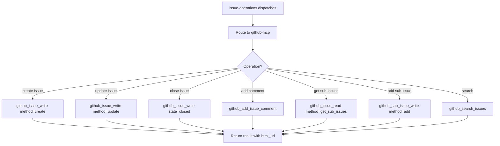

# GitHub MCP Platform Sub-Skill

## Overview

GitHub platform implementation using GitHub MCP tools. Full API coverage with no fallbacks needed.

## Workflow Diagram

## Capability Manifest

| Operation | Supported | Notes |
|----------|-----------|-------|
| Create issue | ✅ | `github_issue_write(method="create")` |
| List issues | ✅ | `github_list_issues` |
| Get issue | ✅ | `github_issue_read(method="get")` |
| Update issue | ✅ | `github_issue_write(method="update")` |
| Close issue | ✅ | `github_issue_write(method="update", state="closed")` |
| Get issue comments | ✅ | `github_issue_read(method="get_comments")` |
| Add comment | ✅ | `github_add_issue_comment` |
| Get sub-issues | ✅ | `github_issue_read(method="get_sub_issues")` |
| Add sub-issue | ✅ | `github_sub_issue_write(method="add")` |
| Remove sub-issue | ✅ | `github_sub_issue_write(method="remove")` |
| Search issues | ✅ | `github_search_issues` |
| Search PRs | ✅ | `github_search_pull_requests` |
| Get labels | ✅ | `github_issue_read(method="get_labels")` |
| Labels on creation | ✅ | `github_issue_write(method="create", labels=[...])` |
| Create PR | ✅ | `github_create_pull_request` |
| Merge PR | ✅ | `github_merge_pull_request` |
| PR reviews | ✅ | `github_pull_request_read(method="get_reviews")` |
| PR comments | ✅ | `github_pull_request_read(method="get_review_comments")` |
| PR files | ✅ | `github_pull_request_read(method="get_files")` |
| File contents | ✅ | `github_get_file_contents` |
| Commits | ✅ | `github_list_commits`, `github_get_commit` |

**Dynamic override:** If GitHub MCP tools provide a `capabilities()` endpoint in the future, this static manifest is overridden by dynamic query results.

## Tools

All operations dispatched through the `github_*` MCP tool family. No Python client needed — the MCP server handles authentication and API routing.

## Fallbacks

None required. GitHub MCP provides complete API coverage.

## Cross-References

- Dispatcher: `../SKILL.md` (issue-operations)
- Related platform: `../gitbucket-api/SKILL.md`

## Sub-Agent Tasks

### Dispatch Audit Table

| Sub-Agent Task | Trigger Condition | Scope of Context | Exclusions | Inline Work? |
|---|---|---|---|---|
| Platform operations | When GitHub MCP platform operations are dispatched | Operation type, issue/PR number, github.owner, github.repo | Implementation context, agent memory | NO |