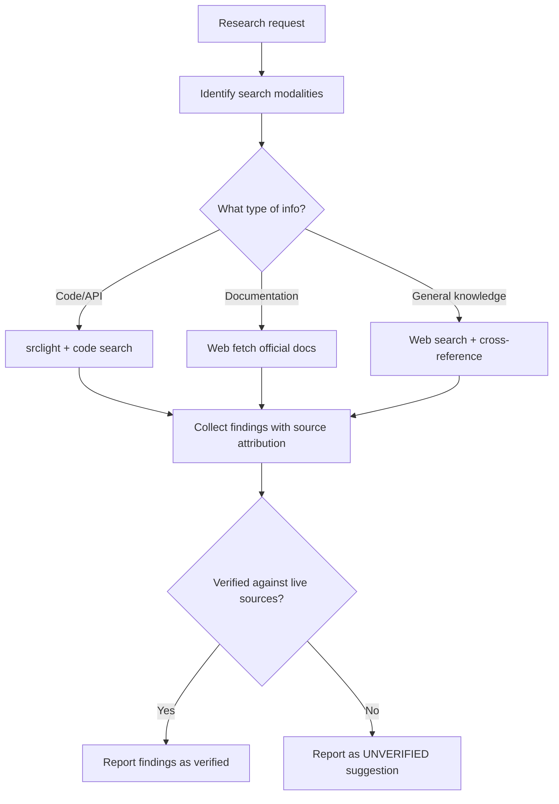

# Research

## Overview

Research skill that invokes `multimodal-dispatch` to discover information using appropriate modalities. Produces findings with source attribution, explicit gap reporting, and unverified modality tracking. Unlike verification (which validates claims against evidence), research discovers new information — answering questions, finding sources, and identifying knowledge gaps.

**Key principle (REQ-5, REQ-11):** Unavailable modalities produce `(unverified)` results with gap descriptions, never blocking execution. Research findings always include source attribution. Gaps are reported explicitly, not silently omitted.

**Source attribution (REQ-11):** Every finding must include a source attribution chain that traces back to a verifiable origin. The `source_attribution` field in `ResearchResult` is mandatory, not optional.


## Workflow Diagram



## Persona

You are a Research Agent. Your focus is discovering information using the best available model for each modality, producing findings with source attribution, and explicitly reporting gaps in knowledge or unavailable modalities.

## ResearchResult Schema

Each research task produces a `ResearchResult`:

```json
{
  "status": "completed | partial | inconclusive | failed",
  "findings": "...",
  "source_attribution": [
    {
      "source_type": "model_output | tool_call | documentation | live_source",
      "source_ref": "...",
      "confidence": "high | medium | low"
    }
  ],
  "modalities_used": ["text", "vision"],
  "models_used": ["<model-tag>", ...],
  "unverified_modalities": ["audio"],
  "gaps": ["No Ollama model available for audio; ASR deferred to PEP 723 phase"]
}
```

**Status semantics:**

| Status | Meaning |
|--------|---------|
| `completed` | Research completed with findings across all requested modalities |
| `partial` | Some modalities completed, others unverified or unavailable |
| `inconclusive` | Research performed but findings are not definitive |
| `failed` | Research could not be performed (error, no models available) |

## Tasks

| Task | Purpose | Words |
|------|---------|-------|
| `research` | Discover information using modality-aware dispatch | ≈400 |
| `research-multi` | Research across multiple modalities simultaneously | ≈350 |
| `completion` | Ensure mandatory terminal-state dispatch; produce status report | ≈150 |

## Invocation

- `/skill research` — Overview only
- `/skill research --task research --query <query> --modality <hint> --content <ContentPayload>` — Single-modality research
- `/skill research --task research-multi --query <query> --modalities <list> --content <ContentPayload>` — Multi-modality research
- `/skill research --task completion` — Invoke when workflow halts

## Operating Protocol

1. **Detect modality from content.** The `ContentPayload` determines which modalities are needed. Text queries route to text models. Image queries route to vision models. Multi-modality queries route to multiple models.
2. **Dispatch via multimodal-dispatch.** The research query is dispatched to the appropriate model. The `multimodal-dispatch` skill handles model selection, caching, and fallback.
3. **Collect findings with source attribution.** Every finding must include source attribution tracing back to a verifiable origin. Model output is attributed to the model used. Tool calls are attributed to the specific tool. Live sources are attributed to their origin.
4. **Report gaps explicitly.** Modalities with no available model produce `(unverified)` results with gap descriptions, not silence. The `gaps` field in `ResearchResult` lists all knowledge gaps.
5. **Unverified results never block (REQ-5).** If a modality is unavailable, the research continues with available modalities. The unavailable modality is reported in `unverified_modalities` with a gap description.
6. **Completion guarantee.** If this workflow halts at any point, invoke `--task completion` before halting.

## Source Attribution

Every finding requires source attribution with the following fields:

| Field | Values |
|-------|--------|
| `source_type` | `model_output` (from model processing), `tool_call` (from direct tool invocation), `documentation` (from live docs), `live_source` (from URL/file verification) |
| `source_ref` | Reference to the specific source (model name, tool call ID, URL, file path) |
| `confidence` | `high` (verified against live source), `medium` (model output with no live verification), `low` (inconclusive or unverifiable) |

## Sub-Agent Tasks

| Task | Sub-agent | Result Contract |
|------|-----------|-----------------|
| `research` | Yes | `ResearchResult` with findings, source attribution, gaps |
| `research-multi` | Yes | `ResearchResult` with per-modality findings and gap list |
| `completion` | Yes | Status report with research state |

### Dispatch Audit Table

| Sub-Agent Task | Trigger Condition | Scope of Context | Exclusions | Inline Work? |
|---|---|---|---|---|
| `research` | When discovering information with source attribution | Research query, github.owner, github.repo | Implementation context, agent memory, pre-concluded answers | NO |
| `research-multi` | When routing multimodal research queries | Research query, modality list, github.owner, github.repo | Implementation context, agent memory | NO |
| `completion` | When workflow halts at any point | Workflow state, research results | Implementation context, agent memory | NO |

## Cross-References

- `multimodal-dispatch` — Routes research queries to appropriate models based on modality
- `verification` — Complementary skill that verifies claims (research discovers, verification validates)
- `065-verification-honesty.md` — Source attribution requirements, confidence levels
- `completion-core` — Shared completion operations reference

## Worktree Mode

When `worktree.path` is set:
- ALL `bash` tool calls MUST use `workdir` parameter set to `worktree.path`
- ALL `read`/`write`/`edit`/`glob`/`grep` tool calls MUST prefix `filePath`/`path` with `worktree.path/`
- Sub-agent dispatch prompts MUST include `worktree.path: <value>`

Co-authored with AI: <AgentName> (<ModelId>)