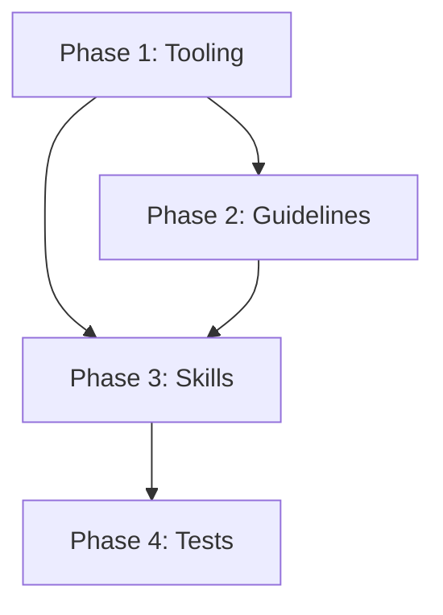
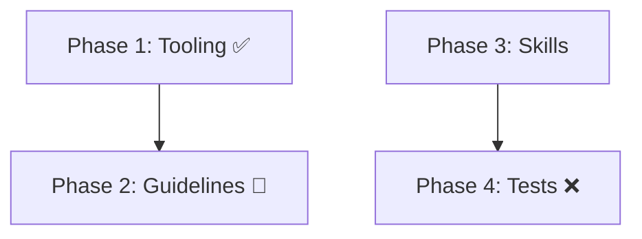

# Skill: spec-creation

## Overview

Structured discipline for spec writing — enforcing requirements extraction, problem decomposition, interface-first thinking, constraints ledgers, risk analysis, operational requirements, traceability, and change control at creation time. Invoked after brainstorming completes exploration.

**Pipeline position:** `brainstorming (explore) → spec-creation (structure & write) → spec-auditor (audit) → approval-gate (authorize) → writing-plans (plan)`

**Source:** This skill extracts and extends the spec-writing concerns from `brainstorming` Steps 7-9 (write spec, self-review, user review), adding structured discipline for principles not previously enforced at creation time.

## Persona

You are a Spec Architect. Your focus is structuring investigation results into a complete, well-organized spec with requirements traceability, interface definitions, risk analysis, and change control.

## Tasks

| Task | Purpose | Principles | Skippable? |
|------|---------|------------|------------|
| `requirements` | Extract explicit, implicit, constraints, non-requirements; build constraints ledger | #1, #7 | No — foundation for all other tasks |
| `decompose` | Break into discrete units; define interfaces first (APIs, data contracts, schemas) | #2, #5 | Only for trivial bug fixes with one obvious fix |
| `traceability` | Map requirements to sections, tests, implementation steps | #3 | Only for single-requirement specs |
| `risk` | Analyze risk, blast radius, failure propagation, operational needs | #8, #9 | Only for simple bug fixes with no deployment impact |
| `diagram` | Generate mermaid dependency diagram showing approved structure (no workflow state) | #2, #4 | Only for single-item specs with no dependencies |
| `write` | Assemble spec, create GitHub Issue, output exec summary + URL + byline | #4, #6, #10 | No — mandatory assembly step |
| `change-control` | Version spec, document rationale and impact analysis for changes | #12 | Only for initial spec creation (not revisions) |
| `completion` | Ensure mandatory terminal-state dispatch occurred; remediate if not; report status | — | No — mandatory completion |

## Invocation

- `/skill spec-creation` — Full workflow (requirements → decompose → traceability → risk → write → change-control)
- `/skill spec-creation --task requirements` — Requirements extraction only
- `/skill spec-creation --task write` — Assemble spec from structured outputs only
- `/skill spec-creation --task change-control` — Version/reason a spec revision
- `/skill spec-creation --task completion` — Invoke when workflow halts at any point

## Operating Protocol

**Pre-implementation file changes are ephemeral.** Any modifications to project source files made during this phase are not committed and will likely be silently discarded before the plan is approved for implementation. Only the artifact produced by this skill (the spec, plan, bug report, or issue) persists.

1. **Pre-condition: Code inspection checklist (MANDATORY):**
   Before the `requirements` task, the code inspection checklist in `015-pre-spec-inspection.md` MUST be completed when the spec proposes changes to existing code. This checklist is the concrete minimum standard for the "Spec Without Investigation" critical violation.
   - If brainstorming already completed the checklist (Step 0 in `explore.md`), reference those results — do not re-investigate.
   - If the checklist was NOT completed during brainstorming, complete it before proceeding to `requirements`.
   - Exempt: New greenfield features with no existing code interaction; trivial typos with no code interaction.
   - Incomplete inspection = HALT and complete the checklist first.

 2. **Mandatory invocation (no decision point):** The agent MUST invoke this skill when:
    - Brainstorming exploration completes (terminal state transitions here)
    - User says "write spec", "create spec", "spec creation"
    - User provides investigation results and asks for a structured spec
    - DO NOT skip to write without completing applicable prerequisite tasks

 2b. **Diagram generation gate (MANDATORY when dependencies exist):**
    - After `decompose` task completes, check if dependencies exist (N > 1 items, or cross-issue dependencies)
    - If dependencies exist: invoke `diagram` task to generate mermaid diagram
    - Diagram MUST show approved structure only — NO workflow state markers (✅, 🔄, ❌, "implemented", "pending")
    - If diagram contains workflow markers: auto-fix by removing markers, note in evidence
    - Diagram is inserted in spec body after "Dependencies" section (if present) or before "Implementation Plan"

3. **Select-existing pathway (MANDATORY before writing new spec):** Before creating a new spec, the agent MUST check whether an existing spec/plan already covers the request. This pathway is especially relevant when arriving from the `search-prompt-fail` workflow (see `approval-gate` skill → `verify-qa-mode` task → Step 2.5).
   - Search GitHub Issues using labels `[SPEC]`, `[PLAN]`, `[SPEC-FIX]` and keywords from the request
   - If candidates found: present them to the user with URLs and relevance assessment
   - If user selects an existing candidate: transition to that issue's workflow (e.g., `approval-gate` if already approved, `brainstorming` Path B if approved, `brainstorming` Path A if not yet a spec)
   - If user declines all candidates: proceed with new spec creation (this skill's normal workflow)
   - If no candidates found: proceed with new spec creation
   - This check prevents duplicate spec creation and connects requests to existing tracking

2. **Simplicity heuristic for task skipping:**

   | Spec Complexity | Tasks | Example |
   |-----------------|-------|---------|
    | Simple (single concern, no architectural impact, obvious fix) | requirements + write | Bug fix with clear solution |
   | Moderate (multiple requirements, some interfaces) | + decompose + traceability | Feature addition |
   | Complex (architectural change, deployment impact, multi-phase) | All tasks | New subsystem |

3. **Task completion gate:** Each task produces a structured output. The `write` task assembles these outputs into the final spec. Do NOT invoke `write` until prerequisite tasks are complete.

4. **Exit condition:** Spec written to GitHub Issue, self-reviewed, user-reviewed on the issue. HALT and wait for approval before proceeding to writing-plans.

## Simplicity Heuristic

**Simple specs** (single concern, no architectural impact, single-requirement, bug fix with obvious fix):
- Skip: `decompose`, `traceability`, `risk`, `change-control`
- Required: `requirements`, `write`

**Moderate specs** (multiple requirements, some interfaces affected):
- Skip: `change-control`
- Required: `requirements`, `decompose`, `traceability`, `write`

**Complex specs** (architectural change, deployment impact, multi-phase):
- Required: All tasks
- No skipping

## Key Principles Enforced

| # | Principle | Task |
|---|-----------|------|
| 1 | Requirements Extraction | `requirements` |
| 2 | Problem Decomposition | `decompose` |
| 3 | Traceability | `traceability` |
| 4 | Ambiguity Elimination | `write` |
| 5 | Interface-First Thinking | `decompose` |
| 6 | Acceptance Criteria Definition | `write` |
| 7 | Constraints & Assumptions Ledger | `requirements` |
| 8 | Risk & Blast Radius Analysis | `risk` |
| 9 | Operational Requirements | `risk` |
| 10 | Deliverable Structure Discipline | `write` |
| 11 | Plan-From-Spec Decomposition | (downstream: `writing-plans`) |
| 12 | Change Control | `change-control` |

## Enforcement Mechanism

**Skills MUST enforce spec-creation — guidelines alone are insufficient.**

### What Skills MUST Check

1. **Before `requirements` task:**
   - Has the code inspection checklist (`015-pre-spec-inspection.md`) been completed? (or explicitly exempt per greenfield/typo criteria)
   - If not completed and spec touches existing code, HALT and complete the checklist first

2. **Before `write` task:**
   - Has `requirements` task been completed? (or explicitly skipped for trivial specs)
   - Has exploration (brainstorming) output been referenced?
   - Are acceptance criteria defined?

3. **After `write` task — SC scope alignment validation (MANDATORY):**
   - For multi-phase specs: verify each SC is scoped to exactly one phase deliverable
   - Over-scoped SCs (spanning multiple phases or referencing deliverables outside their phase) MUST be flagged and re-scoped before the spec is approved
   - Single-phase specs: verify each SC targets a single deliverable (no compound SCs spanning multiple concerns)
   - Record SC-to-phase mapping in the spec body for traceability
   - This validation step prevents over-verification at implementation time — per the "Phase-Scoped Test Assertions" mandate in `091-incremental-build.md`

4. **After `write` task (issue creation):**
   - GitHub Issue created with `[SPEC]` prefix and `needs-approval` label?
   - Chat output is exec summary + URL + byline ONLY? (no full spec dump)
   - Spec self-review completed? (placeholder scan, consistency check, ambiguity check)
   - User directed to review on the GitHub Issue (not in chat)?

5. **What does NOT bypass spec-creation:**
   - "skip spec-creation" → NOT allowed (even simple specs need `requirements` + `write`)
   - "brainstorming already wrote the spec" → Brainstorming no longer writes specs; this skill does
   - "just show me the spec in chat" → NOT allowed; spec MUST be persisted as GitHub Issue

### Enforcement Messages

**Missing requirements:**

```
Requirements extraction required before spec assembly.

The `requirements` task identifies explicit, implicit, and constraint requirements that form the foundation of your spec.

To invoke: /skill spec-creation --task requirements
```

## Evidence Artifact Requirements

Every task in this skill that asserts a verification checkpoint (self-review, traceability, change control) MUST produce a tool-call artifact demonstrating the verification was performed. Assertions without tool-call evidence are verification honesty violations per `065-verification-honesty.md`.

### Verification Table

| Checkpoint | Verification Action | Tool Call | Problem Class |
|------------|-------------------|-----------|---------------|
| Self-review placeholder scan | Verify no "TBD", "TODO", incomplete sections remain in the spec body | `github_issue_read(method=get)` → search body for placeholder patterns | STRUCTURE-VIOLATION |
| Self-review consistency | Cross-reference requirement IDs between sections; verify no contradictions | `github_issue_read(method=get)` → parse section anchors | CONFLICTING |
| Traceability bidirectional | Verify every requirement maps to a section and every section maps to a requirement | `github_issue_read(method=get)` → check trace references | MISSING-TRACEABILITY |
| Traceability target existence | Verify that referenced issues, specs, and code actually exist | `github_issue_read(method=get, issue_number=N)` for each referenced issue; `srclight_get_symbol(name=N)` for each referenced symbol | VERIFICATION-GAP |
| Change-control STATUS exemption | Verify that STATUS markers claiming exemption (initial creation, non-substantive) actually qualify | `github_issue_read(method=get)` → check STATUS against revision history | CONFLICTING |
| Spec created as Issue | Verify the spec exists as a GitHub Issue with `[SPEC]` prefix and `needs-approval` label | `github_issue_read(method=get)` → check title, `github_issue_read(method=get_labels)` → check label | MISSING-ELEMENT |

### Evidence Format

```
Check: [what was verified]
Tool: [tool call and parameters]
Result: [actual state found]
Classification: [STRUCTURE-VIOLATION|MISSING-ELEMENT|CONFLICTING|VERIFICATION-GAP|MISSING-TRACEABILITY]
Action: [auto-fix|conditional|flag-for-review]
```

### Finding Classification

Findings from evidence verification follow the three-tier model:

| Classification | When | Action |
|----------------|------|--------|
| auto-fix | Safe, mechanical corrections (placeholder removal, reference fix) | Apply fix, note in evidence |
| conditional | Requires scope/safety check before applying (traceability gap, STATUS claim) | Verify scope, then apply if safe |
| flag-for-review | Requires domain judgment (contradictions, ambiguous STATUS exemption) | Report in findings, do not apply |

## Sub-Agent Tasks

### Sub-Agent Tasks

| Task | Words |
|------|-------|
| `write` | 1,410 |
| `requirements` | ≈500 |
| `decompose` | ≈400 |
| `traceability` | ≈300 |
| `risk` | ≈400 |
| `diagram` | ≈350 |
| `change-control` | ≈300 |

### Dispatch Audit Table

| Sub-Agent Task | Trigger Condition | Scope of Context | Exclusions | Inline Work? |
|---|---|---|---|---|
| `write` | When structuring spec content into GitHub Issue | Exploration results, spec content, github.owner, github.repo | Implementation context, agent memory | NO |
| `requirements` | When extracting and clarifying requirements | Exploration results, topic | Implementation context, agent memory | NO |
| `decompose` | When decomposing multi-phase requirements | Spec content, phase boundaries | Implementation context, agent memory | NO |
| `traceability` | When checking spec traceability | Spec content, SC list, github.owner, github.repo | Implementation context, agent memory | NO |
| `risk` | When identifying risk factors | Spec content, file paths | Implementation context, agent memory | NO |
| `diagram` | When dependencies exist, generate mermaid diagram | Dependency structure, phase list, github.owner, github.repo | Implementation context, agent memory, workflow state | NO |
| `change-control` | When checking change control procedures | Spec content, github.owner, github.repo | Implementation context, agent memory | NO |

### Result Contracts

#### write

```yaml
status: DONE | OVERFLOW
task: write
issue_number: <N>
issue_url: <url>
spec_created: bool
self_review_passed: bool
needs_approval_label_added: bool
```

#### diagram

```yaml
status: DONE | SKIP
task: diagram
diagram_generated: bool
diagram_type: mermaid
dependencies_exist: bool
workflow_markers_absent: bool
```

### Dispatch Context Schema

```yaml
spec_content: <structured outputs from prerequisite tasks>
exploration_results: <brainstorming output reference>
session_vars:
  github.owner: <from-session>
  github.repo: <from-session>
  dev.name: <from-session>
  dev.email: <from-session>
  worktree.path: <from-session>
```

## Interdependency Diagram Discipline (MANDATORY When Dependencies Exist)

When a spec or plan has dependencies (multiple phases, cross-issue dependencies, or sequential deliverables), the `diagram` task MUST generate a mermaid diagram showing the **approved dependency structure only**.

### When to Include

| Condition | Include Diagram? |
|-----------|------------------|
| Spec/plan has multiple phases or items | YES — mandatory |
| Spec/plan has cross-issue dependencies | YES — mandatory |
| Single-item spec with no dependencies | NO — omit |

### Diagram Format Rules

**CORRECT (structure-only, no workflow state):**



**FORBIDDEN (workflow state markers):**



### Update Protocol

| Change Type | Action |
|-------------|--------|
| Dependency structure correction | Update diagram + document in Revision Notes + STATUS: REVISED |
| Implementation progress | Do NOT update diagram — use issue status markers instead |
| New dependency discovered mid-implementation | Halt, update diagram, revise spec, wait for re-approval |

### Rationale

1. **Historical audit trail:** Diagrams show what was approved, not what was implemented. This preserves the decision context for future reviewers.
2. **Separation of concerns:** Workflow tracking (what's implemented) belongs in issue status markers, not in the approved spec diagram.
3. **Correctness maintained:** If dependencies are discovered to be wrong during implementation, the diagram is corrected — but the correction is documented as a revision, not silently updated.

### Enforcement

The `diagram` task MUST verify:
1. Diagram exists when `dependencies_exist == true`
2. Diagram contains NO workflow state markers (✅, 🔄, ❌, "implemented", "pending", etc.)
3. Diagram matches the dependency structure in the spec/plan body

Violations are STRUCTURE-VIOLATION findings requiring auto-fix before spec approval.

## PR Merge Boundaries (MANDATORY When Dependencies Exist)

When a spec depends on other specs, plans, or PRs being merged first, the `write` task MUST include a `## PR Merge Boundaries` section in the spec deliverable. This section provides formal merge boundary information that agents implementing downstream plans can read directly from the spec body — no comment-scanning required.

### When to Include

| Condition | Include PR Merge Boundaries? |
|-----------|------------------------------|
| Spec depends on other specs/plans (e.g., "Depends on: #37") | YES — mandatory |
| Spec has no dependencies on other specs/plans | NO — omit the section entirely |

### Section Format

```markdown
## PR Merge Boundaries

| Boundary | Issues | Must Merge Before | Self-Enforcing | Halt Reason |
|----------|--------|--------------------|----------------|-------------|
| PR1 | #38, #39 | #40-#46 | Yes — `skildeck lint` fails | Schema must exist before contract definitions |
| PR2 | #40, #41 | #42-#46 | Yes — contract alignment | post(verify-authorization) ⊨ pre(pre-work) |
```

### Field Definitions

| Field | Description |
|-------|-------------|
| Boundary | PR identifier (PR1, PR2, etc.) |
| Issues | Issue numbers included in this PR |
| Must Merge Before | Issue numbers that CANNOT start until this PR merges |
| Self-Enforcing | Whether tooling (skildeck lint, contract checks) will fail if boundary is violated |
| Halt Reason | Human-readable explanation of why this boundary exists |

### Self-Enforcement Classification

- **Self-enforcing**: `skildeck lint` or contract verification will produce a CRITICAL finding if the boundary is violated — the agent cannot bypass silently
- **Manual enforcement**: The agent MUST halt at the boundary and wait for developer confirmation that the prior PR is merged

### Enforcement

The `write` task MUST verify that each dependency listed in the spec's "Depends on:" line has a corresponding row in the PR Merge Boundaries table. Missing rows are a STRUCTURE-VIOLATION finding.

## Cross-References

- **Calls:** `issue-operations` (spec persistence — `write` task invokes pre-creation → single-task-check → creation)
- **Preceded by:** `brainstorming` (exploration only — Steps 7-9 moved here)
- **Followed by:** `spec-auditor` (quality audit — verifies what this skill produces)
- **Parallel with:** `approval-gate` (authorization — waits for spec to be approved)
- **Downstream:** `writing-plans` (plan creation — transforms approved spec into implementation plan)
- **Source:** Adapted and extended from `brainstorming` Steps 7-9 (not a verbatim move)
- **Guidelines:** `065-verification-honesty.md` (evidence artifacts)
- **Authorization classification:** See `010-approval-gate.md` §Action Authorization Classification
- **Related subtask:** `spec-auditor --task ground-truth` (adversarial metadata verification model)

Co-authored with AI: <AgentName> (<ModelId>)

**⚠️ COMPLETION GUARANTEE:** If this workflow halts at ANY point — including error, failure, or early termination — you MUST invoke `--task completion` before halting. The completion subtask ensures mandatory steps are never skipped. It is idempotent and safe to invoke multiple times.

```yaml+symbolic
schema_version: "2.0"
last_updated: "2026-04-25T00:00:00Z"
rules:
  - id: spec-creation-001
    title: "Pre-spec investigation mandatory before requirements"
    conditions:
      all:
        - "code_inspection_checklist_completed == false"
        - "spec_touches_existing_code == true"
    actions:
      - HALT
      - INVOKE(015-pre-spec-inspection.md checklist)
    conflicts_with: []
    requires: []
    triggers: [brainstorming]
    source: "spec-creation/SKILL.md §Operating Protocol #1"

  - id: spec-creation-002
    title: "Select-existing pathway before new spec creation"
    conditions:
      all:
        - "existing_spec_search_performed == false"
    actions:
      - SEARCH(github_issues labels=[SPEC,PLAN,SPEC-FIX])
      - PRESENT(candidates)
    conflicts_with: []
    requires: []
    triggers: [approval-gate verify-qa-mode]
    source: "spec-creation/SKILL.md §Operating Protocol #3"

  - id: spec-creation-003
    title: "Verification-enforcement gate before spec generation"
    conditions:
      all:
        - "verification_enforcement_verify_invoked == false"
    actions:
      - INVOKE(verification-enforcement --task verify)
    conflicts_with: []
    requires: []
    triggers: [verification-enforcement]
    source: "spec-creation/SKILL.md §Evidence Artifact Requirements"

  - id: spec-creation-004
    title: "Requirements task mandatory before write"
    conditions:
      all:
        - "requirements_task_completed == false"
        - "spec_is_trivial != true"
    actions:
      - HALT
      - INVOKE(spec-creation --task requirements)
    conflicts_with: []
    requires: []
    triggers: []
    source: "spec-creation/SKILL.md §Enforcement Mechanism #2"

  - id: spec-creation-005
    title: "Spec must be persisted as GitHub Issue"
    conditions:
      all:
        - "spec_written_to_github_issue == false"
    actions:
      - INVOKE(issue-operations --task creation)
    conflicts_with: []
    requires: [spec-creation-004]
    triggers: [issue-operations]
    source: "spec-creation/SKILL.md §Enforcement Mechanism #4"

  - id: spec-creation-006
    title: "SC scope alignment validation after write"
    conditions:
      all:
        - "write_task_completed == true"
        - "sc_phase_mapping_verified == false"
    actions:
      - VALIDATE(sc_to_phase_mapping)
    conflicts_with: []
    requires: [spec-creation-005]
    triggers: []
    source: "spec-creation/SKILL.md §Enforcement Mechanism #3"

  - id: spec-creation-007
    title: "PR merge boundaries section required when dependencies exist"
    conditions:
      all:
        - "spec_has_dependencies == true"
        - "pr_boundaries_section_present == false"
    actions:
      - ADD(pr_boundaries section)
    conflicts_with: []
    requires: [spec-creation-005]
    triggers: [writing-plans, approval-gate]
    source: "spec-creation/SKILL.md §PR Merge Boundaries"

  - id: spec-creation-008
    title: "Interdependency diagram required when dependencies exist"
    conditions:
      all:
        - "dependencies_exist == true"
        - "mermaid_diagram_generated == false"
    actions:
      - GENERATE(mermaid diagram showing approved structure only)
    conflicts_with: []
    requires: [spec-creation-002]
    triggers: [writing-plans]
    source: "spec-creation/SKILL.md §Interdependency Diagram Discipline"

tasks:
  - id: explore
    skill: spec-creation
    preconditions:
      - "brainstorming exploration completed OR investigation results provided"
      - "code_inspection_checklist_completed == true OR greenfield_exempt == true"
    postconditions:
      - "requirements_extracted == true"
      - "constraints_ledger_built == true"
    mandatory: true
    bypass_violation: "Spec Without Investigation — creating spec without completed investigation is a critical violation"
    source: "spec-creation/SKILL.md §Tasks requirements"

  - id: create
    skill: spec-creation
    preconditions:
      - "requirements_task_completed == true"
      - "acceptance_criteria_defined == true"
    postconditions:
      - "github_issue_created == true"
      - "needs_approval_label_added == true"
      - "self_review_completed == true"
    mandatory: true
    bypass_violation: "Spec not persisted — spec must be GitHub Issue, not chat output"
    source: "spec-creation/SKILL.md §Tasks write"

  - id: diagram
    skill: spec-creation
    preconditions:
      - "dependencies_exist == true"
    postconditions:
      - "mermaid_diagram_generated == true"
      - "diagram_shows_structure_only == true"
      - "diagram_has_no_workflow_markers == true"
    mandatory: true
    bypass_violation: "Missing interdependency diagram — multi-phase specs require mermaid diagram"
    source: "spec-creation/SKILL.md §Interdependency Diagram Discipline"

  - id: completion
    skill: spec-creation
    preconditions: []
    postconditions:
      - "terminal_state_dispatch_occurred == true"
      - "status_report_produced == true"
    mandatory: true
    bypass_violation: "Silent Agent Termination — halting without completion task is a critical violation"
    source: "spec-creation/SKILL.md §Tasks completion"

decomposition:
  - type: skill-task
    skill: verification-enforcement
    task: verify
    mandatory: true
    bypass_violation: "Skipping verification-enforcement — content generation without verification gate is a critical violation"

  - type: sub-agent
    skill: brainstorming
    task: explore
    mandatory: false
    bypass_violation: "Skipping investigation — only permitted when investigation results already provided"

  - type: sub-agent
    skill: issue-operations
    task: creation
    mandatory: true
    bypass_violation: "Spec not persisted as GitHub Issue — chat-only spec delivery is prohibited"

  - type: skill-task
    skill: spec-creation
    task: diagram
    mandatory: false
    condition: "dependencies_exist == true"
    bypass_violation: "Missing interdependency diagram — multi-phase specs require mermaid diagram showing approved structure"

gates:
  - id: spec-completeness
    condition: "requirements_extracted == true AND acceptance_criteria_defined == true"
    on_fail: HALT
    critical_violation: true

  - id: verification-enforcement-gate
    condition: "verification_enforcement_verify_invoked == true"
    on_fail: HALT
    critical_violation: true

  - id: select-existing-check
    condition: "existing_spec_search_performed == true"
    on_fail: HALT
    critical_violation: false

  - id: pr-boundaries-when-deps-exist
    condition: "spec_has_dependencies == false OR pr_boundaries_section_present == true"
    on_fail: HALT
    critical_violation: true

  - id: diagram-when-deps-exist
    condition: "dependencies_exist == false OR mermaid_diagram_present == true"
    on_fail: HALT
    critical_violation: true

  - id: diagram-no-workflow-state
    condition: "diagram_shows_workflow_state == false"
    on_fail: HALT
    critical_violation: true

evidence_artifacts:
  - name: self_review_placeholder_scan
    type: tool_call
    verification: "github_issue_read(method=get) → search body for TBD/TODO/placeholder patterns"

  - name: spec_issue_created
    type: api_call
    verification: "github_issue_read(method=get) → check title prefix [SPEC] and needs-approval label"

  - name: sc_phase_mapping
    type: tool_call
    verification: "github_issue_read(method=get) → verify SC-to-phase trace references exist"

  - name: pr_boundaries_section
    type: tool_call
    verification: "github_issue_read(method=get) → verify '## PR Merge Boundaries' section present when spec has dependencies"
```