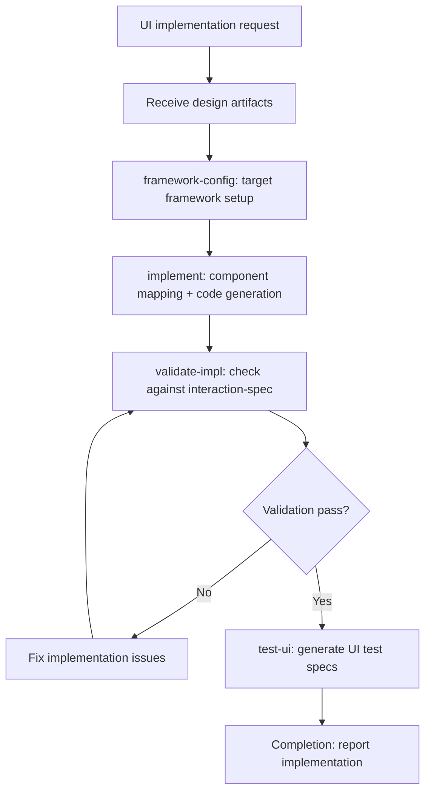

# UI Engineer Skill

## Overview

The `ui-engineer` skill consumes toolkit-agnostic design artifacts produced by `ui-design` and translates them into framework-specific implementations. It operates as a sub-agent dispatched by `divide-and-conquer` or invoked directly via `/skill ui-engineer`.

**Model assignment:** `glm-5.1:cloud`

All implementation output is framework-specific (currently Streamlit). The skill binds design artifacts — interaction specs, wireframes, mockups — to concrete UI code, templates, and test specifications.


## Workflow Diagram



## Persona

**UI Implementation Engineer** — translates design artifacts into production-quality framework-specific code. Focuses on component mapping, accessibility implementation, state management, and testable UI structure.

## Sub-Agent Tasks

| Task | Word Count | Description |
|------|-----------|-------------|
| `implement` | ≈800 | Full UI implementation pass: component mapping, code generation, framework binding |
| `validate-impl` | ≈400 | Validate implementation against interaction-spec requirements |
| `test-ui` | ≈400 | Generate UI test specifications from interaction specs |
| `framework-config` | ≈500 | Configure target framework, component library, and project conventions |
| `completion` | ≈200 | Idempotent cleanup and final summary |

### Dispatch Audit Table

| Sub-Agent Task | Trigger Condition | Scope of Context | Exclusions | Inline Work? |
|---|---|---|---|---|
| `implement` | When full UI implementation pass is needed | Spec requirements, design artifacts, worktree.path, github.owner, github.repo | Implementation context, agent memory, other agents' results | NO |
| `validate-impl` | When validating implementation against interaction-spec | Implementation files, interaction spec, github.owner, github.repo | Implementation context, agent memory | NO |
| `test-ui` | When generating UI test specifications | Interaction spec, implementation files | Implementation context, agent memory | NO |
| `framework-config` | When configuring target framework | Framework name, component library, project conventions | Implementation context, agent memory | NO |
| `completion` | When workflow halts at any point | Workflow state, status | Implementation context, agent memory | NO |

Result contracts (returned by each sub-agent):

```yaml
implement:
  status: DONE | DONE_WITH_CONCERNS | OVERFLOW | BLOCKED
  files_changed: [list of paths relative to worktree]
  summary: string
  concerns: string (empty if none)

validate-impl:
  status: PASS | CONCERNS | FAIL
  findings: [list of {severity, description, recommendation}]
  summary: string

test-ui:
  status: DONE | DONE_WITH_CONCERNS | OVERFLOW | BLOCKED
  artifacts: [list of test spec paths relative to worktree]
  summary: string
  concerns: string (empty if none)

framework-config:
  status: DONE | DONE_WITH_CONCERNS | BLOCKED
  config_path: string (relative to worktree)
  summary: string
  concerns: string (empty if none)

completion:
  status: DONE
  cleaned_up: [list of temp resources cleaned]
  summary: string
```

## Invocation

```
/skill ui-engineer --task implement
/skill ui-engineer --task validate-impl
/skill ui-engineer --task test-ui
/skill ui-engineer --task framework-config
/skill ui-engineer --task completion
```

Dispatch context for sub-agents MUST include: `worktree.path`, `github.owner`, `github.repo`, `dev.name`, `dev.email`, plus any spec or design artifact paths relevant to the task.

## Operating Protocol

1. **Load design artifacts as input.** Read the interaction spec (`interaction-spec.yaml`), mockup (`mockup.html`), screenshot (`screenshot.png`), and wireframe (`wireframe.svg`) produced by `ui-design`. The interaction spec is REQUIRED; other artifacts are recommended or reference-only.
2. **Select target framework via `framework-config` task.** Determine the framework (Streamlit, currently) and project conventions before generating any code.
3. **Produce framework-specific implementation code.** Map toolkit-agnostic design components to framework widgets, layout primitives, and state patterns. Use project templates from `templates/streamlit_template.py`.
4. **Validate implementation against interaction-spec requirements.** Every route, component state, navigation guard, and accessibility requirement in the interaction spec must be present in the implementation.
5. **Generate UI test specifications.** Derive test specs from the interaction spec's navigation routes, component states, and accessibility requirements.
6. **Completion guarantee.** Every task invocation MUST end with the `completion` subtask to clean up temporary resources and produce a final summary. The `completion` task is idempotent and safe to invoke multiple times.

## Trigger Self-Identification (Three Tiers)

### Tier 1: Intelligence (Context Inference)

When the context involves writing UI code, building pages, creating views, or translating a design spec into framework-specific implementation, and no other skill is more specific, `ui-engineer` should activate.

### Tier 2: Keyword-Enhanced

- Issue body contains `[UI]` label or `requires-ui: true` field
- Plan phase mentions "implement UI", "UI code", "frontend code", "Streamlit component", "framework implementation"
- Spec includes UI implementation success criteria

### Tier 3: Direct

- `/skill ui-engineer` explicit invocation
- `--task <task-name>` explicit task selection

## Model Assignment

| Task | Model | Rationale |
|------|-------|-----------|
| All tasks | `glm-5.1:cloud` | Strong code generation, good at framework-specific implementation patterns |

## Design Artifact Consumption

| Artifact | Priority | Source Skill | Description |
|----------|----------|-------------|-------------|
| `interaction-spec.yaml` | REQUIRED | `ui-design` | Navigation routes, component states, data flow, accessibility requirements |
| `mockup.html` | Recommended | `ui-design` | Visual layout reference for component placement and styling |
| `screenshot.png` | Reference | `ui-design` | Rendered visual of mockup for pixel-level comparison |
| `wireframe.svg` | Reference | `ui-design` | Structural layout information for grid/region mapping |

## Cross-References

- **`ui-design`**: Produces the design artifacts that `ui-engineer` consumes. The handoff point is the interaction spec and wireframe/mockup files.
- **`divide-and-conquer`**: Dispatches `ui-engineer` as a sub-agent via `assemble-work` when the plan includes UI implementation phases.
- **`issue-operations`**: Used for posting progress comments and linking implementation artifacts to issues.
- **`verification-before-completion`**: Validates implementation against spec success criteria before marking the phase complete.

```yaml+symbolic
schema_version: "2.0"
last_updated: "2026-04-25T00:00:00Z"
rules:
  - id: ui-engineer-001
    title: "Implementation MUST match design artifacts from ui-design"
    conditions:
      all:
        - "implementation_produced == true"
        - "interaction_spec_requirements_satisfied == false"
    actions:
      - HALT
      - INVOKE(validate-impl)
    conflicts_with: []
    requires: []
    triggers: [verification-before-completion]
    source: "ui-engineer/SKILL.md §Operating Protocol"

  - id: ui-engineer-002
    title: "Interaction spec is REQUIRED input — cannot implement without it"
    conditions:
      all:
        - "implementation_requested == true"
        - "interaction_spec_available == false"
    actions:
      - HALT
      - REPORT("interaction-spec.yaml required from ui-design")
    conflicts_with: []
    requires: [ui-design]
    triggers: []
    source: "ui-engineer/SKILL.md §Design Artifact Consumption"

tasks:
  - id: implement
    skill: ui-engineer
    preconditions:
      - "interaction_spec_available == true"
      - "framework_configured == true"
    postconditions:
      - "framework_specific_code_generated == true"
      - "interaction_spec_requirements_satisfied == true"
      - "accessibility_requirements_implemented == true"
    mandatory: true
    bypass_violation: "implementation does not satisfy interaction spec"
    source: "ui-engineer/SKILL.md §Sub-Agent Tasks"

  - id: validate-impl
    skill: ui-engineer
    preconditions:
      - "implementation_produced == true"
    postconditions:
      - "all_routes_present == true"
      - "all_component_states_present == true"
      - "all_accessibility_reqs_present == true"
    mandatory: true
    bypass_violation: "implementation fails validation against interaction spec"
    source: "ui-engineer/SKILL.md §Sub-Agent Tasks"

decomposition: []
gates:
  - id: interaction-spec-gate
    type: precondition
    check: "interaction-spec.yaml available and loaded"
    on_fail: HALT
    source: "ui-engineer/SKILL.md §Design Artifact Consumption"
  - id: impl-verification-gate
    type: postcondition
    check: "implementation satisfies all interaction spec requirements"
    on_fail: INVOKE(validate-impl)
    source: "ui-engineer/SKILL.md §Operating Protocol"
evidence_artifacts:
  - "interaction-spec.yaml path"
  - "validate-impl findings report"
  - "generated UI code file paths"
```