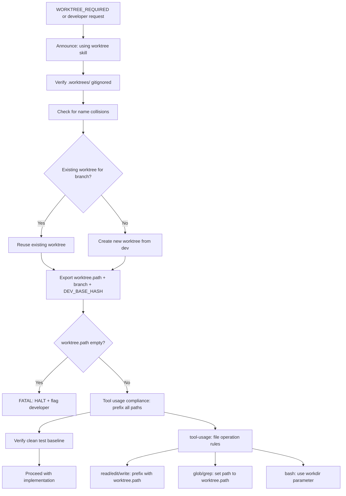

# Skill: using-git-worktrees

## Overview

Git worktrees create isolated workspaces sharing the same repository, allowing work on multiple branches simultaneously without switching. This skill adapts the [obra/superpowers using-git-worktrees](https://github.com/obra/superpowers/blob/main/skills/using-git-worktrees/SKILL.md) pattern for the `feature→dev→main` three-branch workflow used in this project.

**Core principle:** Systematic directory selection + safety verification = reliable isolation for parallel agent work.

**⚠️ Worktrees are OPT-IN, not mandatory.** The default workflow is direct-branch (feature branch in main repo). Worktrees are only created when `WORKTREE_REQUIRED` is set or the developer explicitly requests isolation. See `000-critical-rules.md` → "Direct-Branch Default" for the primary workflow.

**Announce at start:** "Using the using-git-worktrees skill to set up an isolated workspace."

**Source attribution:** Adapted from [obra/superpowers `using-git-worktrees`](https://github.com/obra/superpowers/tree/main/skills/using-git-worktrees). Original concepts and structure used with attribution.


## Workflow Diagram



## Persona

You are a Worktree Setup Specialist. Your focus is creating safe, isolated git worktrees so agents can work in parallel without conflict.

## Tasks

| Task | Purpose | Words |
|------|---------|-------|
| `create-worktree` | Full worktree creation workflow: sync, verify, setup, export env | ≈600 |
| `tool-usage` | File operation and bash tool compliance rules for worktrees | ≈250 |
| `reference` | Quick reference, common mistakes, fatal errors, integration | ≈450 |
| `completion` | Ensure mandatory terminal-state dispatch occurred; remediate if not; report status | ≈200 |

## Sub-Agent Tasks

### Dispatch Audit Table

| Sub-Agent Task | Trigger Condition | Scope of Context | Exclusions | Inline Work? |
|---|---|---|---|---|
| `create-worktree` | When worktree creation is needed before implementation | Branch name, worktree.path, github.owner, github.repo | Implementation context, agent memory, cached verification | NO |
| `tool-usage` | When file operation compliance rules are needed | Worktree.path, file operation context | Implementation context, agent memory | NO |
| `reference` | When quick reference for worktree operations is needed | Worktree.path, branch name | Implementation context, agent memory | NO |
| `completion` | When workflow halts at any point | Workflow state, status | Implementation context, agent memory | NO |

## Invocation

- `/skill using-git-worktrees` — Overview only (this document)
- `/skill using-git-worktrees --task create-worktree` — Create a new worktree
- `/skill using-git-worktrees --task tool-usage` — Tool usage compliance rules
- `/skill using-git-worktrees --task reference` — Quick reference and troubleshooting
- `/skill using-git-worktrees --task completion` — Invoke when workflow halts at any point

## Operating Protocol

1. **Announce intent** at start: "Using the using-git-worktrees skill to set up an isolated workspace."
1. **Default base branch is `dev`** — never from `main`. For work execution workflows, `BASE_BRANCH` may be a prior feature branch or work branch. Feature branches target `dev`.
1. **This skill is invoked ONLY when `WORKTREE_REQUIRED` is set or developer requests isolation** — direct-branch is the default per `000-critical-rules.md` → "Direct-Branch Default"
1. **Always use `.worktrees/` directory** — when worktree mode is active, stash+checkout in main repo is FORBIDDEN
1. **Verify `.worktrees/` is gitignored** before creating worktree. If not, add it and commit.
1. **Check for name collisions** before creating — reuse existing worktree for same branch, HALT on mismatch.
1. **Export `worktree.path`, `branch`, `DEV_BASE_HASH`** after creation — downstream skills require these.
1. **If `worktree.fatal=1`** appears in session init: HALT immediately, report to developer, do NOT proceed.
1. **If `worktree.path` is empty after creation**: FATAL ERROR → FLAG DEV → HALT.
1. **Verify clean test baseline** after setup — report failures, get explicit permission to proceed.
1. **Cleanup** is handled by `finishing-a-development-branch`, not by this skill.

## Three-Branch Model Adaptation

| Original (superpowers) | This Project |
|------------------------|-------------|
| Worktrees from `main` | Worktrees from `dev` |
| Feature branches target `main` | Feature branches target `dev` |
| No project setup step | Auto-detect and run `uv sync` |
| No cleanup integration | Integrates with `finishing-a-development-branch` |

Branch naming: `spec/<short-name>` for spec-driven work, `feature/<description>` for general feature work, `work/<short-name>` for work execution branches.

**BASE_BRANCH parameter:** The `create-worktree` task supports creating worktrees from branches other than `dev`. Defaults to `dev` for standalone branches. In work execution workflows, set to a prior feature branch (for dependency merge) or the work branch. Agent decides at creation time based on context.

## Simple Work Worktree

When the authorization qualifies as "clearly simple work" (per `000-critical-rules.md` → "Simple Work Dispatch Path (Tier 2 Waiver)"), a worktree is ONLY required when `WORKTREE_REQUIRED` is set. In direct-branch mode (default), simple work uses a feature branch in the main repo directly.

### Simple Work Procedure (Direct-Branch Mode — Default)

1. **Branch naming:** Use `docs/`, `runbook/`, or `config/` as the branch prefix for clearly simple work
2. **Feature branch creation:** `git checkout -b <branch-name> dev` directly in main repo
3. **Direct implementation:** Implement directly without worktree or sub-agent dispatch
4. **Completion steps:** Follow the simple work dispatch path: `verification-before-completion` → `finishing-a-development-branch --task checklist` → `git-workflow --task review-prep`

### Simple Work Procedure (Worktree Mode — When WORKTREE_REQUIRED Set)

1. **Branch naming:** Use `docs/`, `runbook/`, or `config/` as the branch prefix
2. **Worktree creation:** Invoke `git-workflow --task pre-work` — worktree creation applies
3. **Direct implementation:** After worktree creation, implement directly in the worktree without sub-agent dispatch
4. **Completion steps:** Follow the simple work dispatch path: `verification-before-completion` → `finishing-a-development-branch --task checklist` → `git-workflow --task review-prep`

### What Does NOT Change for Simple Work

| Step | Simple Work (Direct-Branch) | Simple Work (Worktree) | Complex Work |
|------|----------------------------|------------------------|--------------|
| Worktree required? | NO (default mode) | YES (opt-in) | Only if `WORKTREE_REQUIRED` |
| No commits to main/dev? | YES (Tier 1) | YES (Tier 1) | YES (Tier 1) |
| Path rules apply? | NO (relative paths) | YES (prefix with worktree.path) | Depends on mode |
| Spec/plan needed? | NO (Tier 2 waiver) | NO (Tier 2 waiver) | YES (Tier 2) |
| Sub-agent dispatch? | NO (single concern) | NO (single concern) | YES (divide-and-conquer) |
| Pre-implementation analysis? | NO (no plan) | NO (no plan) | YES (expand sub-issues) |

## Cross-References

- **Called by:** `brainstorming` (Phase 4), `divide-and-conquer`, `executing-plans`
- **Pairs with:** `finishing-a-development-branch` (cleanup), `git-workflow` (branch/PR management)
- **Related guidelines:** `000-critical-rules.md` (worktree bypass violation), `060-tool-usage.md` (path rules)

**⚠️ COMPLETION GUARANTEE:** If this workflow halts at ANY point — including error, failure, or early termination — you MUST invoke `--task completion` before halting. The completion subtask ensures mandatory steps are never skipped. It is idempotent and safe to invoke multiple times.

```yaml+symbolic
schema_version: "2.0"
last_updated: "2026-04-25T00:00:00Z"
rules:
  - id: worktree-001
    title: "Worktree MUST be created before file modification when WORKTREE_REQUIRED is set"
    conditions:
      all:
        - "WORKTREE_REQUIRED == true"
        - "worktree_created == false"
        - "file_modification_attempted == true"
    actions:
      - HALT
      - INVOKE(create-worktree)
    conflicts_with: []
    requires: []
    triggers: [git-workflow, divide-and-conquer]
    source: "using-git-worktrees/SKILL.md §Operating Protocol"

  - id: worktree-002
    title: "If worktree.fatal=1 appears, HALT immediately and report"
    conditions:
      all:
        - "worktree_fatal == 1"
    actions:
      - HALT
      - REPORT("worktree fatal error — flag developer")
    conflicts_with: []
    requires: []
    triggers: []
    source: "using-git-worktrees/SKILL.md §Operating Protocol"

  - id: worktree-003
    title: "If worktree.path is empty after creation, HALT — fatal error"
    conditions:
      all:
        - "WORKTREE_REQUIRED == true"
        - "worktree_path_empty == true"
    actions:
      - HALT
      - REPORT("worktree.path empty after creation — fatal")
    conflicts_with: []
    requires: []
    triggers: []
    source: "using-git-worktrees/SKILL.md §Operating Protocol"

  - id: worktree-004
    title: "Stash+checkout in main repo is FORBIDDEN when worktree mode active"
    conditions:
      all:
        - "WORKTREE_REQUIRED == true"
        - "stash_checkout_attempted == true"
    actions:
      - HALT
      - REPORT("worktree bypass — use .worktrees/ directory")
    conflicts_with: []
    requires: []
    triggers: []
    source: "using-git-worktrees/SKILL.md §Operating Protocol"

tasks:
  - id: create-worktree
    skill: using-git-worktrees
    preconditions:
      - "WORKTREE_REQUIRED == true"
      - "feature_branch_named == true"
    postconditions:
      - "worktree_path_exported == true"
      - "branch_created == true"
      - "clean_baseline_verified == true"
    mandatory: true
    bypass_violation: "file modification without worktree when WORKTREE_REQUIRED"
    source: "using-git-worktrees/SKILL.md §Tasks"

  - id: tool-usage
    skill: using-git-worktrees
    preconditions:
      - "worktree.path_is_set == true"
    postconditions:
      - "all_paths_prefixed_with_worktree_path == true"
      - "bash_uses_workdir_parameter == true"
    mandatory: true
    bypass_violation: "file operations target main repo instead of worktree"
    source: "using-git-worktrees/SKILL.md §Tasks"

decomposition: []
gates:
  - id: worktree-path-gate
    type: precondition
    check: "worktree.path is set and non-empty when WORKTREE_REQUIRED"
    on_fail: HALT
    source: "using-git-worktrees/SKILL.md §Operating Protocol"
  - id: toplevel-verification-gate
    type: postcondition
    check: "git rev-parse --show-toplevel matches worktree.path"
    on_fail: HALT
    source: "using-git-worktrees/SKILL.md §Operating Protocol"
evidence_artifacts:
  - "git rev-parse --show-toplevel output"
  - "git branch --show-current output"
  - "worktree.path value in dispatch context"
```
