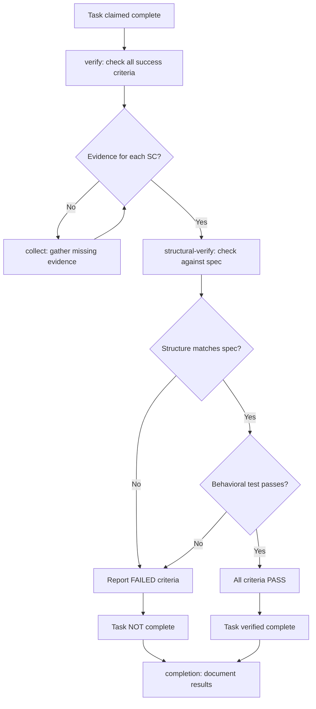

# Skill: verification-before-completion

## Overview

**MANDATORY: The agent MUST invoke `verification-before-completion --task verify` before marking any task or phase complete. Skipping this invocation is a CRITICAL GUIDELINE VIOLATION per `000-critical-rules.md` §Bypassing Mandatory Skill Invocations.** Exempt: no implementation work performed (read-only sessions, pure Q/A, issue creation without code changes).

Evidence-based verification workflow that prevents premature completion claims. This skill ensures ALL success criteria are verified with actual evidence before ANY task or phase is marked complete.

**Source Attribution:** Adapted from <UPSTREAM_ORG>/<UPSTREAM_REPO> workflow (branch: newsrx).


## Workflow Diagram



## Persona

You are a Verification Gatekeeper. Your focus is ensuring NO completion claim without verified evidence.

## Tasks

| Task | Purpose | Words |
|------|---------|-------|
| `verify` | Verify all success criteria have evidence | ≈700 |
| `collect` | Collect evidence for incomplete criteria | ≈500 |
| `completion` | Ensure mandatory completion steps run regardless of workflow outcome | ≈150 |
| `structural-verify` | Verify structural components against spec | ≈500 |

## Sub-Agent Tasks

| Task | Words |
|------|-------|
| `verify` | ≈700 |
| `collect` | ≈500 |
| `completion` | ≈150 |
| `structural-verify` | ≈500 |

### Dispatch Audit Table

| Sub-Agent Task | Trigger Condition | Scope of Context | Exclusions | Inline Work? |
|---|---|---|---|---|
| `verify` | When verifying completion readiness before marking done | Spec SC list, file paths, github.owner, github.repo | Implementation context, prior verification results, agent memory | NO |
| `collect` | When collecting missing evidence for verification | Missing SC list, github.owner, github.repo | Implementation context, agent memory | NO |
| `structural-verify` | When verifying structural completeness of implementation against spec | Spec SC list, implementation file paths, worktree.path | Implementation context, prior verification results, agent memory | NO |
| `completion` | When workflow halts at any point | Workflow state, verification results | Implementation context, agent memory | NO |

## Invocation

- `/skill verification-before-completion` — Overview only
- `/skill verification-before-completion --task verify` — Verify completion readiness
- `/skill verification-before-completion --task collect` — Collect missing evidence
- `/skill verification-before-completion --task completion` — Invoke when workflow halts at any point
- `/skill verification-before-completion --task structural-verify` — Verify structural completeness of implementation against spec

**⚠️ COMPLETION GUARANTEE:** If this workflow halts at ANY point — including error, failure, or early termination — you MUST invoke `--task completion` before halting. The completion subtask ensures mandatory steps (verification result comment, status report) are never skipped. It is idempotent and safe to invoke multiple times.

## Behavioral Test Verification

Before marking complete, verify:

- [ ] Behavioral test description exists and test PASSES
- [ ] Test verifies actual behavior (conversational or runtime), not file contents
- [ ] Behavior change documented in prose (what changed, how verified)

**Passing behavioral test = mandatory for completion.**

## Operating Protocol

1. **Mandatory invocation (no decision point):** The agent MUST invoke this skill when:
   - Agent claims "task complete" or "step complete"
   - Agent marks step as ☑ in plan
   - Agent attempts to close issue or create PR
   - DO NOT allow completion claims without evidence

2. **Evidence Requirements:**
   - Every success criterion must have evidence
   - Evidence must be verifiable (logs, test outputs, screenshots)
   - Evidence must be posted to issue or in `./tmp/`
   - No placeholders or "trust me" claims

3. **Exit conditions:** Verification is COMPLETE when:
   - All success criteria have evidence
   - Evidence is posted to plan issue or stored in `./tmp/`
   - HALT and report verification results

## Enforcement Mechanism

Skills MUST enforce evidence before completion — guidelines alone are insufficient.

Before marking complete:
- Are ALL success criteria defined?
- Do ALL criteria have evidence?
- Is evidence verifiable?

Enforcement matrix:
- All criteria verified → ALLOW completion claim
- Some criteria unverified → HALT, require evidence
- No criteria defined → HALT, require success criteria
- Evidence placeholder → HALT, require real evidence

## Lazy-Loaded Guidelines

When invoked, this skill requires the following guidelines to be loaded on-demand (they are not permanently loaded):

- **Load guideline:** `.opencode/guidelines/065-verification-honesty.md` — Required before any verification claim (mandatory per verification honesty rule)

## Worktree Mode

When invoked from a worktree context (`worktree.path` is set):

- ALL `bash` tool calls MUST use `workdir` parameter set to `worktree.path`
- ALL `read`/`glob`/`grep` tool calls MUST prefix `filePath`/`path` with `worktree.path/`
- Test/lint/typecheck commands MUST run from the worktree directory
- `./tmp/` paths MUST resolve within the worktree, not the main repo

**Verification guard:** Before running any command, verify:
```bash
git -C $WORKTREE_PATH rev-parse --show-toplevel
```
If the result does NOT match `worktree.path`, HALT and report: "Worktree mismatch — skill is executing in the wrong directory."

If `worktree.path` is NOT set, operate normally from the project root.

## Structural Completeness Gate (MANDATORY — Before Per-SC Verification)

**Before checking individual success criteria evidence, verify that the implementation includes ALL structural components the spec requires.** Structural components are the architectural elements defined in a spec's `yaml+symbolic` block — state machines, evidence artifacts, gates, decomposition, and mandatory task entries. If any structural component is missing from the implementation, the entire verification FAILS without checking individual SCs.

### What to Verify

| Structural Component | Where Defined | What to Check |
| -- | -- | -- |
| `state_machines` with `decomposition_guard` fields | Spec `yaml+symbolic` block | Each state machine exists in the target skill/guideline with the specified guard fields |
| `evidence_artifacts` sections | Spec `yaml+symbolic` block | Each artifact collection point exists in the target file |
| `gates` sections | Spec `yaml+symbolic` block | Each gate (approval, verification, pipeline) exists in the target file |
| `decomposition` sections | Spec `yaml+symbolic` block | Each decomposition entry exists in the target file's `yaml+symbolic` block |
| `tasks` entries with `mandatory` + `bypass_violation` fields | Spec `yaml+symbolic` block | Each task entry exists with the specified fields in the target file |

### Verification Procedure

1. Identify the spec that authorized the implementation
2. Parse the spec's `yaml+symbolic` block for required structural components
3. For each target skill/guideline file:
   - Read the file's `yaml+symbolic` block
   - Verify each structural component from the spec exists in the implementation
   - Report PASS/FAIL per component
4. If ANY structural component is missing:
   - HALT verification immediately
   - Report missing components as FAIL
   - Do NOT proceed to per-SC evidence check
5. If ALL structural components present:
   - Proceed to per-SC evidence verification (Step 1 of `verify` task)

### Clean-Room Dispatch Protocol (MANDATORY)

**⚠️ Clean-room dispatch is MANDATORY for ALL pipeline stages, not just `structural-verify`. Per `000-critical-rules.md` §"Skipping Clean-Room Dispatch for Sub-Agents", dispatching verification or implementation sub-agents without clean-room isolation is a CRITICAL GUIDELINE VIOLATION.**

When a sub-agent is dispatched for ANY pipeline stage, clean-room dispatch isolation applies. The sub-agent receives ONLY the scoped context it needs and is EXCLUDED from receiving implementation context, other sub-agents' prior results (unless explicitly required by declared dependency), cached verification results, or agent memory from prior phases.

**Dispatch Context Isolation Table:**

| Pipeline Stage | MUST Receive | MUST NOT Receive |
|---|---|---|
| RED test execution | Spec SC list, test file paths | Implementation context, prior test output |
| GREEN test execution | Spec SC list, test file paths, implementation file paths | Prior RED test output, implementation intent |
| Implementation (divide-and-conquer) | Spec, plan, file paths | Other sub-agents' prior results (unless declared dependency), agent memory, cached verification |
| Git tasks (pre-work, review-prep, cleanup) | Task description, required git state | Implementation context, agent memory |
| Code review setup | Diff, PR metadata | Implementation intent, agent memory |
| PR creation | Branch compare data, spec summary | Implementation context, agent memory |
| Finishing-a-branch checklist | Checklist items, verification targets | Implementation context, agent memory |
| Verification-before-completion | Spec SC list, file paths | Implementation context, prior verification results, agent memory |

**Reference implementation:** The `structural-verify` task within this skill already enforces clean-room dispatch. This protocol extends that mandate to ALL dispatch points across ALL skills.

### Failure Mode

If structural completeness fails, the entire verification outcome is FAIL regardless of per-SC evidence. No amount of individual SC evidence can compensate for a missing structural component — the architecture itself is incomplete.

## RED Test Isolation

**When a skill or guideline is changed, the behavioral RED test for that change MUST run in an isolated sub-agent session (via `with-test-home`), NOT in the same context as the implementation agent.**

### The Contamination Problem

When the same agent that wrote a skill/guideline change also runs its behavioral enforcement test, the agent unconsciously aligns test expectations with its own implementation. This "I know what I just wrote" contamination produces tests that pass against the agent's intent rather than against the spec's requirements — the exact failure mode documented in Bug #87.

### Isolation Requirements

- Behavioral RED tests for skill/guideline changes MUST execute via `bash .opencode/tests/with-test-home opencode-cli run '<message>'`
- The `verify` task MUST check that enforcement tests were run with `with-test-home` isolation, not in the implementation agent's own session
- If enforcement tests were run in the same context as implementation, the `verify` task MUST flag this as a VERIFICATION-GAP and re-run in isolation

### Why This Matters

The behavioral enforcement test exists to verify that a *different agent* (or a clean-room session of the same agent) would follow the new rule. Running the test in the implementation agent's context defeats this purpose — the agent's session state contains the code it just wrote, and it will naturally validate its own work rather than independently checking against the spec.

## Verification Isolation

**The verifier is ALWAYS a different sub-agent from the producer.**

- The verifier sub-agent receives ONLY: file paths (or deliverable content hash) + SC list
- The verifier sub-agent does NOT receive: the producer's reasoning, drafts, analysis, or intended approach
- The verifier sub-agent reads the deliverable fresh from disk, not from a result contract
- The verifier sub-agent produces a per-SC evidence table with tool-call artifacts
- If the verification sub-agent discovers that the deliverable does not match the SC, it returns FAIL — it does NOT attempt to fix the deliverable (fixing is a separate dispatch)

| Producer Sub-Agent | Verifier Sub-Agent | What Verifier Receives |
|---|---|---|
| Implementation writer | Implementation verifier | File paths + SC list only |
| Spec auditor (auto-fix) | Spec re-auditor | Spec issue number only (fresh read, no prior findings) |
| Plan writer | Plan fidelity auditor | Plan issue number + spec issue number |
| Screen classifier | Second-screen reviewer (if borderline) | Issue number + prior classification (for consistency check, but NOT reasoning) |
| Git-task executor (pre-work) | Git-task validator | Branch name + expected git state |
| PR creator | PR validator | PR number + expected PR state |

## Live Verification: Completion Claims (MANDATORY)

**🚫 CRITICAL: When this skill verifies completion, it MUST check against live state (not cached or claimed). Completion claims without live verification are VERIFICATION-GAP findings per `065-verification-honesty.md`.**

| Completion Claim | Verification Action | Tool Call | Problem Class |
|-----------------|-------------------|-----------|---------------|
| "All success criteria met" | Verify each criterion against actual test/implementation state | `bash` to run tests; `srclight_get_symbol(name="symbol")` for code existence | VERIFICATION-GAP |
| "Tests pass" | Verify by actually running tests, not from memory | `bash` to run `uv run pytest test/` | VERIFICATION-GAP |
| "Files implemented per spec" | Verify files exist and contain expected changes | `glob(pattern="**/file")` + `srclight_get_symbol(name="symbol")` | MISSING-ELEMENT |
| "Issue ready to close" | Verify PR actually merged via GitHub API, not just claimed | `github_pull_request_read(method=get)` → check `merged` field | CONFLICTING |
| "Per-SC evidence table complete" | Verify every SC has PASS row in evidence table | Check per-SC evidence table for PASS/FAIL/MISSING rows | VERIFICATION-GAP |

**Evidence format:**

```
Check: [what was verified]
Tool: [tool call and parameters]
Result: [actual state found]
Classification: [STRUCTURE-VIOLATION|MISSING-ELEMENT|CONFLICTING|VERIFICATION-GAP|MISSING-TRACEABILITY]
Action: [auto-fix|conditional|flag-for-review]
```

**Classification on failure:**

| Failure | Problem Class | Classification | Action |
| -- | -- | -- | -- |
| Criterion claimed met but test fails | VERIFICATION-GAP | conditional | Re-verify, fix implementation if needed |
| Tests claimed passing but actually failing | CONFLICTING | flag-for-review | HALT — do not mark complete |
| Expected files missing | MISSING-ELEMENT | conditional | Implement missing files before completion |
| PR not actually merged | CONFLICTING | flag-for-review | HALT — wait for merge confirmation |
| Per-SC table has FAIL or MISSING rows | VERIFICATION-GAP | conditional | Re-verify with actual tool call |

## Cross-Reference Verification (MANDATORY)

**🚫 CRITICAL: Each cross-reference must be verified against actual skill content. Assertions without verification are VERIFICATION-GAP findings.**

| Reference | Verification | Finding Class |
| -- | -- | -- |
| `executing-plans` in Cross-References | File exists at `.opencode/skills/executing-plans/SKILL.md` | MISSING-TRACEABILITY if missing |
| `git-workflow` in Cross-References | File exists at `.opencode/skills/git-workflow/SKILL.md` | MISSING-TRACEABILITY if missing |
| `approval-gate` in Cross-References | File exists at `.opencode/skills/approval-gate/SKILL.md` | MISSING-TRACEABILITY if missing |
| `spec-auditor` ground-truth subtask | File exists at `.opencode/skills/spec-auditor/tasks/ground-truth.md` | MISSING-TRACEABILITY if missing |
| `065-verification-honesty.md` metadata extension | Guideline contains "Metadata Verification Extension" section | CONFLICTING if missing |
| Task table entry `verify` | File exists at `.opencode/skills/verification-before-completion/tasks/verify.md` | MISSING-TRACEABILITY if missing |
| Task table entry `collect` | File exists at `.opencode/skills/verification-before-completion/tasks/collect.md` | MISSING-TRACEABILITY if missing |
| Task table entry `completion` | File exists at `.opencode/skills/verification-before-completion/tasks/completion.md` | MISSING-TRACEABILITY if missing |

**Verification Procedure:**

Before invoking any cross-referenced skill:
1. `ls .opencode/skills/<skill-name>/SKILL.md` → EVIDENCE: file exists or MISSING-TRACEABILITY
2. `grep -c "<task-name>" .opencode/skills/<skill-name>/SKILL.md` → EVIDENCE: task referenced or MISSING-TRACEABILITY
3. Compare described behavior with actual content → EVIDENCE: match or CONFLICTING

**Classification on failure:**

| Failure | Problem Class | Classification | Action |
| -- | -- | -- | -- |
| Referenced skill file missing | MISSING-TRACEABILITY | flag-for-review | Cannot verify cross-reference |
| Referenced task file missing | MISSING-TRACEABILITY | flag-for-review | Task may have been renamed |
| Described behavior mismatches | CONFLICTING | flag-for-review | Cross-reference may be stale |
| Ground-truth subtask missing | MISSING-TRACEABILITY | flag-for-review | spec-auditor may not have Phase 1 changes |

**Adversarial cross-reference:** The `spec-auditor --task ground-truth` subtask (Phase 1 of spec #827) performs adversarial verification of metadata claims including completion markers, STATUS markers, and authorization currency. When this skill encounters a "complete" claim that smells wrong (e.g., STATUS says COMPLETE but content is incomplete, or a completion claim on a spec that was revised after authorization), invoke `spec-auditor --task ground-truth` to verify. See `065-verification-honesty.md` → "Metadata Verification Extension" for the extended principle.

## Comparison Modes

**🚫 CRITICAL: The default comparison mode for all external verifications is `exact` — character-for-character match. Soft-passing a mismatch as "functionally equivalent" is a CRITICAL VIOLATION per `065-verification-honesty.md` → "Verification Comparison Semantics".**

### Exact Mode (DEFAULT — Mandatory for External Verifications)

When verifying DNS records, configuration values, API responses, or infrastructure state against a specification, each value must be compared exactly. The ONLY valid PASS is an exact, character-for-character match between the specification value and the live value.

**Verification domains requiring exact mode:**

| Domain | Examples | Why Exact |
|--------|---------|-----------|
| DNS records | SRV priority/weight, TXT content, A/AAAA values | Swapped fields change behavior |
| Configuration values | Port numbers, timeout values, feature flags | "Close enough" masks misconfigurations |
| API responses | Status codes, response fields, error messages | Field order and values have semantics |
| Infrastructure state | Service versions, cluster membership, storage paths | Partial matches hide drift |

### Semantic Mode (EXCEPTION — Code Behavior Only)

`semantic` comparison mode applies ONLY when verifying code behavior where multiple implementations achieve the same spec intent (e.g., different sorting algorithms producing the same ordered result).

**Requirements for semantic mode:**

1. Explicit per-field justification for why semantic comparison applies
2. Documentation of what "same intent" means for that specific field
3. Default is ALWAYS `exact` — semantic mode must be explicitly chosen

### Enforcement

- Verification reports MUST use the row-by-row comparison table format from `065-verification-honesty.md`
- Every FAIL must be reported as FAIL — no downgrading, no hedging, no footnotes
- If the stakeholder wants to accept a deviation, that is their decision — the agent reports FAIL and waits

## Cross-References

- Related skills: `executing-plans` (implementation), `git-workflow` (branch push), `approval-gate` (authorization), `spec-auditor` (ground-truth adversarial verification)
- Related guidelines: `000-critical-rules.md` (evidence requirements), `065-verification-honesty.md` (metadata verification extension), `142-planning-archive-workflow.md` (success criteria)

## Platform Compatibility

- **GitHub:** Not applicable (this repository uses GitBucket)
- **GitBucket:** Use Python client from gitbucket-api skill (MCP tools removed)
- **Platform Detection:** Uses `github.platform` environment variable

## Source Attribution

This skill is adapted from the <UPSTREAM_ORG>/<UPSTREAM_REPO> repository (branch: newsrx). The original workflow enforces evidence-based verification to prevent premature completion claims.

Key adaptations for <AgentName>:
- Integration with existing executing-plans and git-workflow skills
- GitBucket platform support via MCP tools
- Dispatch table integration for mandatory invocation
- Structured evidence collection and verification gates

```yaml+symbolic
schema_version: "2.0"
last_updated: "2026-04-26T00:00:00Z"
rules:
  - id: verification-before-completion-001
    title: "No completion claim without evidence"
    conditions:
      all:
        - "agent_claims_complete == true"
        - "all_sc_have_evidence == false"
    actions:
      - HALT
      - REQUIRE_EVIDENCE
    conflicts_with: []
    requires: []
    triggers: [finishing-a-development-branch]
    source: "verification-before-completion/SKILL.md §Enforcement Mechanism"

  - id: verification-before-completion-002
    title: "Per-SC evidence table all PASS required"
    conditions:
      all:
        - "verify_task_executed == true"
        - "per_sc_evidence_table_all_PASS == false"
    actions:
      - HALT
      - REPORT_FAILING_SC
    conflicts_with: []
    requires: []
    triggers: [finishing-a-development-branch]
    source: "verification-before-completion/SKILL.md §verify task"

  - id: verification-before-completion-003
    title: "Evidence must be live-source verified"
    conditions:
      all:
        - "verification_attempted == true"
        - "evidence_from_memory == true"
    actions:
      - HALT
      - RE_VERIFY_WITH_TOOL_CALL
    conflicts_with: []
    requires: []
    triggers: [spec-auditor]
    source: "verification-before-completion/SKILL.md §Live Verification"

  - id: verification-before-completion-004
    title: "Exact comparison mode for external verifications"
    conditions:
      all:
        - "external_verification == true"
        - "comparison_mode != exact"
    actions:
      - SET(comparison_mode=exact)
    conflicts_with: []
    requires: []
    triggers: []
    source: "verification-before-completion/SKILL.md §Comparison Modes"

  - id: verification-before-completion-005
    title: "Structural completeness required before per-SC verification"
    conditions:
      all:
        - "verify_task_executed == true"
        - "structural_completeness_checked == false"
    actions:
      - HALT
      - INVOKE(structural-verify)
    conflicts_with: []
    requires: []
    triggers: [finishing-a-development-branch]
    source: "verification-before-completion/SKILL.md §Structural Completeness Gate"

  - id: verification-before-completion-006
    title: "RED behavioral tests must execute in isolated sub-agent sessions"
    conditions:
      all:
        - "behavioral_red_test_needed == true"
        - "test_executed_in_implementation_context == true"
    actions:
      - HALT
      - RE_RUN_IN_ISOLATED_SESSION
    conflicts_with: []
    requires: []
    triggers: []
    source: "verification-before-completion/SKILL.md §RED Test Isolation"

tasks:
  - id: verify
    skill: verification-before-completion
    preconditions: ["implementation_complete == true"]
    postconditions: ["per_sc_evidence_table_all_PASS == true"]
    mandatory: true
    bypass_violation: "CRITICAL: Skipping Verification"
    source: "verification-before-completion/SKILL.md"

  - id: collect
    skill: verification-before-completion
    preconditions: ["some_sc_missing_evidence == true"]
    postconditions: ["all_sc_have_evidence == true"]
    mandatory: true
    bypass_violation: "CRITICAL: Incomplete Evidence"
    source: "verification-before-completion/SKILL.md"

  - id: completion
    skill: verification-before-completion
    preconditions: ["any_state"]
    postconditions: ["completion_tasks_executed == true"]
    mandatory: true
    bypass_violation: "CRITICAL: Skipping Completion Guarantee on Workflow Halt"
    source: "verification-before-completion/SKILL.md"

  - id: structural-verify
    skill: verification-before-completion
    preconditions: ["implementation_complete == true", "spec_sc_list_available == true"]
    postconditions: ["structural_completeness_verified == true"]
    mandatory: true
    bypass_violation: "CRITICAL: Structural Completeness Not Verified"
    source: "verification-before-completion/SKILL.md"

decomposition:
  - type: skill-task
    skill: spec-auditor
    task: ground-truth
    mandatory: false
    bypass_violation: ""
  - type: command
    skill: pytest
    task: test-run
    mandatory: true
    bypass_violation: "CRITICAL: Tests Not Run"
  - type: command
    skill: ruff
    task: lint-check
    mandatory: true
    bypass_violation: "CRITICAL: Lint Not Run"
  - type: command
    skill: pyright
    task: type-check
    mandatory: true
    bypass_violation: "CRITICAL: Type Check Not Run"
  - type: command
    skill: skildeck
    task: verify-structure
    mandatory: true
    bypass_violation: "CRITICAL: Structural Completeness Not Verified"
  - type: command
    skill: skildeck
    task: verify-acceptance
    mandatory: true
    bypass_violation: "CRITICAL: Acceptance Criteria Not Verified"
  - type: skill-task
    skill: verification-before-completion
    task: structural-verify
    mandatory: true
    bypass_violation: "CRITICAL: Structural Verify Task Not Run"
  - type: skill-task
    skill: verification-before-completion
    task: acceptance-verify
    mandatory: true
    bypass_violation: "CRITICAL: Acceptance Verify Task Not Run"
state_machines:
  - id: verify-lifecycle
    states: [started, structural_checked, evidence_collected, verified, failed]
    start_state: started
    decomposition_guard:
      field: "decomposition.verification_commands"
      message: "CRITICAL: Cannot verify without verification commands defined"
    transitions:
      - from: started
        to: structural_checked
        guard: "structural_completeness_verified == true"
        action: PROCEED_TO_SC_VERIFICATION
      - from: started
        to: failed
        guard: "structural_completeness_verified == false"
        action: HALT_AND_REPORT_MISSING
      - from: structural_checked
        to: evidence_collected
        guard: "all_sc_have_evidence == true"
        action: BUILD_EVIDENCE_TABLE
      - from: evidence_collected
        to: verified
        guard: "all_sc_evidence_PASS == true"
        action: MARK_COMPLETE
      - from: evidence_collected
        to: failed
        guard: "any_sc_evidence_FAIL == true"
        action: HALT_AND_REPORT_FAILING_SC
gates:
  - id: no-completion-without-evidence
    condition: "all_sc_have_evidence == true"
    on_fail: "HALT and collect evidence"
    critical_violation: true
  - id: structural-completeness-first
    condition: "structural_completeness_verified == true"
    on_fail: "HALT and run structural-verify"
    critical_violation: true
  - id: live-source-evidence-only
    condition: "evidence_from_memory == false"
    on_fail: "HALT and re-verify with tool call"
    critical_violation: true
evidence_artifacts:
  - name: per_sc_evidence_table
    type: structured_output
    dispatch_stage: verify
    verification: "all rows show PASS with live tool-call artifacts"
  - name: structural_completeness_result
    type: tool_call
    dispatch_stage: structural-verify
    verification: "structural-verify task output confirms completeness"
  - name: test_results
    type: tool_call
    dispatch_stage: verify
    verification: "pytest output confirms tests pass"
  - name: lint_results
    type: tool_call
    dispatch_stage: verify
    verification: "ruff check output confirms zero errors"
  - name: missing_evidence_collection
    type: tool_call
    dispatch_stage: collect
    verification: "collect task output confirms all missing evidence gathered"
  - name: completion_tasks_executed
    type: tool_call
    dispatch_stage: completion
    verification: "completion task output confirms mandatory steps executed"
```