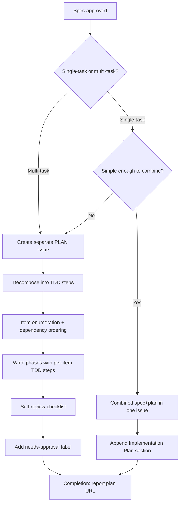
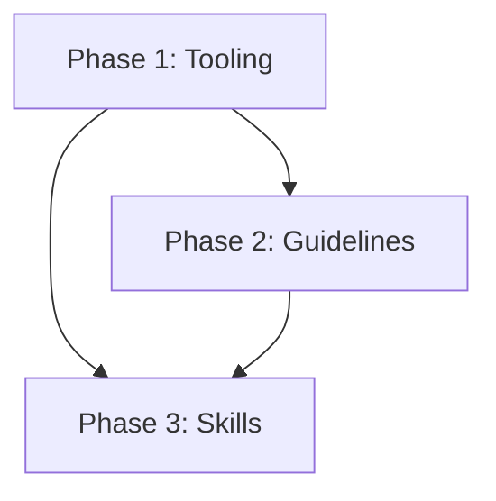
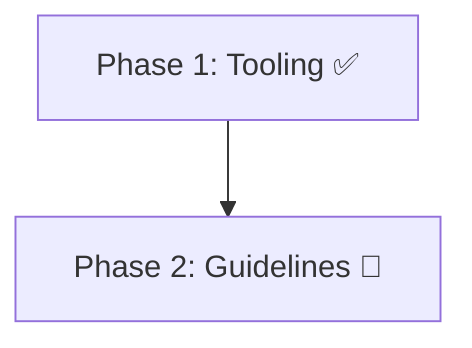
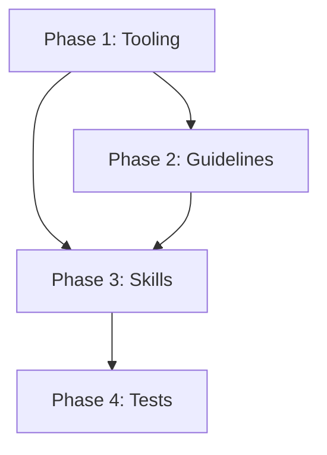
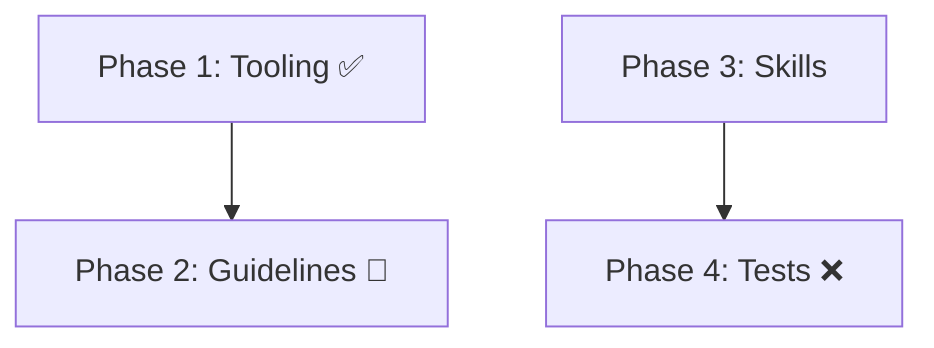

# Skill: writing-plans

## Overview

Plan creation workflow that transforms approved specs into actionable implementation plans using a hybrid structure: **phases** for sub-issue tracking and cross-phase visibility, **TDD steps** within each task for granular execution guidance. Every step is one action (2-5 minutes) with exact code and commands. Placeholders are forbidden in plans.

**Source attribution:** TDD step granularity, no-placeholders rule, plan document header, file structure section, and self-review checklist adapted from [obra/superpowers `writing-plans`](https://github.com/obra/superpowers/blob/main/skills/writing-plans/SKILL.md).


## Workflow Diagram



## Plan Issue Model

Plans are either separate GitHub Issues or combined into the spec issue body, depending on agent intelligence evaluation of spec complexity. The hierarchy is:

**Separate plan (multi-task or agent-determined):**

```
Spec #N (approved)
  → [PLAN] #M (linked reference via body text "Spec: #N")
       ├── Task #P1: [Task: #M] Phase 1
       ├── Task #P2: [Task: #M] Phase 2
       └── Task #P3: [Task: #M] Phase 3
```

**Combined spec+plan (single-task, agent-determined):**

```
Spec #N (approved)
  → Body contains spec content
       └── ## Implementation Plan (appended section with header, file structure, TDD tasks)
```

**Plan issue properties (separate):**
- Title prefix: `[PLAN]`
- Labels: `plan` + `needs-approval`
- Body contains spec reference as prose (e.g., `Spec: #784`)
- Sub-issues are children of the plan, NOT the spec
- The plan references the spec via body text (linked reference), not via GitHub sub-issue link

**Combined spec+plan properties:**
- Title prefix: `[SPEC]` (retained, not changed to `[PLAN]`)
- Labels: existing spec labels (no `plan` label added)
- Plan content appended under `## Implementation Plan` heading in spec body
- No sub-issues (single-task by definition)
- Approval follows spec approval status (no separate plan approval needed)

## Combined Spec+Plan (Single-Task Specs)

When a spec is single-task with simple implementation, the plan may be combined into the spec issue body instead of creating a separate [PLAN] issue. The decision is made at the Step 1.5 decision gate in `tasks/create.md`.

### When to Combine vs Keep Separate

| Condition | Recommendation |
|-----------|---------------|
| Single-task, ≤ few TDD steps, plan content flows naturally after spec | **Combine** — one document aids review |
| Single-task, many TDD steps, or spec body already long/dense | **Separate** — readability degrades with combined content |
| Multi-task (multiple phases, mixed concerns) | **Always separate** — sub-issue tracking required |

### Combined Document Structure

When combined, the spec issue body has this structure:

```
[Existing spec content: objectives, requirements, success criteria, etc.]

---

## Implementation Plan

**Goal:** <one-line goal>
**Architecture:** <architectural approach>
**Tech Stack:** <technologies used>

### File Structure
- `path/to/file1.py` — <responsibility>
- `path/to/file2.py` — <responsibility>

### Phase 1: [Concern Name]
#### Task 1: [Component Name]
- Step 1: Write the failing test
- Step 2: Run test, verify RED ← CHECKPOINT: must produce tool-call evidence of failure
- Step 3: Write minimal implementation
- Step 4: Run test to verify it passes
- Step 5: Commit
```

### Approval Cascade

The spec-to-plan approval cascade applies differently based on authorization scope:

- `standard` scope: The combined plan section requires separate plan approval, even though the spec was already approved. The cascade does NOT apply to newly created plans in standard scope — it only applies to EXISTING plans (per approval-gate Step 5b).
- Pipeline scope (`for_plan` or higher): The combined plan inherits the spec's approval. No separate plan approval needed — the pipeline authorization covers plan creation and approval.
- If the spec has not been approved, the combined plan requires the spec to be approved (single approval covers both, but only when scope >= for_plan)
- Spec revision invalidates the `## Implementation Plan` section — see Spec Revision Revocation below

## Tasks

| Task | Purpose | Words |
| -- | -- | -- |
| `create` | Create plan from approved spec; report in chat | ≈800 |
| `validate` | Check for placeholders and completeness | ≈500 |
| `retroactive` | Create plan for existing spec | ≈600 |
| `clean-room` | Generate independent plan from problem statement only | ≈500 |
| `diagram` | Generate mermaid dependency diagram showing approved structure (no workflow state) | ≈350 |
| `completion` | Ensure mandatory terminal-state dispatch occurred; remediate if not; report status | ≈200 |

## Invocation

- `/skill writing-plans` — Overview only
- `/skill writing-plans --task create` — Create plan from current spec
- `/skill writing-plans --task validate` — Validate existing plan
- `/skill writing-plans --task retroactive` — Create plan for existing spec
- `/skill writing-plans --task clean-room` — Generate clean-room plan (for comparison by spec-auditor)
- `/skill writing-plans --task completion` — Invoke when workflow halts at any point

## RED/GREEN/REFACTOR Test Discipline

## RED Phase Requirements

1. **Write behavioral test description FIRST** — before any implementation
2. **Describe the behavior to verify:**
   - What changes (agent response or code execution)?
   - How to trigger it?
   - What confirms success?
   - What constitutes failure?
3. **Implement test mechanism** — write the script that verifies the described behavior
4. **Verify RED state** — test FAILS before implementation

## GREEN Phase Requirements

1. **Implement behavior change** — skills, guidelines, code, dispatch chain
2. **Verify GREEN state** — test PASSES after implementation
3. **Behavior must differ** — before/after response or execution is different

## REFACTOR Phase Requirements

1. **Run full behavioral suite** — `bash .opencode/tests/behaviors/run-all.sh`
2. **No regressions** — all existing tests still pass

## Hybrid Structure: Phases + TDD Steps

Plans use **phases** (for sub-issue tracking) with **TDD step granularity** within each task:

```
Phase 1: [Concern Name]
  Task 1: [Component Name]
    Step 1: Write the failing test
    Step 2: Run test, verify RED ← CHECKPOINT
    Step 3: Write minimal implementation
    Step 4: Run test, verify GREEN
    Step 5: Commit
```

Phase-level sections are prose (agent decides content). Task-level steps are TDD-granular with exact code and commands.

### RED Verification Checkpoint (MANDATORY)

The TDD step structure includes an explicit **Step 2: Run test, verify RED ← CHECKPOINT** between writing the test (Step 1) and implementing the feature (Step 3). This checkpoint is MANDATORY:

- **Step 2 must produce tool-call evidence of test failure** — the plan must specify the command to run and the expected failure output (e.g., `uv run pytest test/test_file.py::test_name -x` with assertion failure messages)
- **Plans that omit Step 2 will fail validation** — the RED verification checkpoint cannot be combined with Step 1 or skipped
- **Every TDD step block must include Step 2** — no exceptions, no abbreviations that merge Step 1 and Step 2

This requirement enforces the TDD discipline from `091-incremental-build.md`: tests must be proven to fail before implementation begins. Without RED evidence, there is no proof the test actually tests anything.

### Per-Item Bottom-Up Design (Per `091-incremental-build.md`)

Within each task, the plan MUST specify bottom-up design elements as required by the incremental build discipline (`091-incremental-build.md`):

1. **Classes/modules** — What code components will be created or modified
2. **Interfaces** — Function signatures, API contracts, data formats
3. **Test contracts** — What the enforcement test or verification will check before implementation, including RED verification evidence (the tool call and expected failure output that proves the test fails before implementation)

This bottom-up design per item is part of the TDD cycle: RED (write test) → GREEN (implement) → REFACTOR (clean up) → COMMIT. Each item in the plan MUST follow this cycle.

## No-Placeholders Rule (CRITICAL)

Every step must contain actual content. These are **plan failures**: `TBD`, `TODO`, `[to be determined]`, `[needs investigation]`, `[placeholder]`, `[requires research]`, `implement later`, `fill in details`, `Add appropriate error handling`, `Add validation`, `Write tests for the above`, `Similar to Task N`, or steps describing what to do without showing how.

## PR Merge Boundaries in Plan Deliverables (MANDATORY When Dependencies Exist)

When a plan's spec declares dependencies on other specs/plans (e.g., "Depends on: #37"), the plan deliverable MUST include `pr_boundaries` in the `yaml+symbolic` block and a prose `## PR Merge Boundaries` section.

### yaml+symbolic Format

```yaml
pr_boundaries:
  - phase: 1
    pr: "PR1"
    must_be_merged_before_starting: true
    contract_dependencies:
      - "yaml+symbolic schema v2.0 in codebase"
      - "skildeck lint --skill <skill> passes"
    self_enforcing: true
  - phase: 2
    pr: "PR2"
    must_be_merged_before_starting: true
    contract_dependencies:
      - "approval-gate verify-authorization task contract exists"
    self_enforcing: true
```

### Prose Section Format

Each phase in the plan body includes a merge boundary annotation:

```markdown
### Phase 1: [Concern Name]
**PR Boundary:** PR1 (#38, #39) must be merged before this phase starts.
**Self-Enforcement:** `skildeck lint` will fail with "contract unresolvable" if boundary is violated.
```

### When to Include

| Condition | Include pr_boundaries? |
|-----------|-----------------------|
| Plan's spec has "Depends on:" references | YES — mandatory |
| Plan's spec has no dependencies | NO — omit entirely |

### Enforcement

Missing `pr_boundaries` in the `yaml+symbolic` block when dependencies exist is a STRUCTURE-VIOLATION finding from `skildeck lint`.

## Mermaid Diagrams in Plan Deliverables (MANDATORY When Dependencies Exist)

When a plan has dependencies (multiple phases, cross-issue dependencies, or sequential deliverables), the `create` task MUST include a mermaid diagram in the plan deliverable body. The diagram is part of the plan artifact — not an optional appendix — and shows the **approved dependency structure only**.

### When to Include

| Condition | Include Diagram in Plan Body? |
|-----------|-------------------------------|
| Plan has multiple phases | YES — mandatory |
| Plan has cross-issue dependencies | YES — mandatory |
| Single-task plan with no dependencies | NO — omit |

### Diagram Placement in Deliverable

**Separate plans:** The diagram is placed after the plan header (Goal, Architecture, Tech Stack), before "Phase 1".

**Combined plans:** The diagram is placed in the `## Implementation Plan` section, after the header, before phases.

The `create` task assembles the diagram into the final plan body alongside other sections. The diagram is a first-class part of the deliverable — agents creating plans with dependencies MUST produce the diagram content within the plan body, not as a separate artifact.

### Diagram Content Rules

- Diagrams MUST show **approved structure only** — phase relationships, dependency flow, data contracts
- Diagrams MUST NOT include workflow state markers: ✅, 🔄, ❌, "implemented", "pending", "in progress", "blocked", "complete"
- Diagrams MUST use `graph TD` or `flowchart TD` mermaid syntax
- Node labels MUST describe the deliverable or concern name, not its status
- If the `diagram` sub-agent produces markers, the `create` task auto-fixes by removing them before assembly

### Correct Example



### Forbidden Example



### Enforcement in create Task

The `create` task MUST:
1. Check if dependencies exist (multiple phases, or cross-issue dependencies)
2. If dependencies exist: invoke `diagram` task or inline-generate mermaid diagram
3. Insert diagram in plan body at the prescribed placement location
4. Scan diagram content for workflow state markers before final assembly
5. Auto-fix any discovered markers (remove them, note in evidence)

## Interdependency Diagram Discipline (MANDATORY When Dependencies Exist)

When a plan has dependencies (multiple phases, cross-issue dependencies, or sequential deliverables), the plan MUST include a mermaid diagram showing the **approved dependency structure only**.

### When to Include

| Condition | Include Diagram? |
|-----------|------------------|
| Plan has multiple phases | YES — mandatory |
| Plan has cross-issue dependencies | YES — mandatory |
| Single-task plan with no dependencies | NO — omit |

### Diagram Format Rules

**CORRECT (structure-only, no workflow state):**



**FORBIDDEN (workflow state markers):**



### Update Protocol

| Change Type | Action |
|-------------|--------|
| Dependency structure correction | Update diagram + document in Revision Notes + STATUS: REVISED |
| Implementation progress | Do NOT update diagram — use issue status markers instead |
| New dependency discovered mid-implementation | Halt, update diagram, revise plan, wait for re-approval |

### Placement

The diagram is placed in the plan body:
- **Separate plans:** After the plan header (Goal, Architecture, Tech Stack), before "Phase 1"
- **Combined plans:** In the `## Implementation Plan` section, after the header, before phases

### Rationale

1. **Historical audit trail:** Diagrams show what was approved, not what was implemented. This preserves the decision context for future reviewers.
2. **Separation of concerns:** Workflow tracking (what's implemented) belongs in issue status markers, not in the approved plan diagram.
3. **Correctness maintained:** If dependencies are discovered to be wrong during implementation, the diagram is corrected — but the correction is documented as a revision, not silently updated.

### Enforcement

The `validate` task MUST verify:
1. Diagram exists when `dependencies_exist == true`
2. Diagram contains NO workflow state markers (✅, 🔄, ❌, "implemented", "pending", etc.)
3. Diagram matches the dependency structure in the plan body

Violations are STRUCTURE-VIOLATION findings requiring auto-fix before plan approval.

## Self-Review Checklist

After writing the complete plan, check:

1. **Spec coverage:** Can you point to a task for each spec requirement?
2. **Placeholder scan:** Search for red-flag patterns. Fix them.
3. **Type consistency:** Do types/signatures used in later tasks match earlier definitions?

## Auto-Dispatch Entry

This skill can be invoked automatically by `approval-gate` after successful verification of a spec approval. The auto-dispatch chain:

```
approval-gate --task verify-authorization (all gates pass for spec approval)
  → writing-plans --task create (auto-dispatched)
    → issue-operations --task link-sub-issue (sub-issues under plan, not spec)
```

**Auto-dispatch context passed from approval-gate:**

| Parameter | Source | Purpose |
|-----------|--------|---------|
| `spec_issue` | Issue number from `verify-authorization` | Identifies the approved spec to plan from |
| `single_task_determination` | From `issue-operations/tasks/post-creation` (via `single-task-check`) | Informs combined vs separate plan decision (`single-task` or `multi-task`) |
| `single_task` | Boolean from `issue-operations/tasks/post-creation` (via `single-task-check`) | `true` for single-task, `false` for multi-task — shorthand for decision gate |
| `<github.owner>` | Session init | Repository owner for API calls |
| `<github.repo>` | Session init | Repository name for API calls |
| `worktree.path` | Session / worktree setup | Base directory for file operations |

**Spec-to-plan approval cascade (scope-aware):** When `writing-plans --task create` is invoked for a spec that is already approved, the cascade behavior depends on authorization scope:

- `standard` scope: The newly created plan RETAINS the `needs-approval` label. Spec approval authorizes plan creation (first gate), but plan approval requires separate authorization (second gate). The cascade does NOT apply to newly created plans — it only applies to EXISTING plans per approval-gate Step 5b.
- Pipeline scope (`for_plan` or higher): The newly created plan inherits the spec's approval. The `needs-approval` label is removed and a comment documents the cascade — see Step 11 in `tasks/create.md` for the complete post-creation cascade procedure.

This scope-aware distinction prevents the gateway bypass where a newly created plan is auto-approved in standard scope, skipping the second gate of the two-gate authorization model.

**Manual invocation still works:** `writing-plans --task create` can be invoked directly at any time. Auto-dispatch is additive — it eliminates the silent gap between approval and plan creation, but does not replace manual invocation.

**No circular dispatch:** `writing-plans` never dispatches back to `approval-gate`. After plan creation, the plan requires its own approval (user says "approved"), which triggers `approval-gate` → `executing-plans` (not `writing-plans`).

## Spec Revision Revocation

When the spec referenced by a plan is revised, all linked plans must be re-approved:

**For separate plans:**

1. **Find linked plans:** Search GitHub Issues with `plan` label for body text matching `Spec: #N` (where N is the revised spec number)
2. **Re-apply `needs-approval` label** to each found plan
3. **Add audit comment** on each plan: `Spec #N has been revised. Plan requires re-approval before implementation.`
4. **HALT** — do not proceed with implementation from any plan linked to the revised spec until re-approved

**For combined spec+plan:**

1. **The `## Implementation Plan` section is invalidated** by the spec revision
2. **Add a comment** on the spec issue: `Spec revised — the `## Implementation Plan` section requires re-evaluation.`
3. **The agent re-evaluates** whether the combined plan still matches the revised spec, or whether it needs to be rewritten/separated
4. **HALT** — do not proceed with implementation from the combined plan until re-evaluated

This replaces the previous model where plan content lived in the spec body and revision automatically invalidated it. With the plan-bridge model, revision affects the spec but plans are tracked artifacts that must be explicitly re-reviewed — whether they are separate issues or combined sections.

## Re-Implementation

When a new plan is needed under the same spec (e.g., previous plan was rejected or superseded):

**For separate plans:**

1. **Create new `[PLAN]` issue** following standard plan creation procedure
2. **Close old plan** with comment: `Superseded by #N` (where N is the new plan number)
3. **Update old plan labels:** Remove `needs-approval`, add `wontfix` or close outright
4. **Sub-issues of old plan** remain linked to the old plan (not the spec) — they are closed along with the old plan or re-created under the new plan as appropriate

**For combined spec+plan:**

1. **Remove the `## Implementation Plan` section** from the spec issue body (edit the issue body to remove the appended plan content)
2. **If replacing with a new combined plan:** Append the new `## Implementation Plan` section to the spec issue body
3. **If replacing with a separate plan:** Create a new `[PLAN]` issue following standard procedure; no plan content remains in the spec body

The spec itself is the stable reference. Whether the plan is combined or separate, re-implementation modifies the plan artifact, not the spec content above the `## Implementation Plan` marker.


## MANDATORY TASKS

- [ ] MANDATORY: Read approved spec from GitHub Issue — verify spec approval via live tool call (labels + authorization comment), not cached claims — per §Live Verification: Spec State
- [ ] MANDATORY: Check for existing plans referencing the same spec before creating a new plan — per §Operating Protocol Step 1.5
- [ ] MANDATORY: Evaluate combined vs separate plan using `single_task_determination` at decision gate — per §Operating Protocol Step 2
- [ ] MANDATORY: Include TDD step structure (RED/GREEN/REFACTOR) in every task with Step 2 RED verification checkpoint — per §RED Verification Checkpoint and yaml+symbolic writing-plans-005
- [ ] MANDATORY: Verify no placeholders (TBD, TODO, etc.) in plan content — per §No-Placeholders Rule and yaml+symbolic writing-plans-002
- [ ] MANDATORY: Generate mermaid dependency diagram when plan has dependencies (multiple phases or cross-issue dependencies) — per §Interdependency Diagram Discipline and yaml+symbolic writing-plans-009
- [ ] MANDATORY: Verify diagram contains NO workflow state markers (✅, 🔄, ❌, "implemented", "pending") — per §Diagram Format Rules and yaml+symbolic writing-plans-010
- [ ] MANDATORY: Include PR Merge Boundaries section when spec has dependencies on other specs/plans — per §PR Merge Boundaries and yaml+symbolic writing-plans-009 (duplicate ID)
- [ ] MANDATORY: Create sub-issues under the plan (NOT under the spec) for multi-task plans — per §Plan Issue Model and yaml+symbolic writing-plans-003
- [ ] MANDATORY: Self-review plan for spec coverage, placeholders, and type consistency — per §Self-Review Checklist
- [ ] MANDATORY: Verify cross-references against actual skill files before invoking — per §Cross-Reference Verification
- [ ] MANDATORY: Invoke `verification-enforcement --task verify` before plan content generation — per decomposition gate
- [ ] MANDATORY: Add `needs-approval` label to newly created plans in standard scope — per §Approval Cascade
- [ ] MANDATORY: Scope-aware cascade: for `for_plan` or higher scope, remove `needs-approval` and document cascade — for `standard` scope, retain label — per §Approval Cascade
- [ ] MANDATORY: Report chat output as exec summary + URL + byline — per §Operating Protocol Step 10
- [ ] MANDATORY: Invoke `--task completion` before halting at any point — per completion task

```yaml+symbolic
schema_version: "2.0"
last_updated: "2026-04-25T00:00:00Z"
rules:
  - id: writing-plans-001
    title: "Plan must derive from approved spec only"
    conditions:
      all:
        - "spec_approved == false"
        - "authorization_scope != for_plan"
        - "authorization_scope != for_implementation"
    actions:
      - HALT
      - REPORT("spec not approved, cannot create plan")
    conflicts_with: []
    requires: []
    triggers: [approval-gate]
    source: "writing-plans/SKILL.md §Auto-Dispatch Entry"

  - id: writing-plans-002
    title: "No placeholders in plan"
    conditions:
      all:
        - "plan_contains_placeholders == true"
    actions:
      - REJECT(plan)
    conflicts_with: []
    requires: []
    triggers: []
    source: "writing-plans/SKILL.md §No-Placeholders Rule"

  - id: writing-plans-003
    title: "Sub-issues under plan, not spec"
    conditions:
      all:
        - "plan_is_multi_task == true"
        - "sub_issues_parent == spec"
    actions:
      - RESTRUCTURE(move sub-issues to plan)
    conflicts_with: []
    requires: []
    triggers: [issue-operations]
    source: "writing-plans/SKILL.md §Plan Issue Model"

  - id: writing-plans-004
    title: "Spec revision revokes plan approval"
    conditions:
      all:
        - "spec_revised == true"
        - "plan_linked_to_spec == true"
    actions:
      - REAPPLY(needs-approval label to plan)
      - ADD_COMMENT("Spec revised — plan requires re-approval")
      - HALT
    conflicts_with: []
    requires: []
    triggers: []
    source: "writing-plans/SKILL.md §Spec Revision Revocation"

  - id: writing-plans-005
    title: "RED verification checkpoint mandatory per TDD step"
    conditions:
      all:
        - "tdd_step_block_missing_red_checkpoint == true"
    actions:
      - REJECT(plan)
    conflicts_with: []
    requires: []
    triggers: []
    source: "writing-plans/SKILL.md §RED Verification Checkpoint"

  - id: writing-plans-006
    title: "Verification-enforcement gate before plan generation"
    conditions:
      all:
        - "verification_enforcement_verify_invoked == false"
    actions:
      - INVOKE(verification-enforcement --task verify)
    conflicts_with: []
    requires: []
    triggers: [verification-enforcement]
    source: "writing-plans/SKILL.md §Live Verification: Spec State"

  - id: writing-plans-007
    title: "Scope-aware plan approval cascade"
    conditions:
      any:
        - "authorization_scope == for_plan"
        - "authorization_scope == for_implementation"
        - "authorization_scope == for_code_review"
        - "authorization_scope == for_pr"
    actions:
      - AUTO_APPROVE(plan_if_newly_created)
      - REMOVE(needs-approval label)
    conflicts_with: [writing-plans-001]
    requires: []
    triggers: [approval-gate]
    source: "writing-plans/SKILL.md §Approval Cascade"

  - id: writing-plans-008
    title: "Duplicate plan check before creation"
    conditions:
      all:
        - "existing_plan_for_spec_found == true"
        - "developer_acknowledgment_received == false"
    actions:
      - HALT

  - id: writing-plans-009
    title: "Interdependency diagram required when dependencies exist"
    conditions:
      all:
        - "plan_has_dependencies == true"
        - "mermaid_diagram_generated == false"
    actions:
      - GENERATE(mermaid diagram showing approved structure only)
    conflicts_with: []
    requires: []
    triggers: []
    source: "writing-plans/SKILL.md §Interdependency Diagram Discipline"

  - id: writing-plans-010
    title: "Diagram must not show workflow state"
    conditions:
      all:
        - "diagram_shows_workflow_state == true"
    actions:
      - REMOVE(workflow markers from diagram)
    conflicts_with: []
    requires: [writing-plans-009]
    triggers: []
    source: "writing-plans/SKILL.md §Interdependency Diagram Discipline"
      - PRESENT(overlap)
    conflicts_with: []
    requires: []
    triggers: []
    source: "writing-plans/SKILL.md §Operating Protocol Step 1.5"

  - id: writing-plans-009
    title: "PR merge boundaries mandatory when spec has dependencies"
    conditions:
      all:
        - "spec_has_dependencies == true"
        - "pr_boundaries_in_yaml_symbolic == false"
    actions:
      - ADD(pr_boundaries section to yaml+symbolic block)
      - ADD(pr_boundary annotations to each phase)
    conflicts_with: []
    requires: [writing-plans-001]
    triggers: [approval-gate, divide-and-conquer]
    source: "writing-plans/SKILL.md §PR Merge Boundaries in Plan Deliverables"

tasks:
  - id: create
    skill: writing-plans
    preconditions:
      - "spec_approved == true OR authorization_scope >= for_plan"
      - "spec_issue_number known"
    postconditions:
      - "plan_issue_created == true OR combined_plan_appended == true"
      - "sub_issues_created == true (if multi-task)"
      - "self_review_passed == true"
    mandatory: true
    bypass_violation: "Implementation without plan — plan creation is mandatory before implementation"
    source: "writing-plans/SKILL.md §Tasks create"

  - id: completion
    skill: writing-plans
    preconditions: []
    postconditions:
      - "terminal_state_dispatch_occurred == true"
      - "status_report_produced == true"
    mandatory: true
    bypass_violation: "Silent Agent Termination — halting without completion task is a critical violation"
    source: "writing-plans/SKILL.md §Tasks completion"

  - id: diagram
    skill: writing-plans
    preconditions:
      - "dependencies_exist == true"
    postconditions:
      - "mermaid_diagram_generated == true"
      - "diagram_shows_structure_only == true"
      - "diagram_has_no_workflow_markers == true"
    mandatory: true
    bypass_violation: "Missing interdependency diagram — multi-phase plans require mermaid diagram in deliverable"
    source: "writing-plans/SKILL.md §Mermaid Diagrams in Plan Deliverables"

decomposition:
  - type: skill-task
    skill: verification-enforcement
    task: verify
    mandatory: true
    bypass_violation: "Skipping verification-enforcement — plan generation without verification gate is a critical violation"

  - type: sub-agent
    skill: brainstorming
    task: explore
    mandatory: false
    bypass_violation: "Skipping analysis — only permitted when spec already contains sufficient detail"

  - type: sub-agent
    skill: issue-operations
    task: link-sub-issue
    mandatory: true
    bypass_violation: "Multi-task plan requires sub-issue linkage under plan — skipping is a critical violation"

  - type: skill-task
    skill: writing-plans
    task: diagram
    mandatory: false
    condition: "dependencies_exist == true"
    bypass_violation: "Missing interdependency diagram — multi-phase plans require mermaid diagram in deliverable"

gates:
  - id: plan-fidelity
    condition: "plan_covers_all_spec_requirements == true AND plan_no_placeholders == true"
    on_fail: HALT
    critical_violation: true

  - id: sub-issue-count-matches-phases
    condition: "plan_sub_issues_count == plan_body_phase_count"
    on_fail: HALT
    critical_violation: true

  - id: red-checkpoint-present
    condition: "all_tdd_step_blocks_have_red_checkpoint == true"
    on_fail: HALT
    critical_violation: true

  - id: pr-boundaries-when-deps-exist
    condition: "spec_has_dependencies == false OR pr_boundaries_in_yaml_symbolic == true"
    on_fail: HALT
    critical_violation: true

  - id: diagram-in-deliverable-when-deps-exist
    condition: "dependencies_exist == false OR mermaid_diagram_in_plan_body == true"
    on_fail: HALT
    critical_violation: true

  - id: diagram-deliverable-no-workflow-state
    condition: "diagram_in_deliverable_shows_workflow_state == false"
    on_fail: HALT
    critical_violation: true

evidence_artifacts:
  - name: spec_approved_verification
    type: tool_call
    verification: "github_issue_read(method=get_labels) + github_issue_read(method=get_comments) → confirm approval"

  - name: plan_issue_created
    type: api_call
    verification: "github_issue_read(method=get) → check title prefix [PLAN] or combined plan section"

  - name: sub_issue_linkage
    type: api_call
    verification: "github_issue_read(method=get_sub_issues, issue_number=plan_N) → count matches phase count"

  - name: pr_boundaries_section
    type: tool_call
    verification: "github_issue_read(method=get) → verify pr_boundaries in yaml+symbolic block when spec has dependencies"
```

## Operating Protocol

**Pre-implementation file changes are ephemeral.** Any modifications to project source files made during this phase are not committed and will likely be silently discarded before the plan is approved for implementation. Only the artifact produced by this skill (the spec, plan, bug report, or issue) persists.

1. Read approved spec from GitHub Issue
1.5. Check for existing plans referencing the same spec — if found, surface overlap and require developer acknowledgment (see `tasks/create.md` Step 1.6 for the full duplicate plan check procedure)
2. **Decision gate:** Evaluate combined vs separate plan using `single_task_determination` and `single_task` inputs — see `tasks/create.md` Step 1.5
3. Map file structure (all files to create/modify with responsibilities)
4. Plan phase structure by judgment (prose-driven)
5. Define tasks within each phase using TDD step structure
6. Write plan document header (Goal, Architecture, Tech Stack)
7. Store plan document: if combined, append `## Implementation Plan` to spec issue body; if separate, create `[PLAN]` GitHub Issue with sub-issues via `issue-operations` skill
8. Self-review (coverage, placeholders, type consistency)
9. Validate (no placeholders, TDD structure, actionable steps)
10. Chat output with URL — Report plan creation (combined or separate) using exec summary + URL + byline format per `000-critical-rules.md`

## Enforcement

- No plan → CREATE plan (writing-plans skill) as `[PLAN]` GitHub Issue or combined into spec body per decision gate
- Plan exists but unapproved → HALT, wait for plan approval (not spec approval of plan content)
- Plan approved but has placeholders → REJECT plan
- Plan approved but missing TDD steps → REJECT plan
- Plan approved and complete → PROCEED to implementation
- Combined spec+plan (scope >= for_plan) → plan inherits spec approval status; no separate plan approval needed
- Combined spec+plan (standard scope) → plan requires separate approval; cascade does NOT apply to newly created plans

## Sub-Agent Tasks

### Sub-Agent Tasks

| Task | Words |
|------|-------|
| `create` | 1,598 |
| `validate` | ≈500 |
| `retroactive` | ≈600 |
| `clean-room` | ≈500 |
| `diagram` | ≈350 |
| `completion` | ≈200 |

### Dispatch Audit Table

| Sub-Agent Task | Trigger Condition | Scope of Context | Exclusions | Inline Work? |
|---|---|---|---|---|
| `create` | When creating a plan from an approved spec | Spec issue number, github.owner, github.repo, authorization_scope | Implementation context, agent memory, cached verification | NO |
| `validate` | When validating plan structure and fidelity | Plan issue number, spec issue number, github.owner, github.repo | Implementation context, agent memory | NO |
| `retroactive` | When creating a retroactive plan for already-implemented work | Spec issue number, implementation evidence, github.owner, github.repo | Implementation context, agent memory | NO |
| `clean-room` | When generating a clean-room plan without implementation context | Spec issue number, github.owner, github.repo | Implementation context, implementation intent, agent memory | NO |
| `diagram` | When dependencies exist, generate mermaid diagram | Dependency structure, phase list, github.owner, github.repo | Implementation context, agent memory, workflow state | NO |

### Result Contract (create)

```yaml
status: DONE | OVERFLOW
task: create
plan_issue: <N|null>
plan_url: <url|null>
combined: bool
sub_issues_created: [<N>]
self_review_passed: bool
```

### Result Contract (diagram)

```yaml
status: DONE | SKIP
task: diagram
diagram_generated: bool
diagram_type: mermaid
dependencies_exist: bool
workflow_markers_absent: bool
```

### Dispatch Context Schema

```yaml
spec_issue: <N>
single_task: bool
single_task_determination: <str>
authorization_scope: <standard|for_spec|for_plan|for_implementation|for_code_review|for_pr|pr_only|review_only>
session_vars:
  github.owner: <from-session>
  github.repo: <from-session>
  dev.name: <from-session>
  dev.email: <from-session>
  worktree.path: <from-session>
```

## Cross-Reference Verification (MANDATORY)

**🚫 CRITICAL: Each cross-reference must be verified against actual skill content. Assertions without verification are VERIFICATION-GAP findings.**

| Reference | Verification | Finding Class |
| -- | -- | -- |
| `brainstorming` in Cross-References section | File exists at `.opencode/skills/brainstorming/SKILL.md` | MISSING-TRACEABILITY if missing |
| `approval-gate` in Cross-References and Auto-Dispatch Entry | File exists at `.opencode/skills/approval-gate/SKILL.md` | MISSING-TRACEABILITY if missing |
| `executing-plans` in Cross-References section | File exists at `.opencode/skills/executing-plans/SKILL.md` | MISSING-TRACEABILITY if missing |
| `spec-auditor` in Cross-References section | File exists at `.opencode/skills/spec-auditor/SKILL.md` | MISSING-TRACEABILITY if missing |
| `issue-operations` in Cross-References and Auto-Dispatch Entry | File exists at `.opencode/skills/issue-operations/SKILL.md` | MISSING-TRACEABILITY if missing |
| `spec-creation` in Cross-References section | File exists at `.opencode/skills/spec-creation/SKILL.md` | MISSING-TRACEABILITY if missing |
| Task table entry `create` | File exists at `.opencode/skills/writing-plans/tasks/create.md` | MISSING-TRACEABILITY if missing |
| Task table entry `validate` | File exists at `.opencode/skills/writing-plans/tasks/validate.md` | MISSING-TRACEABILITY if missing |
| Task table entry `retroactive` | File exists at `.opencode/skills/writing-plans/tasks/retroactive.md` | MISSING-TRACEABILITY if missing |
| Task table entry `clean-room` | File exists at `.opencode/skills/writing-plans/tasks/clean-room.md` | MISSING-TRACEABILITY if missing |
| Task table entry `completion` | File exists at `.opencode/skills/writing-plans/tasks/completion.md` | MISSING-TRACEABILITY if missing |
| `approval-gate` auto-dispatch behavior | Matches actual SKILL.md: `verify-authorization` dispatches to `writing-plans` | CONFLICTING if mismatched |
| `issue-operations` dispatch behavior | Matches actual SKILL.md: `link-sub-issue` task for sub-issue linking | CONFLICTING if mismatched |
| `spec-auditor` clean-room invocation | Matches actual SKILL.md: `fidelity` subtask invokes `writing-plans --task clean-room` | CONFLICTING if mismatched |

**Verification Procedure:**

Before invoking any cross-referenced skill:
1. `ls .opencode/skills/<skill-name>/SKILL.md` → EVIDENCE: file exists or MISSING-TRACEABILITY
2. `grep -c "<task-name>" .opencode/skills/<skill-name>/SKILL.md` → EVIDENCE: task referenced or MISSING-TRACEABILITY
3. Compare described behavior with actual content → EVIDENCE: match or CONFLICTING

**Classification on failure:**

| Failure | Problem Class | Classification | Action |
| -- | -- | -- | -- |
| Referenced skill file missing | MISSING-TRACEABILITY | flag-for-review | Cannot verify cross-reference |
| Referenced task file missing | MISSING-TRACEABILITY | flag-for-review | Task may have been renamed |
| Described behavior mismatches | CONFLICTING | flag-for-review | Cross-reference may be stale |
| Invocation mismatch | CONFLICTING | flag-for-review | Skill may have been updated |

## Live Verification: Spec State (MANDATORY)

**🚫 CRITICAL: When this skill reads spec metadata (approval status, revision state, content), it MUST verify against live GitHub state. Trusting cached or claimed spec state is a VERIFICATION-GAP finding per `065-verification-honesty.md`.**

| Metadata Trust Point | Verification Action | Tool Call | Problem Class |
|---------------------|-------------------|-----------|---------------|
| Spec claimed as "approved" | Verify `needs-approval` label is absent AND authorization comment exists from a developer | `github_issue_read(method=get_labels)` + `github_issue_read(method=get_comments)` | CONFLICTING |
| Spec content used for planning | Verify spec body matches current issue state, not a cached version | `github_issue_read(method=get, issue_number=N)` → read body fresh | VERIFICATION-GAP |
| Spec claimed as "not revised since approval" | Verify no revision comments or STATUS changes after authorization comment | `github_issue_read(method=get_comments)` → compare timestamps | CONFLICTING |
| Spec-to-plan cascade eligibility | Verify spec approval actually exists (not just assumed) before auto-approving plan | `github_issue_read(method=get_comments)` → find explicit authorization comment | VERIFICATION-GAP |

**Evidence format:**

```
Check: [what was verified]
Tool: [tool call and parameters]
Result: [actual state found]
Classification: [STRUCTURE-VIOLATION|MISSING-ELEMENT|CONFLICTING|VERIFICATION-GAP|MISSING-TRACEABILITY]
Action: [auto-fix|conditional|flag-for-review]
```

**Classification on failure:**

| Failure | Problem Class | Classification | Action |
| -- | -- | -- | -- |
| Spec lacks approval but plan created | CONFLICTING | flag-for-review | HALT — plan requires separate approval |
| Spec content stale vs live | VERIFICATION-GAP | auto-fix | Re-read spec, regenerate plan |
| Spec revised after authorization | CONFLICTING | conditional | Verify plan still matches revised spec |
| Cascade assumed without evidence | VERIFICATION-GAP | conditional | Collect authorization evidence before proceeding |

## Cross-References

- Related skills: `brainstorming` (pre-spec), `approval-gate` (authorization), `executing-plans` (implementation), `spec-auditor` (fidelity subtask uses clean-room), `issue-operations` (sub-issue creation via `link-sub-issue` task), `spec-creation` (spec creation discipline)
- Source: adapted from [obra/superpowers `writing-plans`](https://github.com/obra/superpowers/blob/main/skills/writing-plans/SKILL.md)

**⚠️ COMPLETION GUARANTEE:** If this workflow halts at ANY point — including error, failure, or early termination — you MUST invoke `--task completion` before halting. The completion subtask ensures mandatory steps are never skipped. It is idempotent and safe to invoke multiple times.
